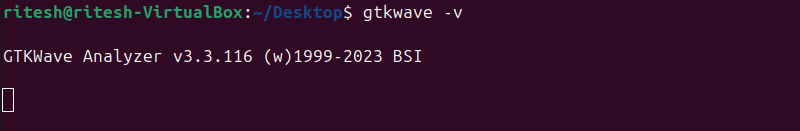

# Tool Installation - Week 0

---

## System Configuration

6GB RAM, 50 GB HDD  
Ubuntu 20.04+  
4 vCPU  

---

## 1--> Yosys

$ sudo apt-get update  
$ git clone https://github.com/YosysHQ/yosys.git  
$ cd yosys  
$ sudo apt install make (If make is not installed please install it)  
$ sudo apt-get install build-essential clang bison flex \  
libreadline-dev gawk tcl-dev libffi-dev git \  
graphviz xdot pkg-config python3 libboost-system-dev \  
libboost-python-dev libboost-filesystem-dev zlib1g-dev  
$ make config-gcc  
$ make  
$ sudo make install  

---

## Iverilog

Steps to install iverilog:  

$ sudo apt-get update  
$ sudo apt-get install iverilog  

---

## GTKWave

Steps to install gtkwave:  

$ sudo apt-get update  
$ sudo apt install gtkwave  

