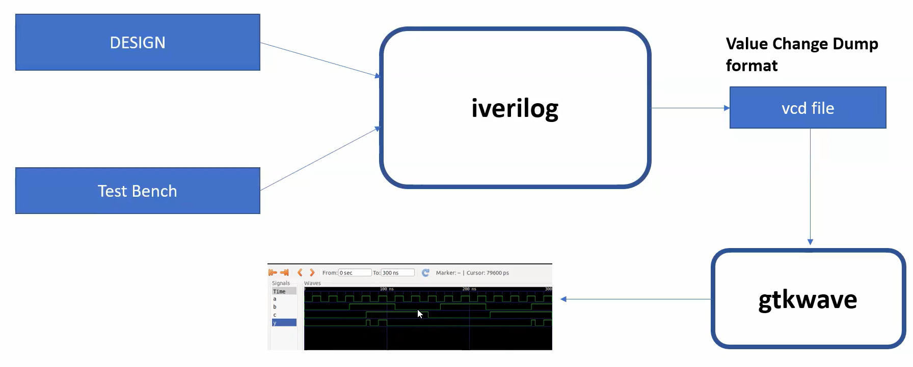
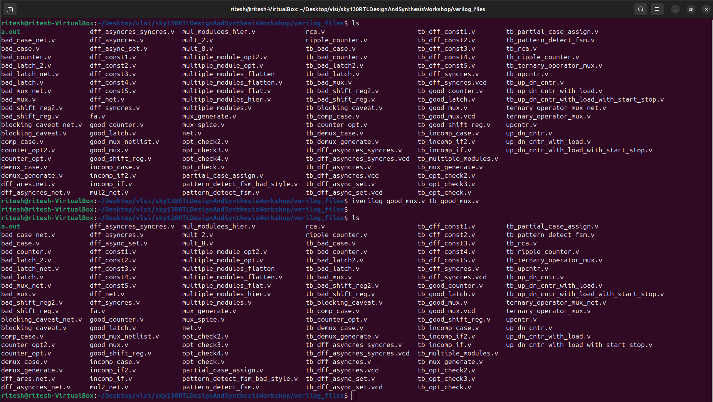
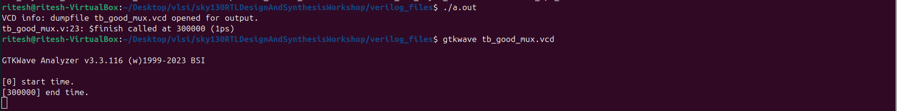
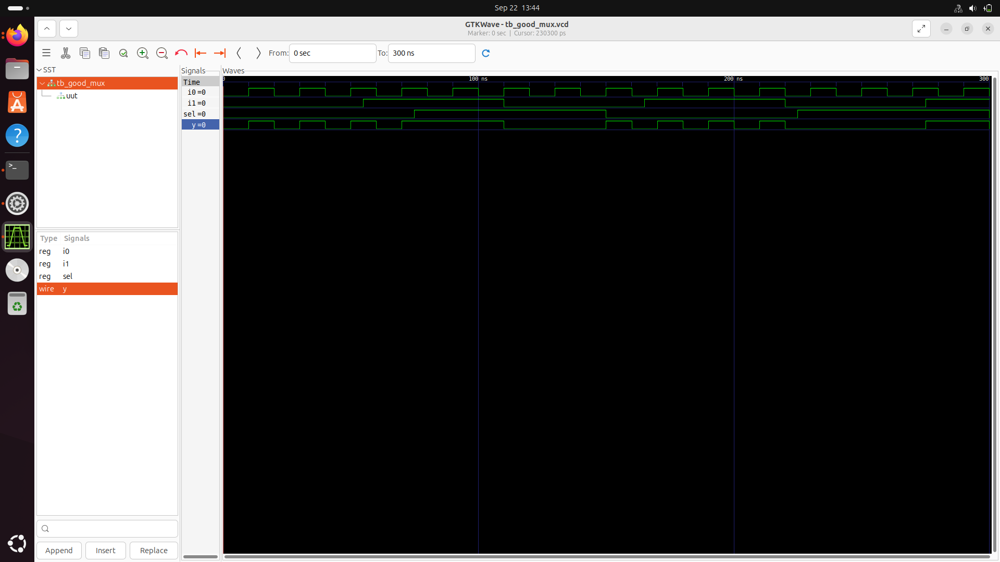
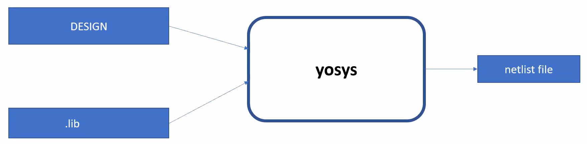
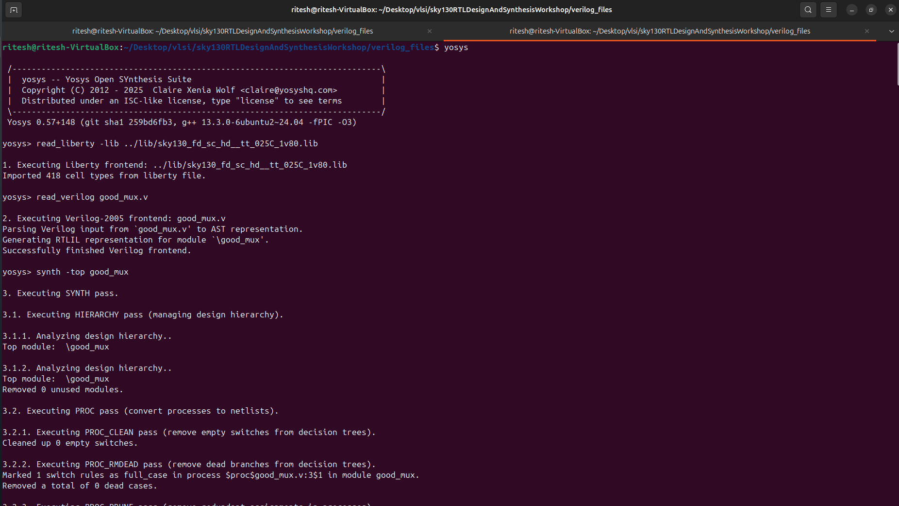
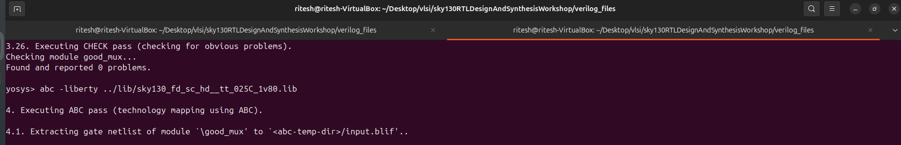
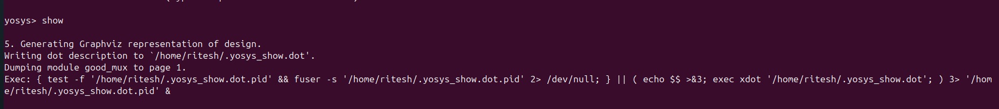
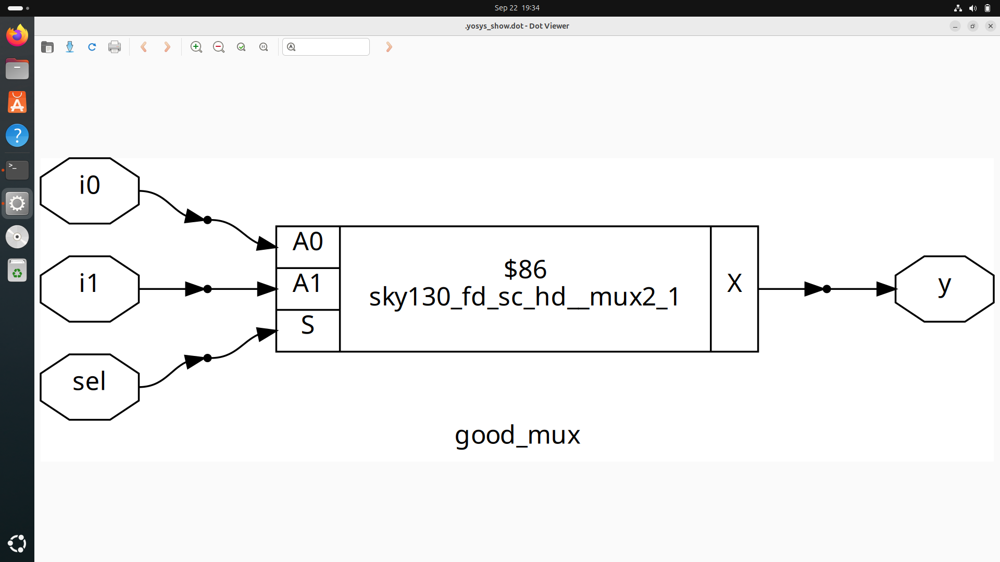
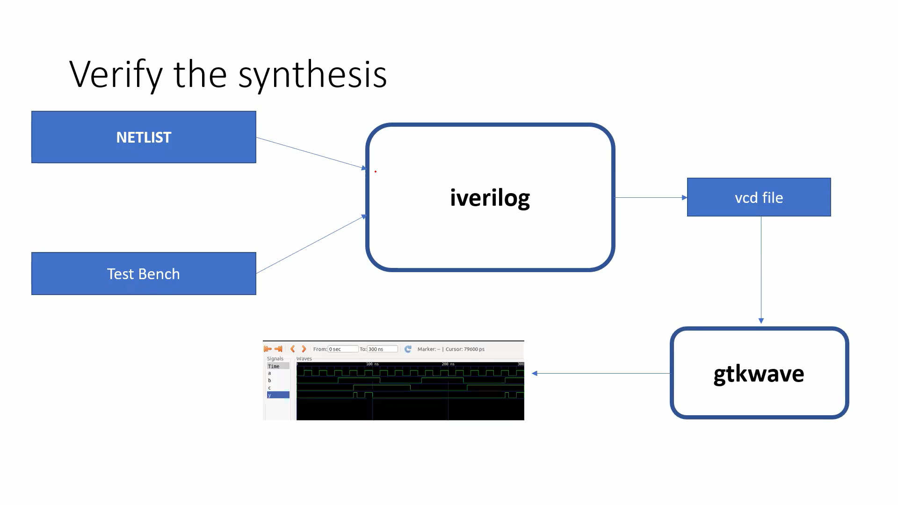

# Day 1: RTL Design and Simulation Workshop

---

## Table of Contents
- [Simulation](#simulation)
- [How a Simulator Works](#how-a-simulator-works)
- [Lab: Simulating a 2:1 MUX](#lab-simulating-a-21-mux)
- [Yosys: RTL to Netlist Synthesis](#yosys-rtl-to-netlist-synthesis)
- [Technology Library File](#technology-library-file)
- [Lab: Generating a Netlist for a 2:1 MUX](#lab-generating-a-netlist-for-a-21-mux)
- [Verification of the Netlist](#verification-of-the-netlist)
- [Summary – Day 1](#summary--day-1)

---

## Simulation

A **simulator** is a tool that verifies an **RTL design** by comparing it against a given **specification**.  
It uses a **testbench** to apply **stimulus** (test vectors) to the design and check if the output is correct.  

**Icarus Verilog (Iverilog)** is a commonly used simulation tool.

---

## How a Simulator Works

A simulator evaluates the **output** of a design **only when there is a change in the input**.  
If the input remains unchanged, the output is not re-evaluated.

**Simulation flow:**

Value Change Dump (VCD)
VCD is a file format that records changes in signal values over time, which can then be visualized using a waveform viewer like GTKWave.

---

## Lab: Simulating a 2:1 Mux
For this lab, we'll use a pre-existing repository for practice.

### Cloning the Repository
 

    git clone https://github.com/kunalg123/sky130RTLDesignAndSynthesisWorkshop.git

This command downloads the workshop files, including the Verilog files located in sky130RTLDesignAndSynthesisWorkshop/verilog_files.

### Simulating 2x1 Mux(good_mux.v)
1. Compilation: Compile the design and the testbench using iverilog.

        iverilog design.v test_bench.v

        iverilog good_mux.v tb_good_mux.v

   

3. Running the simulation: This command creates a VCD file.

        ./a.out

4. Visualizing the waveform: Open the VCD file with GTKWave to view the simulation results.

        gtkwave tb_good_mux.vcd

   

## Output WaveForm 

 

 ----

## Yosys: RTL to Netlist Synthesis

Yosys is a tool that converts an RTL design into a netlist. A netlist is a collection of logical gates from a given technology library.

### Yosys Workflow

---

## Technology Library File
A technology library is a collection of logical gate models with different characteristics, or "flavors." 
These variations can include:

Number of inputs: 1, 2, 3,...

Performance: Gates with different delays, optimized for slower (low power/area) or faster (high power/area) operation.

The synthesis tool chooses the appropriate gate based on the design's **"constraints"**, which define the required timing and performance targets.

---

## Lab: Generating a Netlist for a 2:1 Mux
To generate a netlist, follow these steps within the Yosys shell:

1. Start Yosys

        yosys

2. Read the Library File
This command loads the technology library.

        read_liberty -lib path_to_sky130_fd_sc_hd_tt_025c-1v80.lib

3. Read the Design File
This command loads your RTL design.

        read_verilog design.v(good_mux.v)

4. Synthesize the Module
This command synthesizes the specified top-level module into a generic netlist.

        synth -top module_name(good_mux)
   

   
6. Technology Mapping
This step maps the generic netlist to the specific gates available in the library.

        abc -liberty path_to_sky130_fd_sc_hd_tt_025c-1v80.lib

     

8. Visualize the Netlist
This command generates a visual representation of the synthesized netlist.

        show

  
  
  
---

## Netlist of 2x1 Mux:

## Verification of the Netlist
To verify that the synthesized netlist is functionally equivalent to the original RTL design, you can use the same testbench with the netlist. The waves generated should be identical.

### Netlist Verification Flow
* Verification ensures that the synthesized netlist behaves the same as the RTL.

* This is done by simulating the netlist with the same testbench used in RTL simulation.

* The waveforms are compared to confirm correctness.

---

## Summary – Day 1

 Learned how RTL designs are simulated with Icarus Verilog

   [] Generated and viewed waveforms in GTKWave
   
   [] Understood how Yosys synthesizes RTL into a gate-level netlist
   
   [] synthesized netlist against the original RTL design
