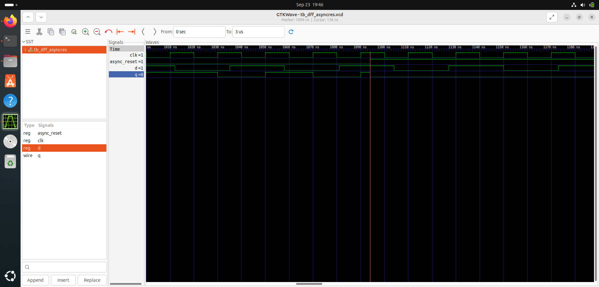
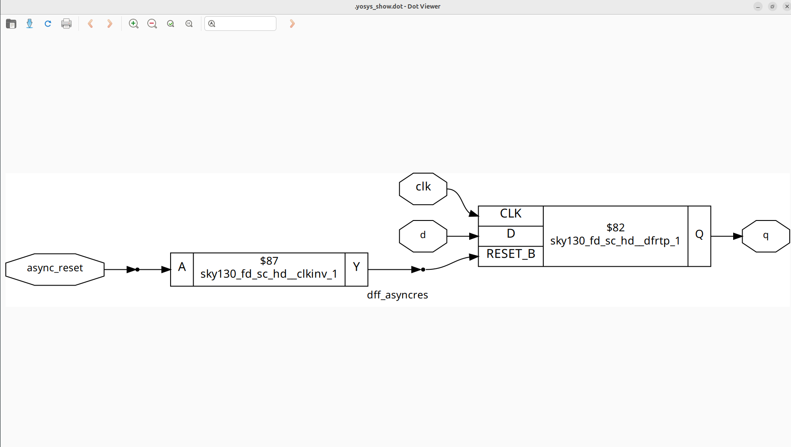
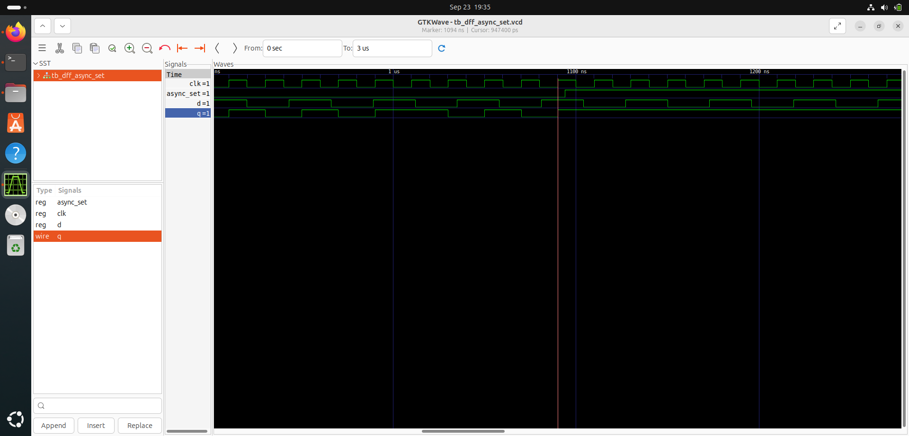
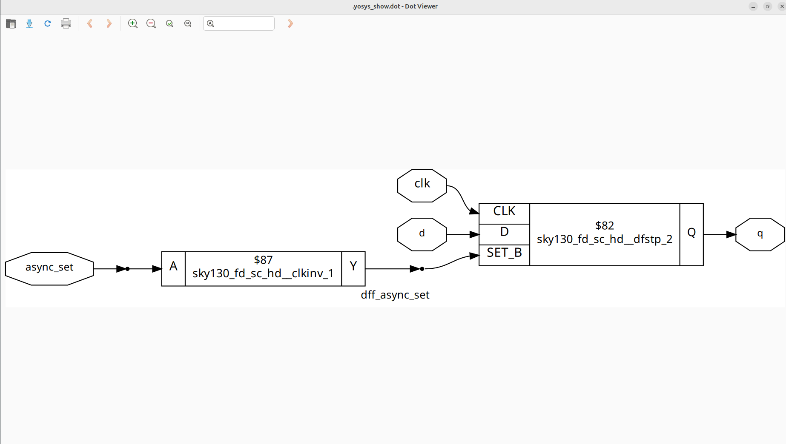
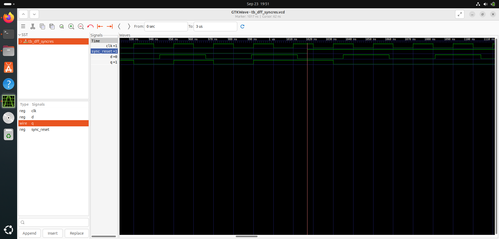
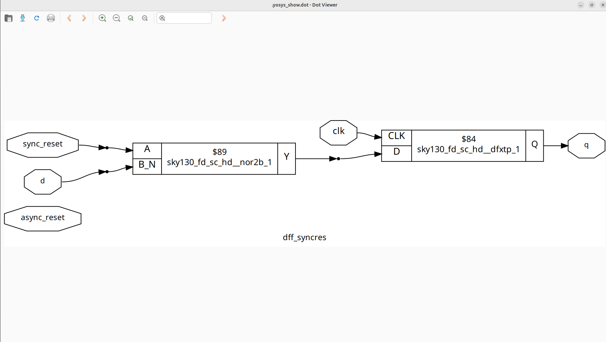
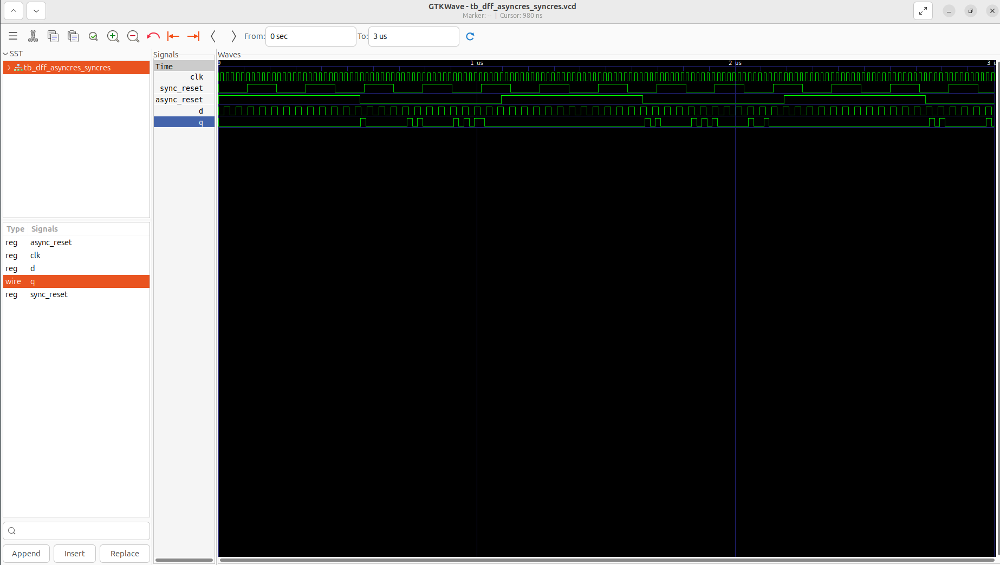
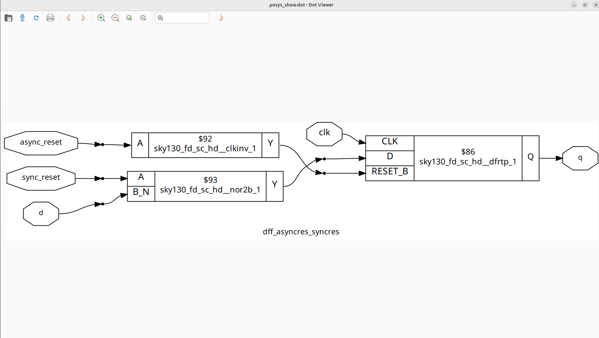
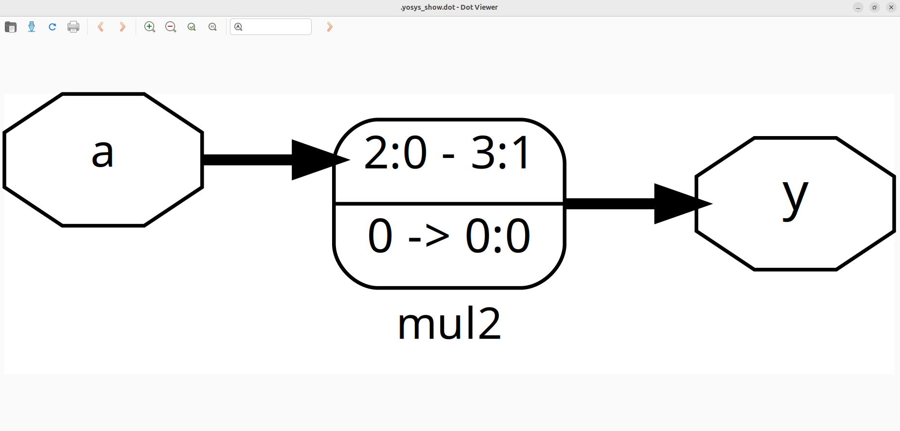
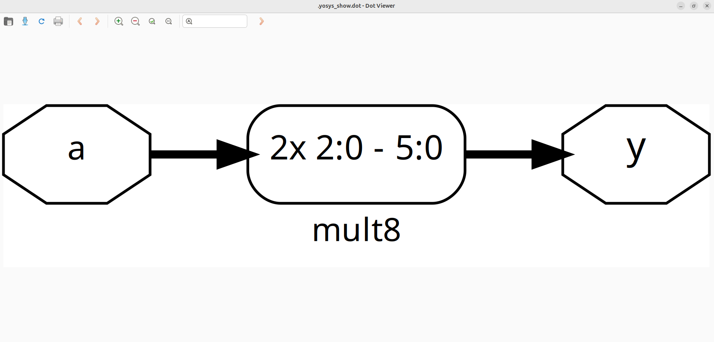

#  Week 1 – Day 2  

## Table of Contents:

- [Library File Overview](#library-file-overview)  
  - [Naming Convention](#-naming-convention)  
  - [Cell Variants](#-cell-variants)  
- [Hierarchical vs. Flat Synthesis](#hierarchical-vs-flat-synthesis)  
  - [Hierarchical Synthesis](#-hierarchical-synthesis)  
  - [Flat Synthesis](#-flat-synthesis)  
  - [Generating Flatten Netlist](#generating--flatten-netlist)  
- [Use of synth top module_name](#use-of-synth--top-modulename)  
- [Why Flip-Flop Coding Style](#why-flip--flop-coding-style)  
  - [Types of Flip-Flop](#types-of-flip-flop)  
  - [Asynchronous Reset / Set](#asynchronous-reset--set)  
  - [Synchronous Reset / Set](#synchronous-resetset)  
  - [Asynchronous + Synchronous Reset](#asynchronous-reset--synchronous-reset)  
- [Optimization - Multiplication](#optimization---multiplication)  
  - [Multiply by 2](#code)  
  - [Multiply by 9](#code-mul-by-9)  
- [Summary](#summary)  

___

## Library File Overview  

### The standard cell library used is:  
        sky130_fd_sc_hd_tt_025C-1v80

### 🔹 Naming Convention  
- **p → Process**  
- **v → Voltage**  
- **t → Temperature**  

Example:  
- `025C` → Temperature = 25°C  
- `1v80` → Voltage = 1.8V  
- `tt` → Typical process corner  

### 🔹 Cell Variants  
Within the library, there are multiple versions of the same logic gate with the same number of inputs but **different drive strengths (area vs. speed trade-off)**.  

Example:  
- `and2_0` → Small area, slower propagation  
- `and2_1` → Medium area/speed  
- `and2_2` → Larger area, faster propagation  

---

## Hierarchical vs. Flat Synthesis  

### 🔹 Hierarchical Synthesis  
- Uses a **divide-and-conquer** approach
- Each block/submodule is synthesized **individually**
- Makes the design easier to **manage, debug, and reuse**  
- Preserves design hierarchy in the synthesized netlist 

---

### 🔹 Flat Synthesis  
- Synthesizes the **entire design** as a single unit.  
- The tool **flattens all submodules** into the top-level design.  
- The final netlist contains **only one module** (top), with no hierarchy preserved.  
- Often results in **better optimization**, but harder to debug/manage.  

### Design Code:
    module sub_module2 (input a, input b, output y);
  	  assign y = a | b;
    endmodule
    
    module sub_module1 (input a, input b, output y);
    	assign y = a&b;
    endmodule

    module multiple_modules (input a, input b, input c , output y);
    	wire net1;
    	sub_module1 u1(.a(a),.b(b),.y(net1));  //net1 = a&b
    	sub_module2 u2(.a(net1),.b(c),.y(y));  //y = net1|c ,ie y = a&b + c;
    endmodule

--> Hierarchical Synthesis:

--> Flatten Synthesis:

### Generating  Flatten Netlist

1. Start Yosys

        yosys

2. Read the Library File
This command loads the technology library.

        read_liberty -lib path_to_sky130_fd_sc_hd_tt_025c-1v80.lib

3. Read the Design File
This command loads your RTL design.

        read_verilog design.v
4. Synthesize the Module
This command synthesizes the specified top-level module into a generic netlist.

        synth -top module_name
   
5. Flatten the netlist

        flatten

6. Technology Mapping
This step maps the generic netlist to the specific gates available in the library.

        abc -liberty path_to_sky130_fd_sc_hd_tt_025c-1v80.lib

7. Visualize the Optimized Netlist
This command generates a visual representation of the synthesized netlist.

        show  

---

**Why**? --> The flattened Netlist uses NAND Gate with inverted input in the place of the OR Gate 

In CMOS Technology the OR Gate Design contains stacked PMOS which is not efficient as PMOS has poor mobility (holes are majority carrier) and stacked connection will further decrease the mobility.

---

## Use of Synth -top module_name:
- If same module is instantiated multiple times then sub module Synthesis is preffered.

- Allows divide and conquer technique in logical Synthesis

---

## Why?? Flip & Flop Coding Style

        Glitch: 
        - A glitch is a short-time incorrect output in a circuit.
        - It happens because signals inside the circuit take different times to travel (time variations).
        - The output becomes correct after a moment, but for a very small duration, it shows the wrong value.

- To avoid this glitch flip flops are used in the circuits.

## Types of flip flop 
        1. Asynchronous Reset
        2. Asynchronous Set
        3. Synchronous Reset
        4. Synchronous Set
        5. Asynchronous Reset & Synchronous Reset

### Netlist Generation:

1. Start Yosys

        yosys

2. Read the Library File
This command loads the technology library.

        read_liberty -lib path_to_sky130_fd_sc_hd_tt_025c-1v80.lib

3. Read the Design File
This command loads your RTL design.

        read_verilog design.v
4. Synthesize the Module
This command synthesizes the specified top-level module into a generic netlist.

        synth -top module_name
   
5. DFF Library Mapping
Maps the flip-flops in the RTL design to the available flip-flops in the standard cell library during synthesis.

        dfflibmap -liberty path_to_sky130_fd_sc_hd_tt_025c-1v80.lib

6. Technology Mapping
This step maps the generic netlist to the specific gates available in the library.

        abc -liberty path_to_sky130_fd_sc_hd_tt_025c-1v80.lib

7. Visualize the Optimized Netlist
This command generates a visual representation of the synthesized netlist.

        show  

### Asynchronous Reset / Set

- In this type of flip flops output can change immediately in response to reset/set indpendent of clock signal.Reset has more priority that the edge of the clock in Asynchronous type dff.

### Code (Reset):
        module dff_asyncres ( input clk ,  input async_reset , input d , output reg q );
        always @ (posedge clk , posedge async_reset)
                begin
                        if(async_reset)
                                q <= 1'b0;
                        else	
                                q <= d;
                end
        endmodule

### Waveform

-when reset is high immediately the output becomes logic 0 even the clock is in positive level.

### Netlist

### Code (Set):

        module dff_async_set ( input clk ,  input async_set , input d , output reg q );
        always @ (posedge clk , posedge async_set)
        begin
                if(async_set)
                        q <= 1'b1;
                else	
                        q <= d;
        end
        endmodule
### Waveform

### Netlist

---

### Synchronous Reset/Set

- In Synchronous time of flip flops where the register/flip flop will get reset/set in the posedge of clock when the reset/set is triggered.It prevents from time hazards and glitches.

### Code(Reset):

        module dff_syncres ( input clk , input async_reset , input sync_reset , input d , output reg q );
        always @ (posedge clk )
        begin
                if (sync_reset)
                        q <= 1'b0;
                else	
                        q <= d;
        end
        endmodule

### Waveform

- when the reset get triggered but the output is affected at the positive edge of the clock

### Netlist:

---

### Asynchronous Reset & Synchronous Reset

### Code:

        module dff_asyncres_syncres ( input clk , input async_reset , input sync_reset , input d , output reg q );
        always @ (posedge clk , posedge async_reset)
        begin
                if(async_reset)
                        q <= 1'b0;
                else if (sync_reset)
                        q <= 1'b0;
                else	
                        q <= d;
        end
        endmodule

### Waveform:

### Netlist:

## Optimization - Multiplication:

### Code:

        module mul2 (input [2:0] a, output [3:0] y);
                assign y = a * 2;
        endmodule
- when a number is multipled by 2^n then the output will be the left shift of that number n times(<<n)

- So, in this case multiplied by 2^1 so the number should left shifted 1 and the y[0] must 0.

### Netlist:

### Code (Mul by 9):

        module mult8 (input [2:0] a , output [5:0] y);
                assign y = a * 9;
        endmodule

a*9 = a*(8+1) = (a*8)+(a*1) 

(a*8)+(a*1) =(a*8)+a = (a*(2^3))+a

(a*(2^3))+a=(a<<3)+a

y[5:0]={a,3'b00}(shifted)+{a}

y[5:0]={a,a}

### Netlist:

---

## Summary  

- **Library File:** The `sky130_fd_sc_hd_tt_025C-1v80` library provides standard cells with multiple drive strengths and defined PVT conditions.  
- **Synthesis Styles:**  
  - *Hierarchical synthesis* preserves design hierarchy, supports modularity, and ease of debugging.  
  - *Flat synthesis* removes hierarchy, enabling better optimization but making debugging harder.  
- **Yosys Commands:** Key commands include `read_liberty`, `read_verilog`, `synth`, `flatten`, `abc`, `dfflibmap`, and `show`.  
- **Flip-Flops:** Explored various styles (async/sync set/reset) with corresponding code, waveforms, and netlists. Flip-flops are crucial for avoiding glitches and ensuring timing correctness.  
- **Optimization:** Multiplication by constants can be simplified into shift-and-add operations (e.g., `*2` → left shift, `*9` → shift + add), reducing hardware complexity.  

