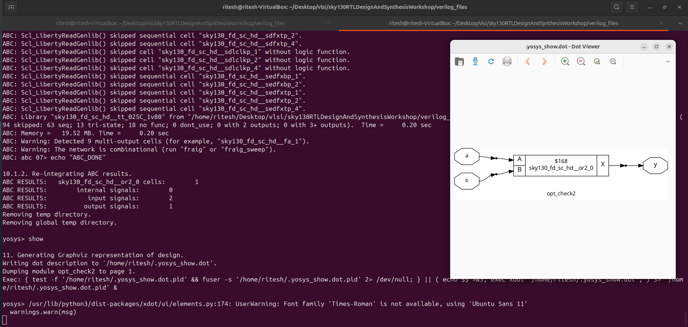
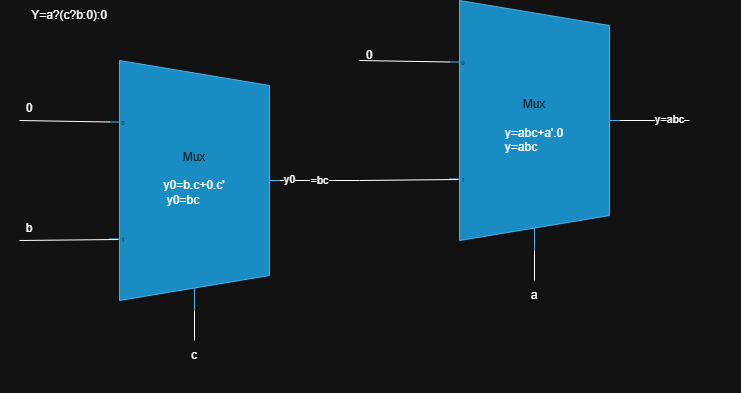
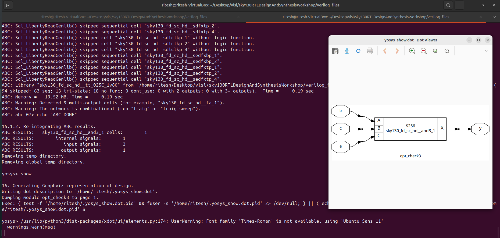
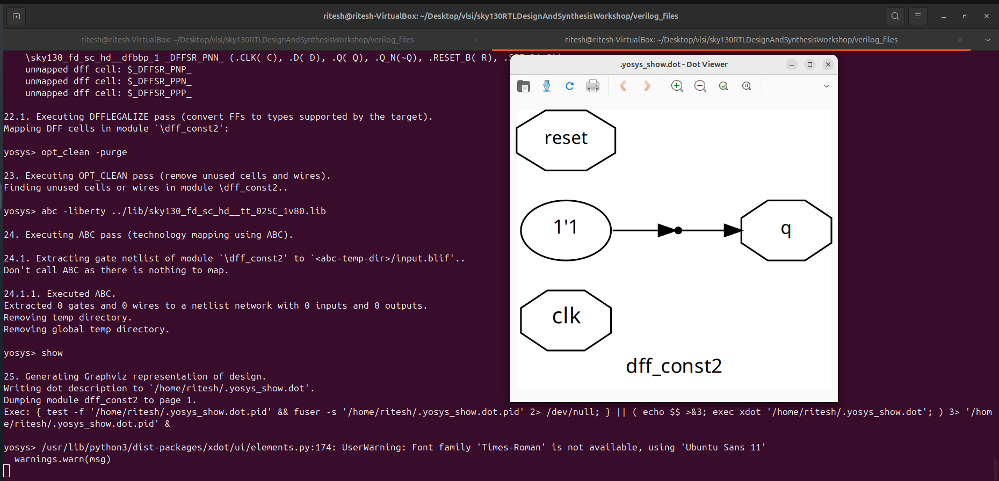

# Introduction to Optimization

         i) Combinational Logic Optimization
        ii) Sequential Logic Optimization

## Combinational Logic Optimization

- The process of reducing the number of logic gates and the number of inputs to those gates in a circuit

### Methods :
- Constant Propogation
- Boolean Logic Optimization
 

### Constant Propogation:-

Process of Replacing a constant value(0/1) to the variable 

Example: y=(a+(bc)+(da))'  (CMOS Logic - 10 Mos used)

- if a=gnd (logic 0)

-  y=bc' (CMOS Logic - 4 Mos used)

### Boolean Logic Optimization:-

The boolean expression is optimized using K-Map,Quine–McCluskey etc...

Example: 

        Y=a?(b?(a&c):c):(!c) is optimized as y=ac+a'c' 

---

## Sequential Logic Optimization:

### Methods-

        1. Basic - Sequential Constant Propogation
        2. Advances - state Optimization, Retiming, Sequential Logic Clonning
### Sequential Constant :-

When a ouput of a block is constant value(0/1) independent of the change in inputs of the circuit then the ouput is sequential constant 

#### Example:

The output from the flip flop will be always 0.

The expression y becomes  y=0.a' -> y=0' -> y=1(always) ---> Sequential Constant

#### Example (not sequential constant):

in this the output of Flip Fliup depends on the set . If set=1 then the output q immediately (asynchronous set) becomes one.But when the set=0 it waits for posedge to follow the d (0) to output. So we can describe y=set -->(Wrong). 

---

## Advanced Optimization:

### State Optimization : 
- reducing number of states in fsm to improve the harware implementations

### Clonning:      
-  When a single gate's output is connected to the inputs of many other gates (a high fanout), it can cause a significant signal delay . To reduce this identical copy of that gate/ff is created and divided among the multiple gates/ff.

### Retiming:
-  It is a technique in digital circuit design that moves registers (flip-flops) across combinational logic to reduce the clock cycle time.

---

## Combinational Optimization:

### command to perform optimization
        opt_clean -purge

### Generating Optimized Netlist

1.. Start Yosys

        yosys

2. Read the Library File
This command loads the technology library.

        read_liberty -lib path_to_sky130_fd_sc_hd_tt_025c-1v80.lib

3. Read the Design File
This command loads your RTL design.

        read_verilog design.v
4. Synthesize the Module
This command synthesizes the specified top-level module into a generic netlist.

        synth -top module_name
   
5. Logical Function Optimization
Optimizes the design by removing redundant logic and simplifying logical functions for a minimal implementation

        opt_clean - purge
  
6. Technology Mapping
This step maps the generic netlist to the specific gates available in the library.

        abc -liberty path_to_sky130_fd_sc_hd_tt_025c-1v80.lib

7. Visualize the Optimized Netlist
This command generates a visual representation of the synthesized netlist.

        show  

## Examples (Lab):

### Rtl code:

    module opt_check(input a,input b,output y);
        assign y=a?b:0;
    endmodule

### Optimization :

### Netlist 

---
### Rtl code:

    module opt_check2 (input a , input b , output y);
	    assign y = a?1:b;
    endmodule

### Optimization :

### Netlist 

---

### Rtl code:

    module opt_check3 (input a , input b, input c , output y);
	    assign y = a?(c?b:0):0;
    endmodule

### Optimization :

### Netlist 

---

### Rtl code:

    module opt_check4 (input a , input b , input c , output y);
        assign y = a?(b?(a & c ):c):(!c);
    endmodule

### Optimization :

### Netlist 

---

### Mutliple Module:

	command : flatten

	this command is used in between syth -top and abc-liberty as same as procedure in (#Generating Optimized Netlist)

	
### RTL Code:
    module sub_module1(input a , input b , output y);
        assign y = a & b;
    endmodule

    module sub_module2(input a , input b , output y);
        assign y = a^b;
    endmodule

    module multiple_module_opt(input a , input b , input c , input d , output y);
    wire n1,n2,n3;

    sub_module1 U1 (.a(a) , .b(1'b1) , .y(n1));
    sub_module2 U2 (.a(n1), .b(1'b0) , .y(n2));
    sub_module2 U3 (.a(b), .b(d) , .y(n3));

    assign y = c | (b & n1); 

    endmodule

### Netlist 

---

---
## Sequential Optimization

### Rtl code:

    module dff_const1(input clk, input reset, output reg q);
    always @(posedge clk, posedge reset)
    begin
        if(reset)
            q <= 1'b0;
        else
            q <= 1'b1;
    end

    endmodule

### Netlist 

   

---
### Rtl code:

    module dff_const2(input clk, input reset, output reg q);
    always @(posedge clk, posedge reset)
    begin
        if(reset)
            q <= 1'b1;
        else
            q <= 1'b1;
    end

    endmodule

### Netlist 

   

---
### Rtl code:
    module dff_const3(input clk, input reset, output reg q);
    reg q1;

    always @(posedge clk, posedge reset)
    begin
        if(reset)
        begin
            q <= 1'b1;
            q1 <= 1'b0;
        end
        else
        begin
            q1 <= 1'b1;
            q <= q1;
        end
    end

    endmodule

### Netlist 

  

---
### Rtl code:
    module dff_const4(input clk, input reset, output reg q);
    reg q1;

    always @(posedge clk, posedge reset)
    begin
        if(reset)
        begin
            q <= 1'b1;
            q1 <= 1'b1;
        end
        else
        begin
            q1 <= 1'b1;
            q <= q1;
        end
    end

    endmodule
### Netlist 

   

---
### Rtl code:

    module dff_const5(input clk, input reset, output reg q);
    reg q1;

    always @(posedge clk, posedge reset)
    begin
        if(reset)
        begin
            q <= 1'b0;
            q1 <= 1'b0;
        end
        else
        begin
            q1 <= 1'b1;
            q <= q1;
        end
    end

    endmodule

### Netlist 

   

---
## Counter Example 
### Rtl code:

    module counter_opt (input clk , input reset , output q);
    reg [2:0] count;
    assign q = count[0];

    always @(posedge clk ,posedge reset)
    begin
        if(reset)
            count <= 3'b000;
        else
            count <= count + 1;
    end

    endmodule
### Netlist 

   

---
### Rtl code:

    module counter_opt (input clk , input reset , output q);
    reg [2:0] count;
    assign q = (count[2:0] == 3'b100);

    always @(posedge clk ,posedge reset)
    begin
        if(reset)
            count <= 3'b000;
        else
            count <= count + 1;
    end

    endmodule

### Netlist 

   

---

