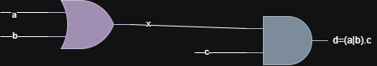

# Day - 4: Gate Level Simulation (GLS)

## Introduction

This document covers **Gate Level Simulation (GLS)**, a crucial step in verifying synthesized RTL designs.  
GLS ensures that the netlist generated from RTL behaves correctly both logically and in terms of timing.  
We also explore common mistakes like **blocking vs non-blocking statements**, sensitivity list issues, and how synthesis tools handle them.

---

## Table of Contents

1. [Introduction to GLS](#introduction-to-gate-level-simulation-gls)  
2. [Why GLS?](#why-gls)  
3. [GLS Workflow](#gls-workflow)  
4. [Example of GLS](#example-of-gls)  
5. [Why Verification is Still Needed](#why-verification-is-still-needed)  
6. [Blocking and Non-Blocking Statements](#blocking-and-non-blocking-statements)  
7. [Summary](#summary)

---

## Introduction to Gate Level Simulation (GLS)  

Gate Level Simulation (GLS) is the process of simulating the **netlist** that is created by synthesizing the RTL code using a testbench.  

- The netlist is **logically equivalent** to the RTL code, so the same testbench can be reused.  

### Why GLS?  
- To verify the **logical correctness** after synthesis of RTL into a netlist.  
- In case of timing circuits, to ensure that the **timing goals of the design are met**.  

### GLS Workflow  
  

---

## Example of GLS  

## RTL expression:  

    assign y = (a | b) & c;

### Equivalent netlist:

    or  u_or  (.a(a), .b(b), .y(i));
    and u_and (.a(i), .b(c), .y(y));

- or and and are gates, and this information is provided by the gate-level model.

### Gate Level Models

- Timing-Aware Model → Verifies both functionality and timing.

- Functional Model → Verifies only the functionality.

---

### Why Verification is Still Needed?

Even though the netlist is logically equivalent to the RTL, verification is done because there can be synthesis and simulation mismatches.

## Synthesis and Simulation Mismatch

### Missing sensitivity list:
The simulator works only on activity (i.e., changes in input signals).

**Example** :

    module bad_mux (input i0 , input i1 , input sel , output reg y);
    always @ (sel)
    begin
        if(sel)
            y <= i1;
        else 
            y <= i0;
    end
    endmodule

### Output Wave

- The select line is 0 till the marked block.For an actual 2x1 mux  the output should follow the i0 but but it evaluates outupt at the instant when that select line (sel) changes. 

- But actually the always block should entered whenever any of the input signal changes (always @(*))

### After Synthesis of Code:

-This error is got corrected at the synthesis (depends on synthesis tool and library) .

### Netlist

---

### Blocking and Non-Blocking Statements

- Blocking: Executes the given statements one by one, in order.

- Non-Blocking: Executes all the right-hand side expressions first, then assigns them to the left-hand side.

### Example:

**Expected Logic:**

- d=(a|b).c

    module blocking_caveat (input a , input b , input  c, output reg d); 
        reg x;
        always @ (*)
        begin
            d = x & c;
            x = a | b;
        end
    endmodule

### Output waveform:

    a=0 ; b=0; c=1; Output Got d=1 
    
    (a|b).c -> (0|0).1 -> 0.1 -> 0 (Expected)

- blocking statment is used inside always modeule,which Executes expression one by one 
-  (i.e) d=x&c , where x=(a|b)(previous) so d=(previous state)x&(current)c. The output will be wrong.
- later only x is eqauated withe present(a|b)

### Synthesised Output :

### Netlist

- Non-blocking statements are always used in sequential circuits.

 --- 

 ## Summary

- **Gate Level Simulation (GLS)** verifies the logical correctness and timing of the netlist generated from RTL.  
- The **netlist** is logically equivalent to RTL, but verification ensures there are no synthesis-simulation mismatches.  
- Common mismatches can occur due to **missing sensitivity lists** in `always` blocks.  
- **Blocking statements** execute sequentially, which may lead to incorrect results if used in sequential logic.  
- **Non-blocking statements** execute all right-hand side assignments first, then update left-hand side, making them suitable for sequential circuits.  
- Waveform analysis and netlist inspection help verify that the synthesized design behaves as intended.  
