# Day 5

## IF Statement :
- It is a priority based logic ,checks the conditon one by one in order if one satsifies the if block gets terminates and come end of if block.

        if <cond1> 
        ...
        c1
        ...
        else if<cond2>
        ...
        c2
        ...
        else if <cond3>
        ...
        c3
        ...
        else
        ...
        e
        ...

-This Block can be represented as 
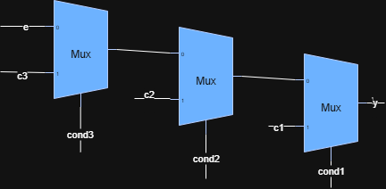

##Caution of If Satatement 
### Inferred Latch

-This inferred latch occurs when there is missing of condition in if statement which occurs.

### Example1(Lab):

Rtl Code:

    module incomp_if (input i0 , input i1 , input i2 , output reg y);
    always @ (*)
    begin
        if(i0)
            y <= i1;
    end
    endmodule

### Gtk_Wave(incomp_if):

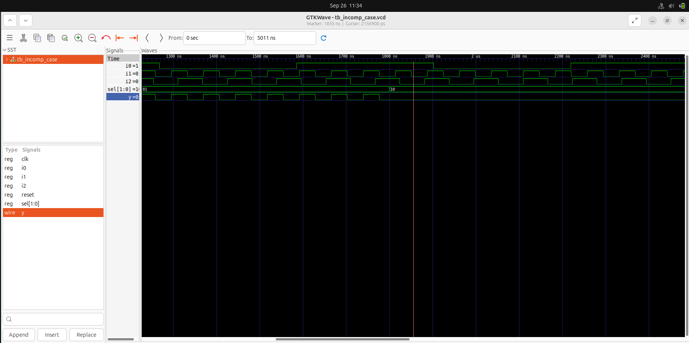

- when i0=0 the wave will be constant output of previous value which will include a latch in the circuit.

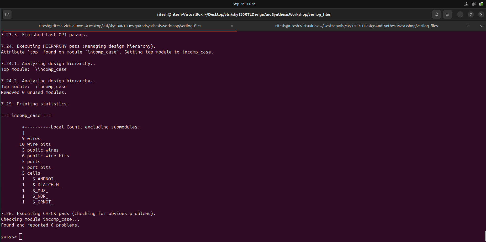

-from this we can see that d latch is included in the netlist.

### Netlist:

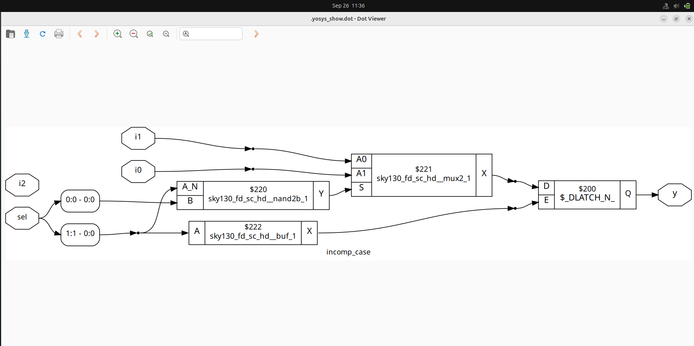

---

### Example2(Lab):

Rtl Code:

    
    module incomp_if2 (input i0 , input i1 , input i2 , input i3, output reg y);
    always @ (*)
    begin
        if(i0)
            y <= i1;
        else if (i2)
            y <= i3;

    end
    endmodule
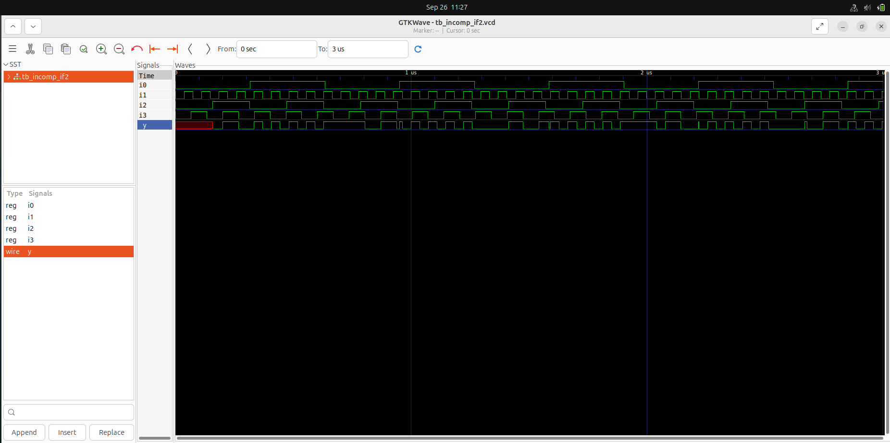

### Gtk_Wave(incomp_if2):

---

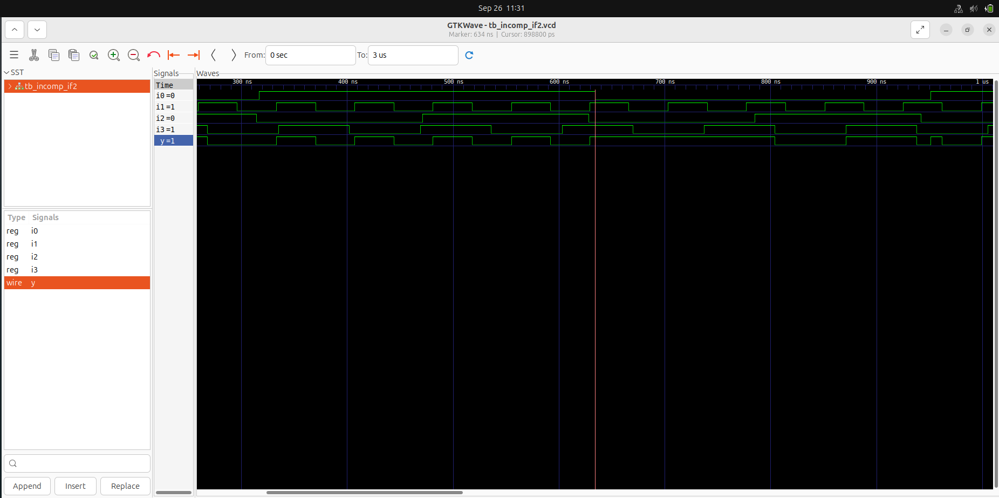

- when i0==0 or i2==0 the wave will be constant output of previous value which will include a latch in the circuit.

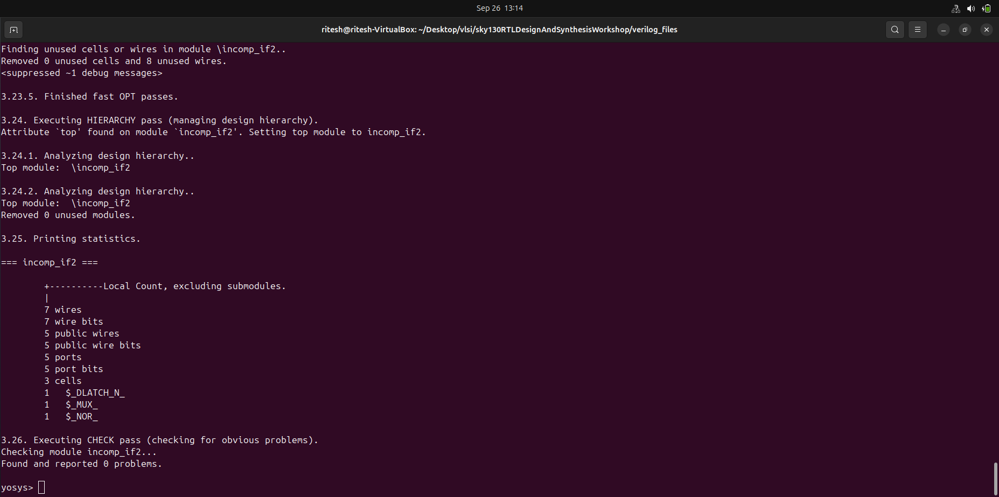

-from this we can see that d latch is included in the netlist.

### Netlist:

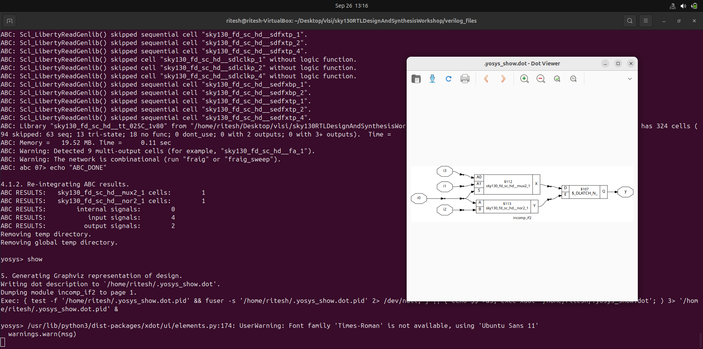

---

---

-Counter shoulde contain inferred latch because of the principle of counter as it should increment from previous value so, in that case it is good to have inferred latch.

**Note**:
- whatever the statementassignes inside if/case satement must be of reg variable.

## Case Statement:
- In Verilog, a case statement is used for multi-way branching based on an expression.
- It checks all conditions one by one, and even if one matches, it continues checking the next conditions.

### Limitations

### 1. Inferred Latch:
- This arises due to the missing of conditon inside case statement which occurs then the circuit will use previous output for that case. So, Latch is used to store the previous Output.

### Example1(lab):

Code:

    module incomp_case (input i0 , input i1 , input i2 , input [1:0] sel, output reg y);
    always @ (*)
    begin
        case(sel)
            2'b00 : y = i0;
            2'b01 : y = i1;
        endcase
    end
    endmodule

Gtk_wave:

    

- when sel=2'b10 the output y goes to contsant value of previous output.So, latch is invoked at the circuit.

    

- when sel=2'b11 the output y goes to contsant value of previous output.So, latch is invoked at the circuit.

[Synthesis Details](img/incomp_case_synth.png)

- in this d-latch is used

### Netlist:

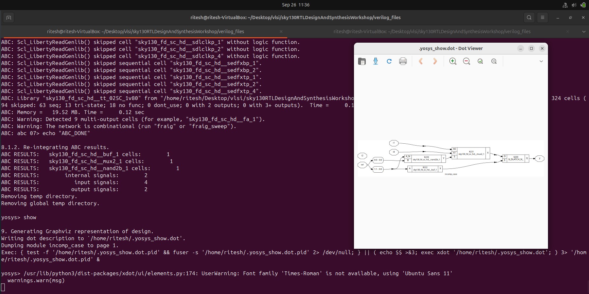

---

### Example2(lab):

Code:

    module comp_case (input i0 , input i1 , input i2 , input [1:0] sel, output reg y);
    always @ (*)
    begin
        case(sel)
            2'b00 : y = i0;
            2'b01 : y = i1;
            default : y = i2;
        endcase
    end
    endmodule

Gtk_wave:

    

- when sel=2'b11 the output y goes to contsant value of previous output.So, latch is invoked at the circuit.

[Synthesis Details](img/incomp_case_synth.png)

- in this d-latch is used

### Netlist:

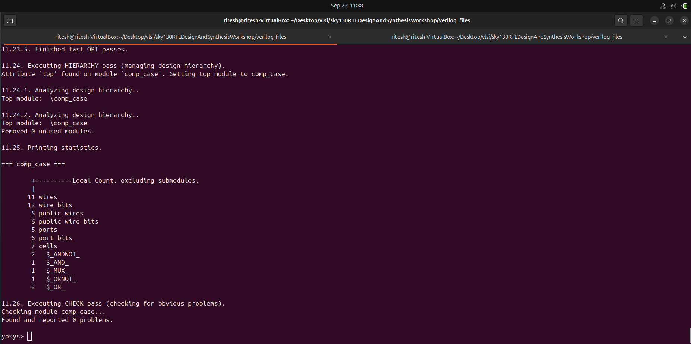

### Logic 

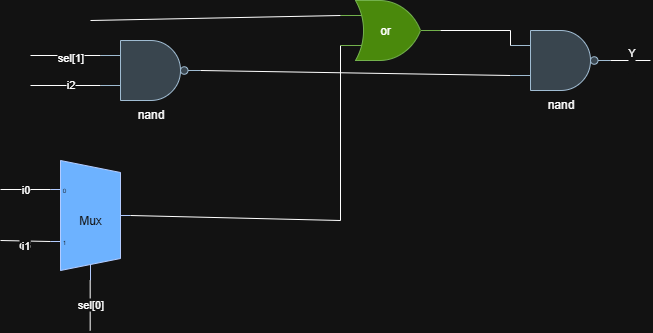

---

### 2. Partial Assignment:
- This arises due to the missing assignment of input signal to output.

### Example(lab):

Code:

    module partial_case_assign (input i0 , input i1 , input i2 , input [1:0] sel, output reg y , output reg x);
    always @ (*)
    begin
        case(sel)
            2'b00 : begin
                y = i0;
                x = i2;
                end
            2'b01 : y = i1;
            default : begin
                    x = i1;
                y = i2;
                end
        endcase
    end
    endmodule

Gtk_wave:

    

- when sel=2'b01 the x goes to contsant value of previous output.

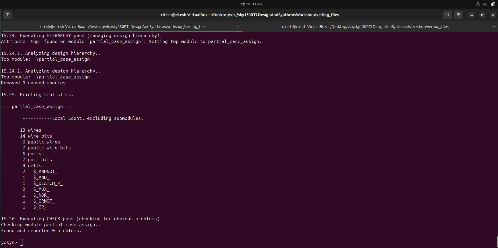

### Netlist:

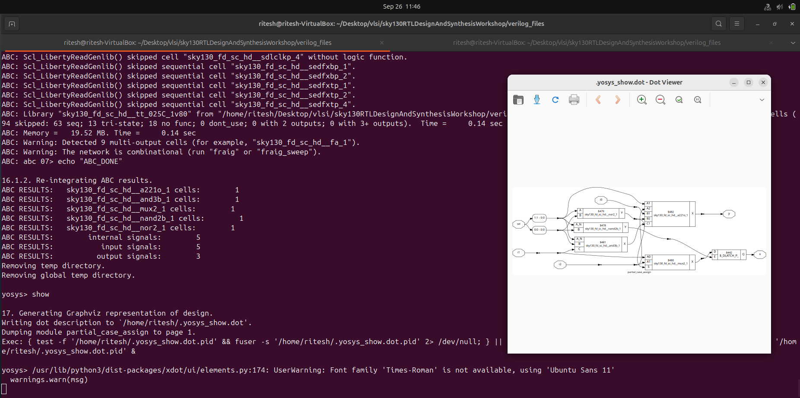

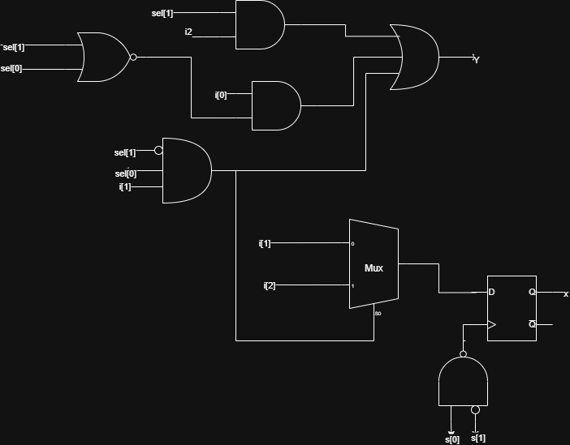
---

### 3. Overlapping Case:
- This arises due to the overlaping of case conditons that is if multiple case block conditons are true then it get colapsed.

### Example1(lab):

Code:

    module bad_case (input i0 , input i1, input i2, input i3 , input [1:0] sel, output reg y);
    always @(*)
    begin
        case(sel)
            2'b00: y = i0;
            2'b01: y = i1;
            2'b10: y = i2;
            2'b1?: y = i3;
            //2'b11: y = i3;
        endcase
    end

    endmodule

Gtk_wave:

    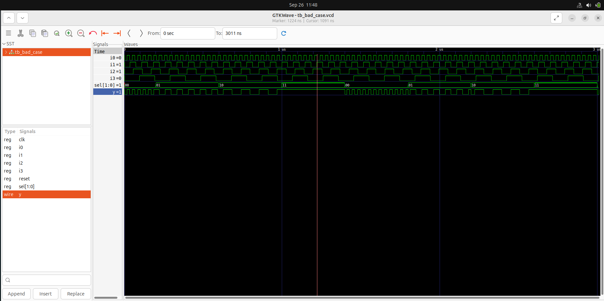

- here sel=2'b11 the output y goes to contsant value 1 because of mutliple case condition are true.

### Code get Synthesised

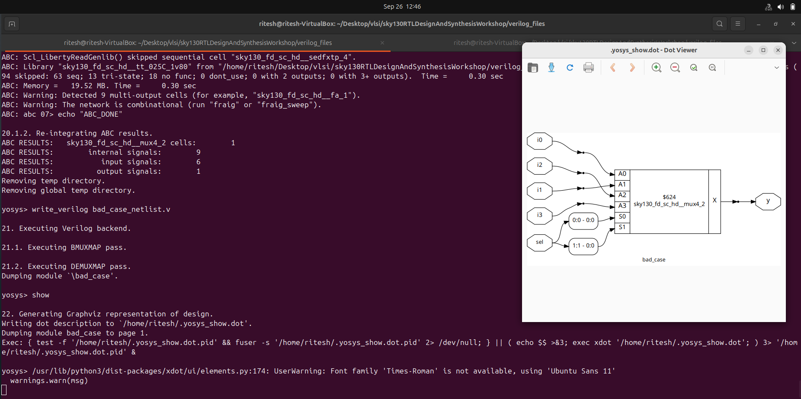

- in this d-latch is used

### Netlist:

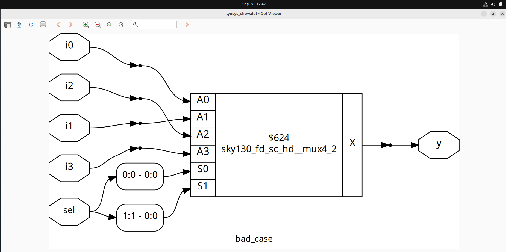

### After Synthesis (Gtk Wave Form):

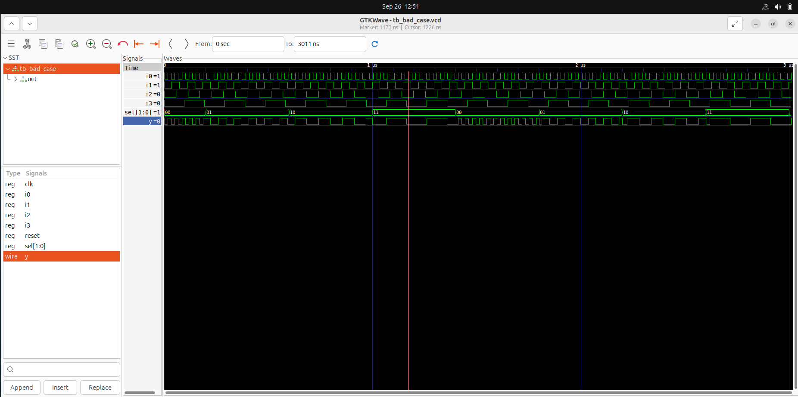

---

## Looping Constructs:

    1. For Loop
    2. Generate For Loop

### For Loop:
- It is used inside a always block used for evaluation of expression.

Example: 
- In case of mux it can be implemented using case block but when the mux comes to wide range (i.e 32x1,64x1...) then writing mulitple case lines is diffcult.

- So, **for loop** is used in which very less number of line is used to write the functionality of wide mux/demux.

### 1. Mux Using For Loop:

        module mux_generate (input i0 , input i1, input i2 , input i3 , input [1:0] sel  , output reg y);
            wire [3:0] i_int;
            assign i_int = {i3,i2,i1,i0};
            integer k;
            always @ (*)
            begin
            for(k = 0; k < 4; k=k+1) begin
                if(k == sel)
                    y = i_int[k];
            end
            end
        endmodule

- for loop is interated for no of inputs (n) times when select line matches with the k then it is assigned to output.

### Mux_Output_Wave:

- output shows the actual fucnitonality 4X1 Mux

### Synthesis:

### Netlist

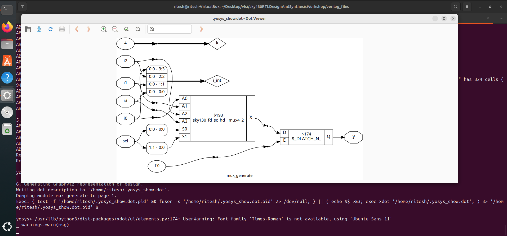

### Output_Wave (Synthesis):

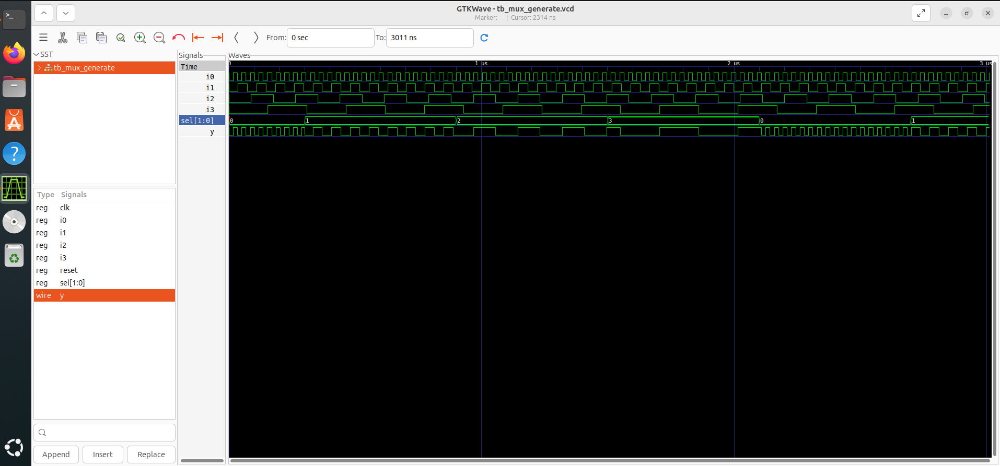

---

### 2. Demux

2.1 demux using case:

### Code:

        module demux_case (output o0 , output o1, output o2 , output o3, output o4, output o5, output o6 , output o7 , input [2:0] sel  , input i);
            reg [7:0]y_int;
            assign {o7,o6,o5,o4,o3,o2,o1,o0} = y_int;
            integer k;
            always @ (*)
            begin
            y_int = 8'b0;
                case(sel)
                    3'b000 : y_int[0] = i;
                    3'b001 : y_int[1] = i;
                    3'b010 : y_int[2] = i;
                    3'b011 : y_int[3] = i;
                    3'b100 : y_int[4] = i;
                    3'b101 : y_int[5] = i;
                    3'b110 : y_int[6] = i;
                    3'b111 : y_int[7] = i;
                endcase

            end
        endmodule

- the demux is implementes using case , if the mux is wide then is is not efficient to write multiple lines

### Demux_Output_Wave:

### Synthesis:

### Netlist

### Demux Using for loop:

        
    module demux_generate (output o0 , output o1, output o2 , output o3, output o4, output o5, output o6 , output o7 , input [2:0] sel  , input i);
        reg [7:0]y_int;
        assign {o7,o6,o5,o4,o3,o2,o1,o0} = y_int;
        integer k;
        always @ (*)
        begin
        y_int = 8'b0;
        for(k = 0; k < 8; k++) begin
            if(k == sel)
                y_int[k] = i;
        end
        end
    endmodule

- this is same demux which is implemented using case block ,but the number of line used is less compared to that.So, for loop is prefered for design of mux/demux etc...

### Demux_Output_Wave:

### Netlist

### Demux_Output_Wave (Synthesis):

---

## For Generate:

- It is declared outside always block.It is used for multiple instantion of hardware module.

- replication of hardware

### Example(Ripple Carry Adder)
- A ripple carry adder performs binary addition by passing the carry output of each bit addition into the next higher bit.

- The carries “ripple” through all stages, making the addition process sequential.

### Code:

    module rca (input [7:0] num1 , input [7:0] num2 , output [8:0] sum);
        wire [7:0] int_sum;
        wire [7:0]int_co;

        genvar i;
        generate
            for (i = 1 ; i < 8; i=i+1) begin
                fa u_fa_1 (.a(num1[i]),.b(num2[i]),.c(int_co[i-1]),.co(int_co[i]),.sum(int_sum[i]));
            end

        endgenerate
        fa u_fa_0 (.a(num1[0]),.b(num2[0]),.c(1'b0),.co(int_co[0]),.sum(int_sum[0]));

        assign sum[7:0] = int_sum;
        assign sum[8] = int_co[7];
    endmodule

    module fa (input a , input b , input c, output co , output sum);
	    assign {co,sum}  = a + b + c ;
    endmodule

- fa(full adder) module is instantiated mulitple times using for loop.
- In rca the first carry should be low(0) show the first bit is assigned sperately outside the for and other than that is instatiated inside generate for block.

### Rca_Output_Wave:

### Synthesis:

### Netlist:

### Gls:

- writing netlist file 

- generating output wave of synthesised rca

### RCA_Waveform:
!()[lib/rca_wave_synth.png]

---

