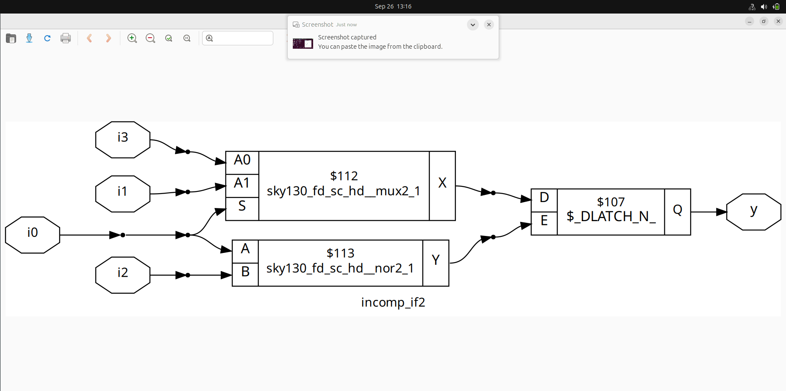

# Day 5

## IF Statement :
- It is a priority based logic ,checks the conditon one by one in order if one satsifies the if block gets terminates and come end of if block.

        if <cond1> 
        ...
        c1
        ...
        else if<cond2>
        ...
        c2
        ...
        else if <cond3>
        ...
        c3
        ...
        else
        ...
        e
        ...

-This Block can be represented as 

##Caution of If Satatement 
### Inferred Latch

-This inferred latch occurs when there is missing of condition in if statement which occurs.

### Example1(Lab):

Rtl Code:

    module incomp_if (input i0 , input i1 , input i2 , output reg y);
    always @ (*)
    begin
        if(i0)
            y <= i1;
    end
    endmodule

### Gtk_Wave(incomp_if):

- when i0=0 the wave will be constant output of previous value which will include a latch in the circuit.

-from this we can see that d latch is included in the netlist.

### Netlist:

---

### Example2(Lab):

Rtl Code:

    
    module incomp_if2 (input i0 , input i1 , input i2 , input i3, output reg y);
    always @ (*)
    begin
        if(i0)
            y <= i1;
        else if (i2)
            y <= i3;

    end
    endmodule

### Gtk_Wave(incomp_if2):

---

- when i0==0 or i2==0 the wave will be constant output of previous value which will include a latch in the circuit.

-from this we can see that d latch is included in the netlist.

### Netlist:

---

---

-Counter shoulde contain inferred latch because of the principle of counter as it should increment from previous value so, in that case it is good to have inferred latch.

**Note**:
- whatever the statementassignes inside if/case satement must be of reg variable.

## Case Statement:
- In Verilog, a case statement is used for multi-way branching based on an expression.
- It checks all conditions one by one, and even if one matches, it continues checking the next conditions.

### Limitations

### 1. Inferred Latch:
- This arises due to the missing of conditon inside case statement which occurs then the circuit will use previous output for that case. So, Latch is used to store the previous Output.

### Example1(lab):

Code:

    module incomp_case (input i0 , input i1 , input i2 , input [1:0] sel, output reg y);
    always @ (*)
    begin
        case(sel)
            2'b00 : y = i0;
            2'b01 : y = i1;
        endcase
    end
    endmodule

Gtk_wave:

    

- when sel=2'b10 the output y goes to contsant value of previous output.So, latch is invoked at the circuit.

    

- when sel=2'b11 the output y goes to contsant value of previous output.So, latch is invoked at the circuit.

[Synthesis Details](img/incomp_case_synth.png)

- in this d-latch is used

### Netlist:

---

### 2. Partial Assignment:
- This arises due to the missing assignment of input signal to output.

### Example(lab):

Code:

    module partial_case_assign (input i0 , input i1 , input i2 , input [1:0] sel, output reg y , output reg x);
    always @ (*)
    begin
        case(sel)
            2'b00 : begin
                y = i0;
                x = i2;
                end
            2'b01 : y = i1;
            default : begin
                    x = i1;
                y = i2;
                end
        endcase
    end
    endmodule

Gtk_wave:

    

- when sel=2'b01 the x goes to contsant value of previous output.

### Netlist:

---

### 3. Overlapping Case:
- This arises due to the overlaping of case conditons that is if multiple case block conditons are true then it get colapsed.

### Example1(lab):

Code:

    module bad_case (input i0 , input i1, input i2, input i3 , input [1:0] sel, output reg y);
    always @(*)
    begin
        case(sel)
            2'b00: y = i0;
            2'b01: y = i1;
            2'b10: y = i2;
            2'b1?: y = i3;
            //2'b11: y = i3;
        endcase
    end

    endmodule

Gtk_wave:

    

- here sel=2'b11 the output y goes to contsant value 1 because of mutliple case condition are true.

### Code get Synthesised

- in this d-latch is used

### Netlist:

### After Synthesis (Gtk Wave Form):

---

