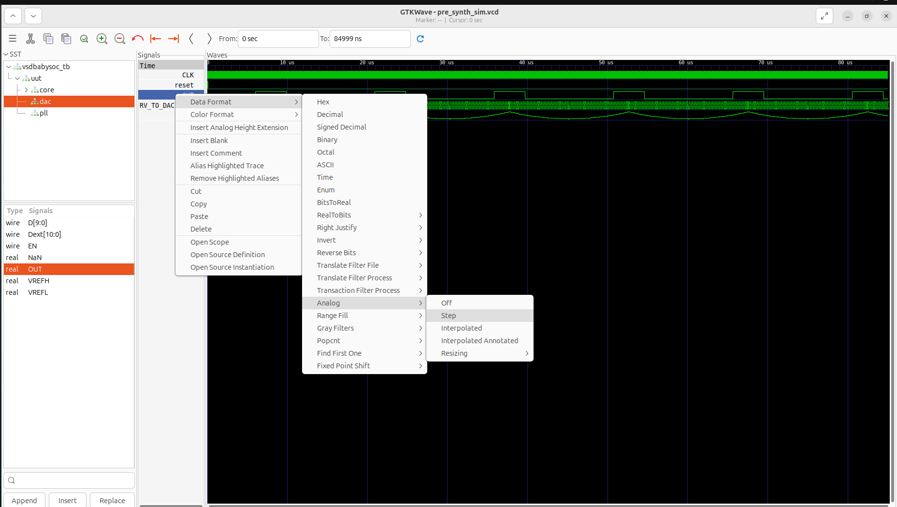
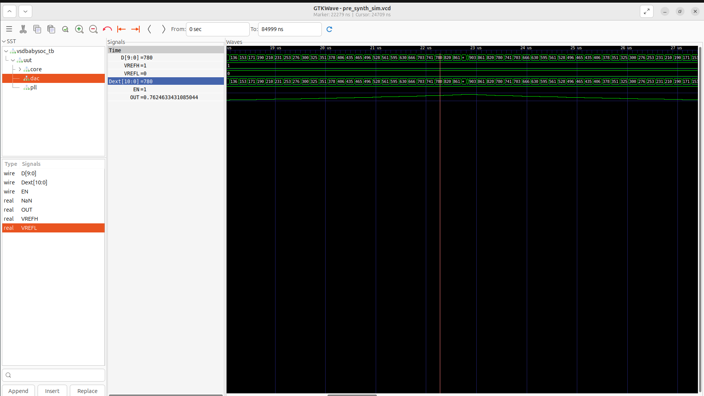
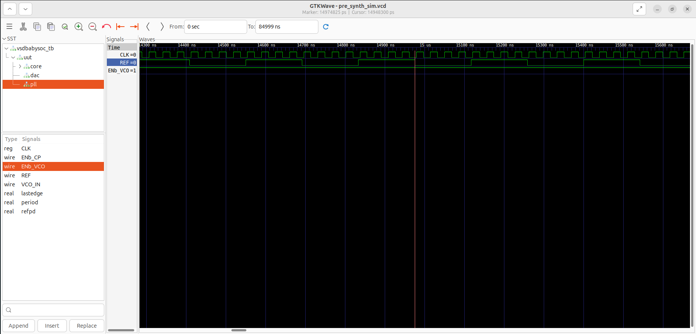
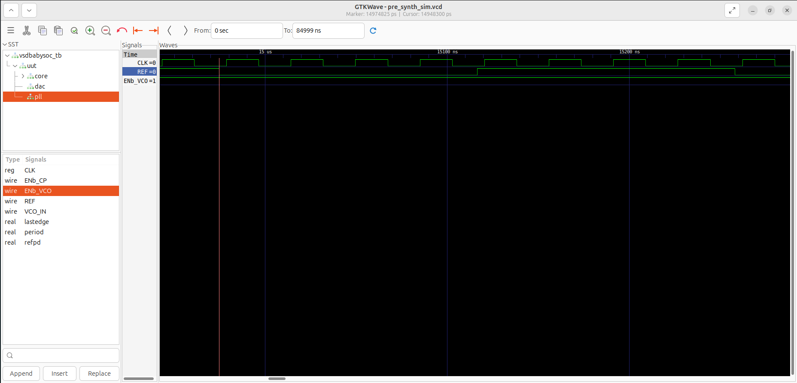

# BabySoC Fundamentals & Functional Modelling

## Table of Contents

- [Cloning VSD BabySoC](#cloning-vsd-babysoc)
- [Conversion of .tlv to .v (using SandPiper-SaaS)](#conversion-of-tlv-to-v-using-sandpiper-saas)
- [Synthesis using Icarus Verilog](#synthesis-using-icarus-verilog)
- [DAC (Digital to Analog)](#dac-digital-to-analog)
- [PLL (Phase Locked Loop)](#pllphase-locked-loop)

---

## Lab

## Cloning VSD BabySoC

    cd > verilogfiles
    git clone https://github.com/manili/VSDBabySoC.github

- Modules inside VSDBabySoC/src/module/
    

- avsddac.v : Models a 10-bit digital-to-analog converter (DAC). It maps digital values from the RISC-V core into real analog voltages between VREFL and VREFH

- avsdpll.v : PLL model that generates a clock (CLK) from a reference (REF) and a VCO. It measures the reference period and adjusts the output clock frequency accordingly.

-rvmyth.v: RISC-V processor core implementation . It executes instructions, outputs digital data (10-bit bus), and is the central computational engine of the BabySoC.

-testbench.v: The testbench.v generates clock and reset signals to drive the design under test.
It also records waveforms in a .vcd file for analyzing the BabySoC’s behavior.

---

## Converstion of .tlv to .v (using sandpiper-saas ):

- Steps to Install sandpiper :

1: Install the venv package 

    sudo apt update
    sudo apt install python3.12-venv

2: Move to your project directory

    cd ~/Desktop/vlsi/sky130RTLDesignAndSynthesisWorkshop

3: Create a virtual environment

    python3 -m venv venv

4: Activate the virtual environment

    source venv/bin/activate

5: Install SandPiper-SaaS 

    pip install pyyaml click sandpiper-saas

6: Deactivate V-env (when done)

    deactivate

- Run SandPiper-SaaS to Convert TL-Verilog to Verilog

    cd VSDBabySoC
    sandpiper-saas -i ./src/module/*.tlv -o rvmyth.v --bestsv --noline -p verilog --outdir ./src/module/

-i: Input TL-Verilog files

-o: Output Verilog file name (rvmyth.v)

--bestsv: Use best SystemVerilog practices

--noline: Removes debug line directives

-p verilog: Output format is Verilog

--outdir: Directory where the output file will be saved

---

-**After Convertion :**

- while listing the files in modules the rvmyth.v is created as the converstion of rvmyth.tlv

---

## Synthesis using Icarus Verilog

1. Create a Directory to Store waveform:

    mkdir -p output/pre_synth_sim

2. Synthesis

    iverilog -o output/pre_synth_sim.out -DPRE_SYNTH_SIM src/module/testbench.v -I src/include -I src/module

-o output/pre_synth_sim.out: Creates simulation executable

-D PRE_SYNTH_SIM: Defines a macro used in testbench

src/module/testbench.v: Main testbench file

-I src/include and -I src/module: Include directories for Verilog headers and design files

3. 
    cd output/pre_synth_sim
    ./pre_synth_sim.out

4. Waveform 

    gtkwave pre_synth_sim.vcd

- Output Waveform:

- to convert analog format

-rightclick on signal -> Data Format -> Analog -> Step
--- 

## Dac (Digital to Analog)

- from the output waveform we can see that as the digital value increses the analog signal also rises and when digital value decrease analgo signal also follows the same.

    vout=vrefl+(d/1023)*(vrefh-vrefl)
    vout=0+(780/1023)*(1-0)
    vout=780/1023 = 0.762 v

---

## PLL(Phase Locked Loop):

- The waveform shows that when ENb_VCO = 1, the CLK output oscillates according to the input REF frequency, indicating that the PLL successfully generates a stable clock signal synchronized with the reference. When ENb_VCO = 0, the output remains low, confirming correct enable control functionality.

---

