# Week 3 - Post-Synthesis GLS
## Gate-Level Simulation (GLS)

- Gate-Level Simulation (GLS) is the process of simulating a synthesized netlist (after RTL is converted into logic gates) to verify that the design behaves correctly at the gate level.

- GLS is performed to check timing, functional correctness, and logic after synthesis, ensuring the final hardware will work as intended before fabrication.

---

## GLS of BabySoc :

### 1. Yosys
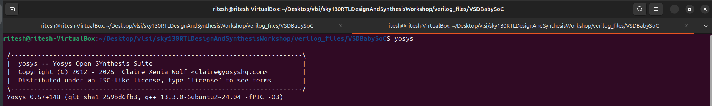

### 2. Loading the Liberty Files
    read_liberty -lib src/lib/sky130_fd_sc_hd__tt_025C_1v80.lib
    read_liberty -lib src/lib/avsdpll.lib
    read_liberty -lib src/lib/avsddac.lib

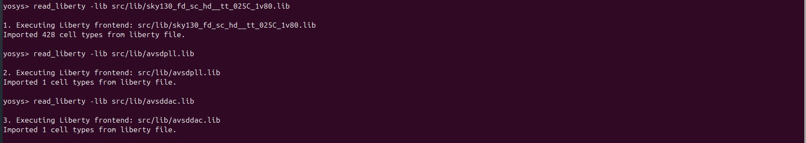

### 3. Loading Verilog Files

    read_verilog src/module/vsdbabysoc.v
    read_verilog -I src/include src/module/rvmyth.v
    read_verilog -I src/include src/module/clk_gate.v

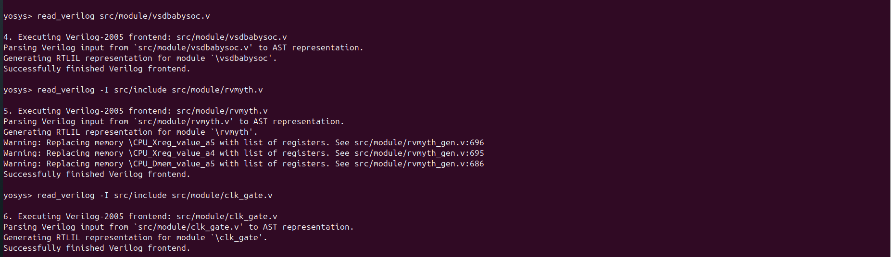

### 4. Run synthesis

    synth -top vsdbabysoc

- Statistics 

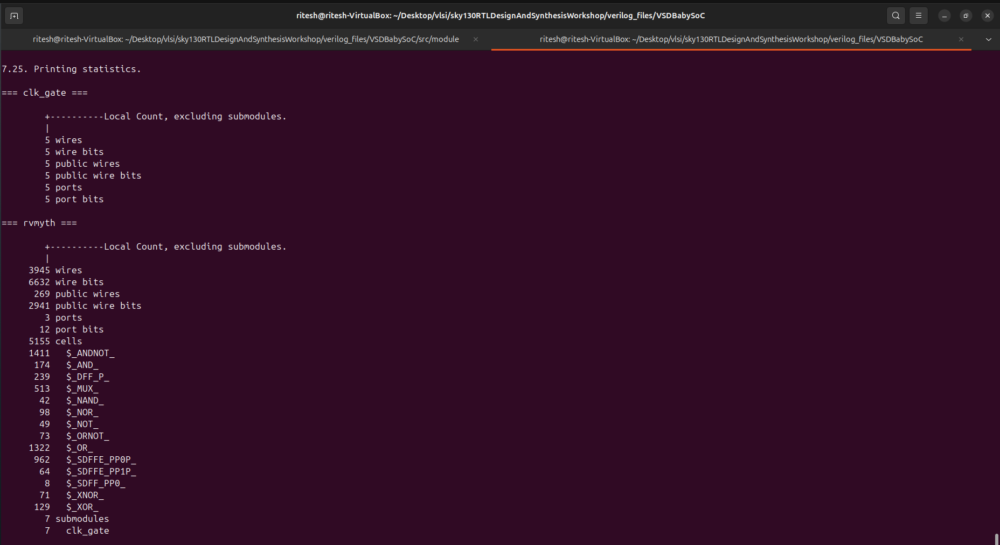
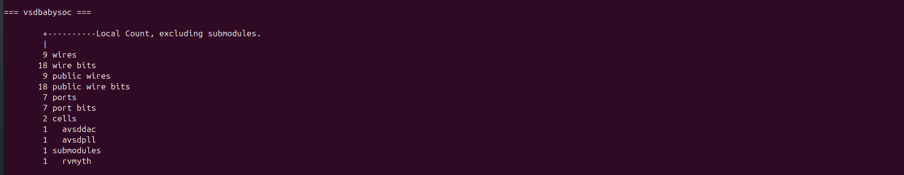
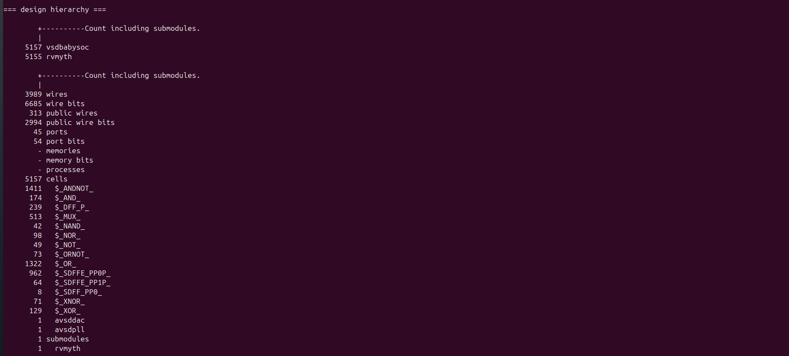

### 5. DFF Library Mapping

    dfflibmap -liberty src/lib/sky130_fd_sc_hd__tt_025C_1v80.lib

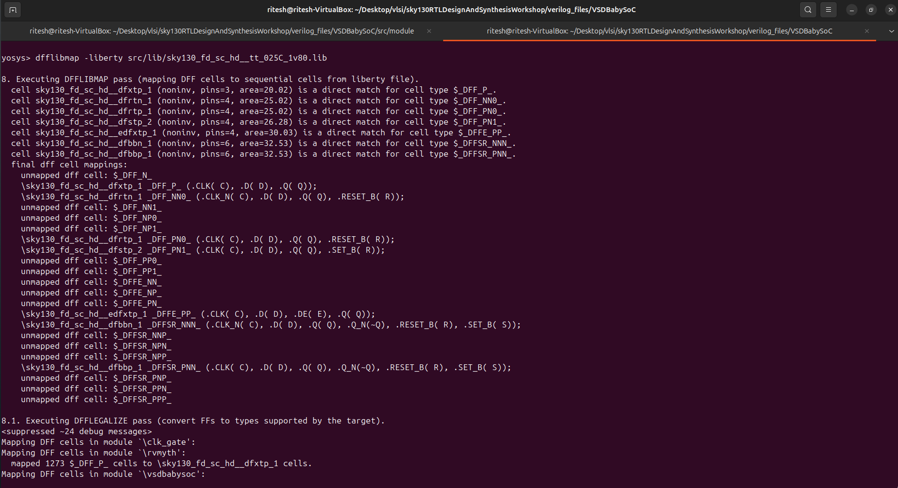

### 6. Logic Optimization and Technology Mapping

    opt
    abc -liberty src/lib/sky130_fd_sc_hd__tt_025C_1v80.lib

### 7. Flattening, Cleaning, and Preparing the Synthesized Design

    flatten
    setundef -zero
    clean -purge
    rename -enumerate

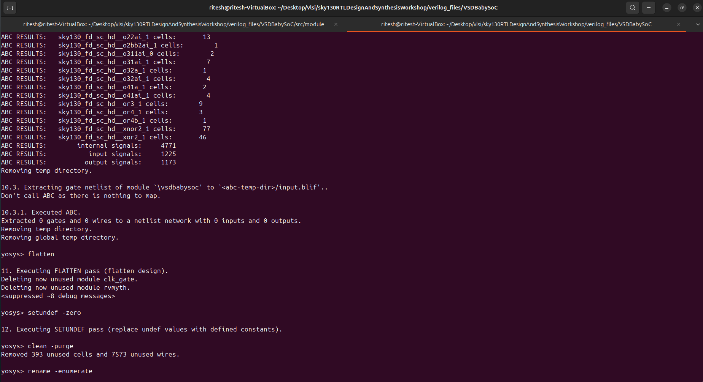

### 8. Viewing Statistics

    stat
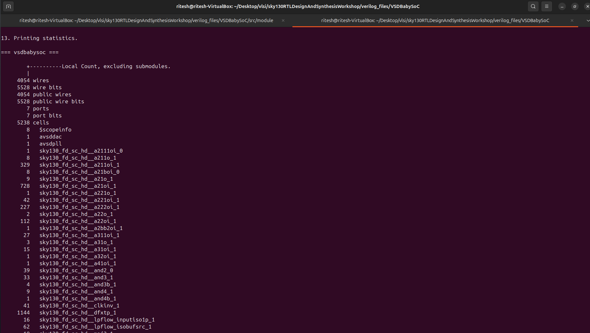
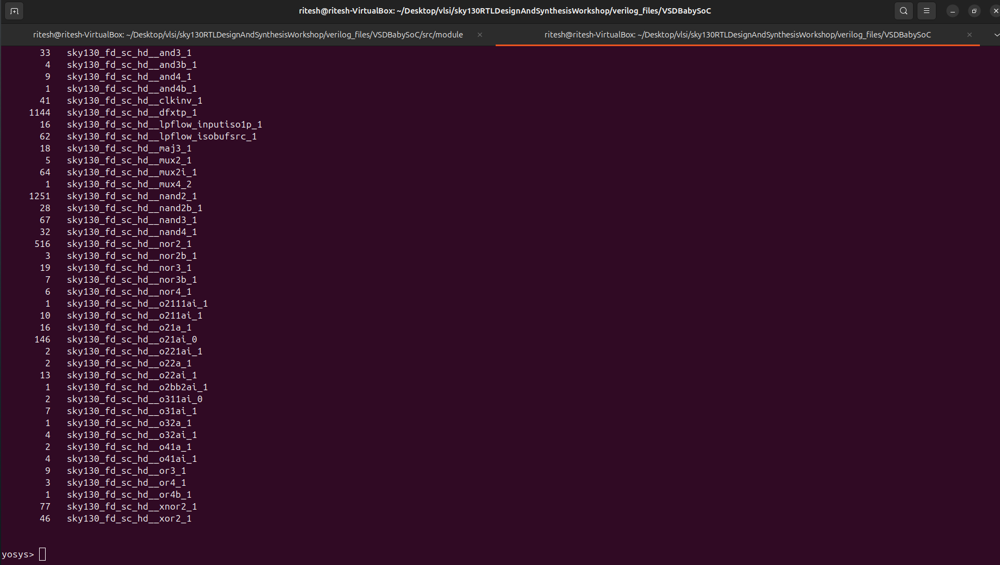

### 9. Write Synthesized Verilog Netlist
- creating directory
    cd output
    mkdir post_synth_sim

- write verilog
    write_verilog -noattr output/post_synth_sim/vsdbabysoc.synth.v

---

## Synthesis and Waveform:

### 1. Compiling Gate-Level Netlist with Icarus Verilog

    iverilog -I src/gls_model -I output/post_synth_sim -I src/include -I src/module -o output/post_synth_sim/post_synth_sim.out -DPOST_SYNTH_SIM -DFUNCTIONAL -DUNIT_DELAY=#1 src/module/testbench.v

### 2. Running 

    cd output/post_synth_sim
    ./post_synth_sim.out

### 3. Gtkwave
    gtkwave post_synth_sim.vcd

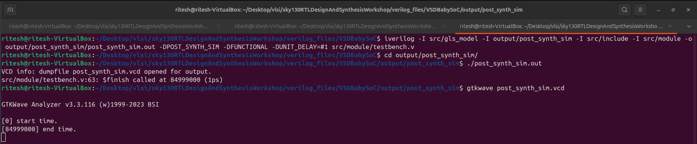

### GtkWave Form 

- **Post Synthesis**
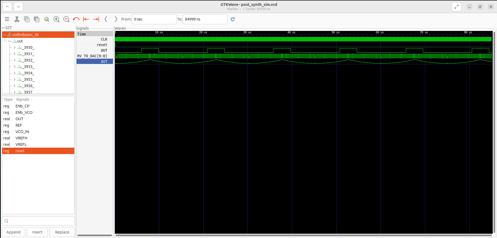

- **Pre Synthesis**

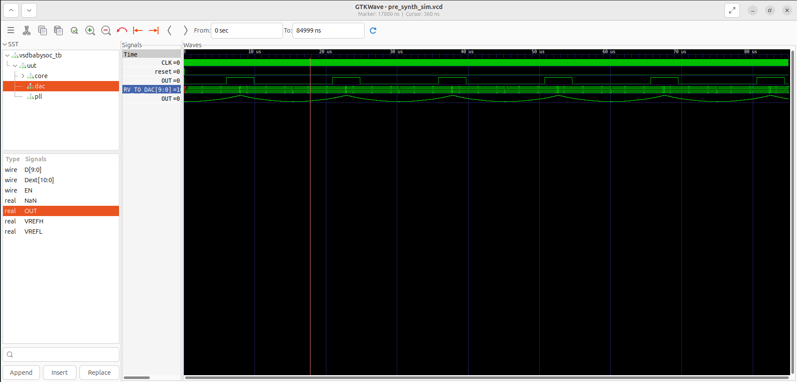

- the wave post synthesis is same as the wave at pre synthesis .

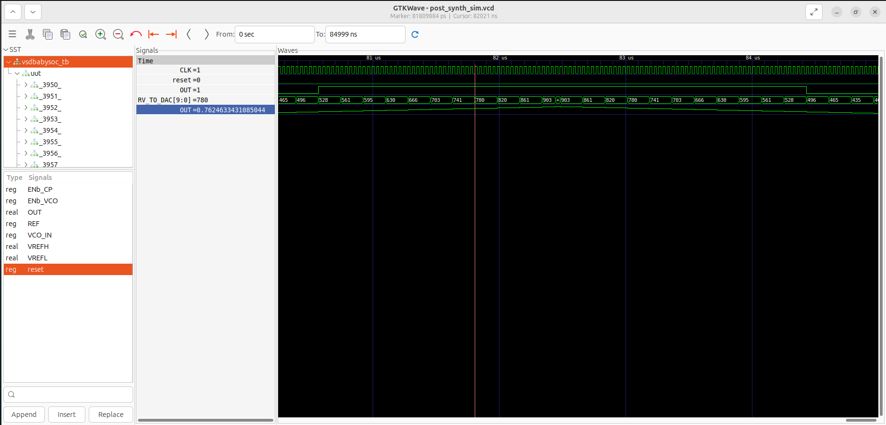

- it is clearly seen from waveform that when the digital value increases the analog also rises and when the digital value decreases the analog wave decreases.

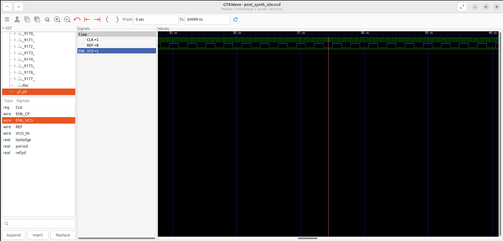

-  the CLK output oscillates according to the input REF frequency, indicating that the PLL successfully generates a stable clock signal synchronized with the reference. 
