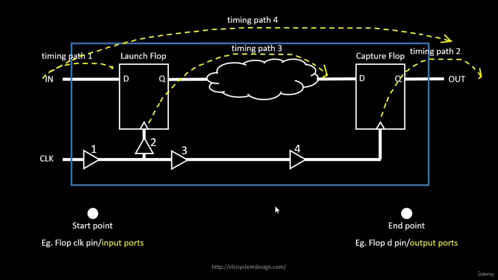
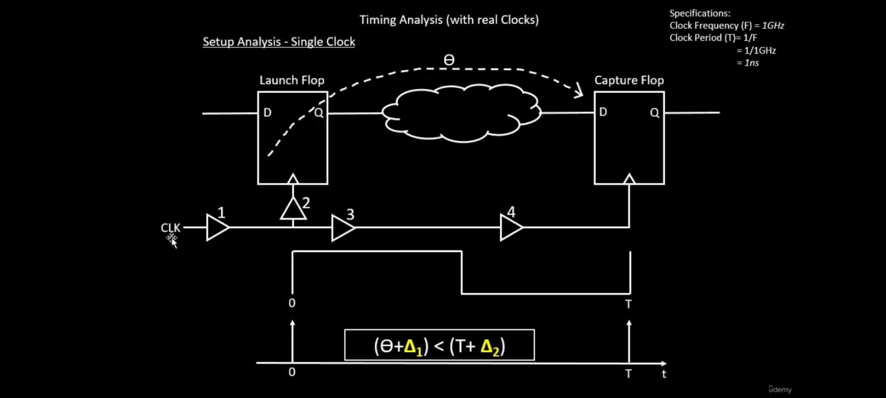
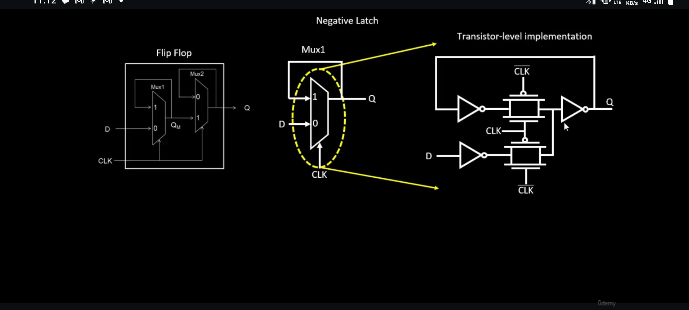
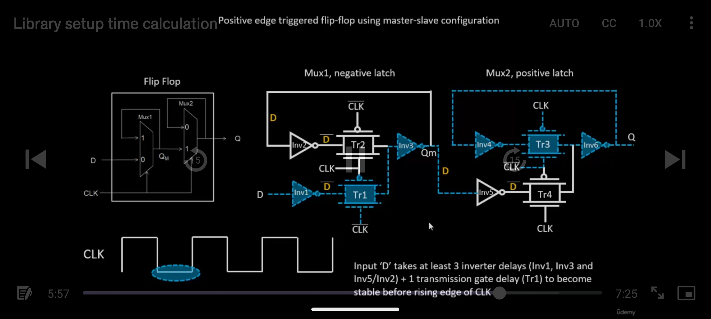
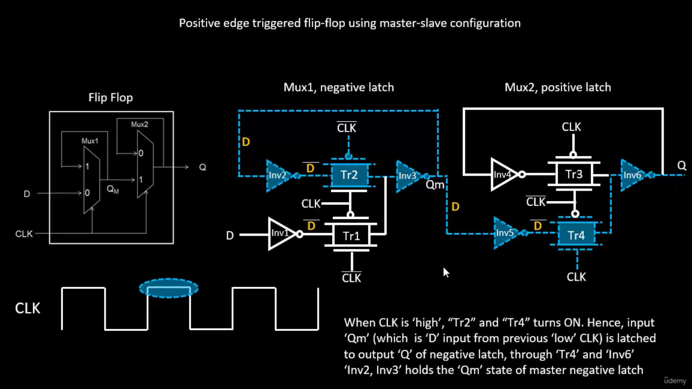
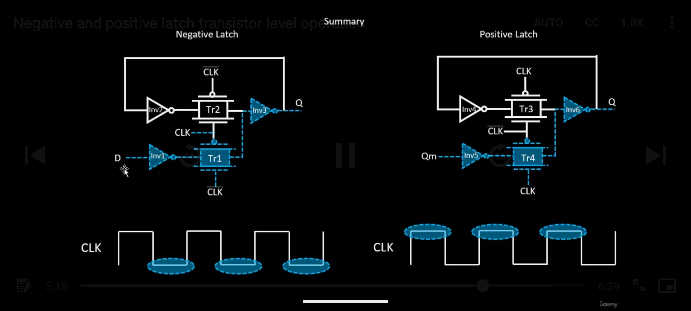

# Week 3: Fundamentals of STA (Static Timing Analysis)

## Table of Contents

- [Week 3: Fundamentals of STA (Static Timing Analysis)](#week-3-fundamentals-of-sta-static-timing-analysis)
  - [Timing Path](#timing-path)
  - [Slack Time](#slack-time)
  - [Setup and Hold Analysis](#types-of-setuphold-analysis)
  - [Slew and Load Analysis](#slewtransition-analysis)
  - [Reg to Reg Setup Analysis](#reg-to-reg-setup-analysis)
  - [Latch and Flip-Flop Operation](#timing-graph-based-on-pin-node-conversion)
  - [Jitter](#jitter)
  - [OCV (On-Chip Variation)](#on-chip-variation-ocv)

## Static Timing Analysis

Majorly these three are covered under static timing analysis:
- Checks  
- Constraints  
- Library  

---

## Timing Path:

start point ⬤ ------------------------------------  ⬤ End Point

Path between these two points.

**Start point:** e.g., Flip-flop Q pin, input ports  
**End point:** Flop D pin, output port  

---

### Arrival Time:
Time required to reach from the start point to the end point.

### Required Time:
Time expected by the design constraint (what the design needs).

There are **min (expected time)** and **max (expected time)**.

Example: If the clock = 1 GHz  

Between the capture FF and sending FF, the capture FF should get the signal before `1ns - hold time`.

---

### Slack Time:
Difference between arrival time and expected time. How it varies is slack time.

There are different types of slack:

Min Slack = (Arrival Time - Min Expected Time)
Max Slack = (Max Expected Time - Arrival Time)

Condition:

Min Expected Time < Arrival Time < Max Expected Time

---

## Types of Setup/Hold Analysis:

- Reg to Reg  
- In to Reg  
- Reg to Out  
- In to Out  
- Clock Gating  
- Recovery/Removal  
- Data to Data  
- Latch  

---

## Slew/Transition Analysis:

Min Slew < Slew Time < Max Slew

---

## Load Analysis:

### Types:
- Fanout Analysis  
- Capacitance Analysis  
- Clock Analysis  

---

## Reg to Reg Setup Analysis:

The circuit is converted to a **Directed Acyclic Graph (DAG)**.  
Every logical gate is converted into nodes.

### Actual Arrival Time (AAT):
Time at any node where the **latest transition** is done after the **first rise of the clock edge**.  
For every node to the next node, the worst arrival time is taken.

### Required Arrival Time (RAT):
Time at any node where we expect the **latest transition** with the specified time (constraint).  
From every node, the minimum expected time is taken.

In case of two nodes with two incoming connections:

AAT = max(AT1, AT2)
RAT = min(RT1, RT2)

---

### Slack Computation:

Slack (S) = RAT - AAT

If `AAT < RAT`, then every node meets the expectation.  
Slack for every node is calculated by the difference between `AAT` and `RAT`.

---

## Timing Graph Based on Pin Node Conversion:

Every pin (input/output) is considered as a separate node.

Transistor-level circuit for flops:

---

### Negative Latch + Positive Latch = Positive Edge FF

`TR1` and `TR2` are transmission gates.

- **Negative latch:** Works on negative clock; TR1 = ON → Direct path D to QM.  
- **Positive latch:** TR4 is ON → Direct path between QM and Q.  

There will be a delay between D → QM and QM → Q.

Ideal clock → Slew = 0

---

## Total Working

### At negative level of clock:
- INV1, TR1, INV3 = ON  
- INV4, TR3, INV6 = ON  
- Previous state is retained.

**Setup time:**  
Before the rising edge of the clock, input D should become valid (from diagram: time taken to reach D to INV5 input).  
So, before the rising edge, the data should arrive.

At the end of the negative level, the data is present at the input of INV5.

---

### At positive level of clock:
- INV2, TR2, INV3 = ON  
- INV5, TR4, INV6 = ON  
- Direct connection between INV5 to output Q.

**Clk to Q delay:**  
Time taken for D to reach Q from INV5 output to latch output (delay = TR4 + INV6 delays).

**Hold time:**  
After the positive edge of the clock, D input should remain stable for a certain time, called hold time.  
(In this case, hold time = 0) because at posedge there is no direct connection between D and QM.

---

## Jitter:

In practice, multiple versions of a clock may have time differences and voltage variations in every clock signal.

**Jitter** creates a temporary variation in clock edge delay (or advancement).

It is added in the time calculation as **uncertainty**, subtracted from the clock period on the RHS.

t = Clock Period
s = Setup Time
su = Setup Uncertainty

01 + Δ1 < (t + Δ2) - s - su

01 + Δ1 → Data Arrival Time
(t + Δ2) - s - su → Expected Time

---

## Converting Graphical to Text:

### Setup Analysis (Graphical to Text Representation):

    Δ1 = b1/a
    b2/y
    b2/a
    b3/a
    b3/y

    -----------------------------------------

    Δ2=b1/a
    b1/y
    b2/a
    b4/a
    b4/y

Here:
- b(1,2,3,4) /a = Delay at net  
- b(1,2,3,4) /y = Delay at module  

---

### Slack Time Calculation:

Δ1 = b1/a
b2/y
b2/a
b3/a
b3/y
+θ

(Data Arrival)

---

t + Δ2 = b1/a
b1/y
b2/a
b4/a
b4/y
-s
-su

## Hold Analysis:

θ > Hold_Time

Where:  
`θ` → Time delay at the combinational circuit.

θ + 1 + 2 > h + 1 + 3 + 4
θ + Δ1 = h + Δ2 + hu (Hold Uncertainty)

Data Arrival - Data Required = Slack

---

### Hold Time (Graphical to Textual Conversion):

This is similar to the setup analysis conversion.

---

## On-Chip Variation (OCV):

### Sources of Variation:
### Etching  (impacts delay of the cell)

The shape in the layout may be distorted depending on etching.

While fabricating multiple gates together, there may be differences in the errors created, and more distortion occurs in both the edge gates. Some of the affected parameters are:

---

### Width and Length of Gates:

Width and length of the layout (interconnects) may be distorted during etching, which affects the **drain current**.

Id = μ * Cox * (W/L) * ((Vgs - Vt)Vds - Vds²/2)

So, **W/L** affects the drain current.

---

### Oxide Thickness:

Cox = εox / tox

`td` depends on `Cox`, and `Cox` depends on `tox`; hence, it affects the drain current.

---

### Relationship Between Resistance, Drain Current, and Tpd (Propagation Delay):

Unlike Ohm’s law where resistance (R) is linear, in MOSFET it is **not linear**.

Resistance differs when `Id` increases.

tp = f(R) = f(Id) = f(tox, W, L)

So, while fabricating a chain of inverters, for example, they will differ in delay for each inverter.

Example:

By this graph, **OCV (On-Chip Variation)** is named.

- Below 100 ps → 9% variation  
- Above 100 ps → 8% variation  

100 ps is the expected delay.

---

## OCV-Based Setup Timing Analysis:

There are four possible combinations to analyze:

-  Increase both **arrival time** and **required time** path delay by 20%  
-  Increase **arrival time** by 20% and decrease **required time** by 20%  
-  Decrease **delay of arrival time** by 20% and increase **required time** by 20%  
-  Decrease **delay of arrival time** by 20% and decrease **required time** by 20%

By doing these combinations, OCV analysis is performed.

- **Clock Pull-In:** When data required time delay is reduced  
- **Clock Push-Out:** When data arrival time delay increases  

By performing these, slack time is calculated and the best result is taken.

It is also done by optimizing the time delay (after pessimism) of either required time or setup time, and the best of them is taken.

---

## OCV-Based Hold Timing Analysis:

- The same procedure as setup timing analysis is applied here.  
All four combinations are performed for this analysis as well.

- Pessimism plays a major role in achieving a better slew rat

