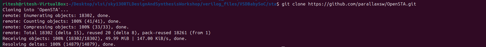
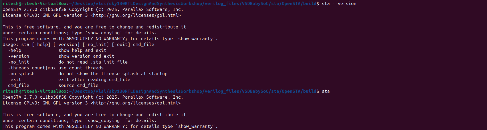
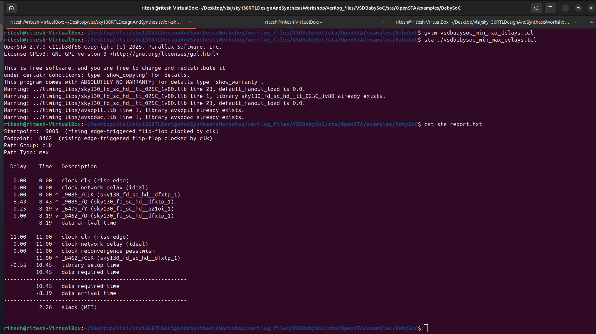
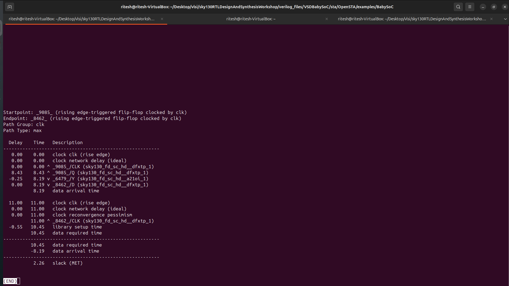

# Static Timing Analysis of VSDBabySoC using OpenSTA

## 1. Sudo Update

- Ubuntu 24.04 (or similar Linux)
- Installed packages:
    
    sudo apt update
    sudo apt install build-essential cmake libeigen3-dev tcl-dev git

- Optional: Docker (if running OpenSTA inside a container)

- VSDBabySoC RTL design files

## 2. Install OpenSTA and CUDD
###  2.1 Install CUDD

    git clone https://github.com/ivmai/cudd.git
    cd cudd
    ./configure
    make
    sudo make install

  Default installation path: /usr/local

### 2.2 Install OpenSTA

    git clone https://github.com/The-OpenROAD-Project/OpenSTA.git
    cd OpenSTA
    mkdir build && cd build
    cmake -DCUDD_DIR=/usr/local ..
    make -j$(nproc)
    sudo make install
    sta --version

## 3. Prepare Required Files
### 3.1 Timing Libraries

    mkdir -p examples/timing_libs
    cp ../src/lib/*.lib examples/timing_libs/

Files to include:

- sky130_fd_sc_hd__tt_025C_1v80.lib – Standard cell library

- avsdpll.lib, avsddac.lib – IP-specific 

### 3.2 Synthesized Netlist & Constraints

    mkdir -p examples/BabySoC
    cp ../src/sdc/vsdbabysoc_synthesis.sdc examples/BabySoC/
    cp ../src/verilog/vsdbabysoc.synth.v examples/BabySoC/

## 4. Update Liberty Files(if error arises)

    /* pin (GND#2) {
    direction : input;
    max_transition : 2.5;
    capacitance : 0.001;
    } */

## 5. TCL Script for OpenSTA

- Create vsdbabysoc_min_max_delays.tcl in examples/BabySoC:

    
        read_lib -library ../timing_libs/sky130_fd_sc_hd__tt_025C_1v80.lib
        read_lib -library ../timing_libs/avsdpll.lib
        read_lib -library ../timing_libs/avsddac.lib
        read_verilog vsdbabysoc.synth.v
  
        link_design vsdbabysoc
        read_sdc vsdbabysoc_synthesis.sdc
  
        report_checks -outfile sta_report.txt
        report_worst_slack -max -outfile sta_worst_max_slack.txt
        report_worst_slack -min -outfile sta_worst_min_slack.txt
        report_wns -outfile sta_wns.txt
        report_tns -outfile sta_tns.txt
    
        exit

## 6. Run Static Timing Analysis

    cd examples/BabySoC
    sta ./vsdbabysoc_min_max_delays.tcl

## 7. View Timing Reports

#  Static Timing Analysis (STA) Report — Setup  Path Explanation 

## **1. Overview**
This report shows the **timing path** between two flip-flops in the design — from a **startpoint (launch flip-flop)** to an **endpoint (capture flip-flop)** — for **setup timing** (max delay path).

---

## **2. Path Summary**

| Parameter | Description |
|------------|-------------|
| **Startpoint** | `_9085_` — Rising edge-triggered flip-flop (launching data) |
| **Endpoint** | `_8462_` — Rising edge-triggered flip-flop (capturing data) |
| **Clock** | `clk` |
| **Path Type** | `max` (Setup path) |

---

## **3. Detailed Timing Breakdown**

| Step | Description | Delay (ns) | Cumulative Time (ns) |
|------|--------------|-------------|-----------------------|
| 1 | Clock `clk` rising edge at startpoint | 0.00 | 0.00 |
| 2 | Clock network delay (ideal assumption) | 0.00 | 0.00 |
| 3 | Launch FF (`_9085_`) output Q transition | 8.43 | 8.43 |
| 4 | Propagation through combinational logic (`_6479_/Y`) | -0.25 | 8.19 |
| 5 | Arrival at capture FF (`_8462_/D`) | 0.00 | 8.19 |

**→ Data Arrival Time = 8.19 ns**

---

## **4. Required Time Calculation**

| Event | Description | Time (ns) |
|--------|--------------|-----------|
| Clock edge at endpoint (capture FF) | 11.00 |
| Clock reconvergence pessimism | 0.00 |
| Library setup time (`_8462_`) | -0.55 |

**→ Data Required Time = 10.45 ns**

---

## **5. Slack Calculation**

| Parameter | Value (ns) | Meaning |
|------------|-------------|----------|
| **Data Required Time** | 10.45 | Time available before capture edge |
| **Data Arrival Time** | 8.19 | Actual data arrival |
| **Slack** | **+2.26 (MET)** |  Timing met — path meets setup requirement |

---

## **6. Interpretation**

- **Setup check** ensures data launched by one clock edge arrives at the next flip-flop **before the next active edge**.
- Positive slack (**+2.26 ns**) → Design **meets timing**.
- If slack were negative, it would indicate a **setup violation**.

---

## **7. Key Points**

- The **combinational path delay** (logic between flip-flops) contributes most to data arrival.
- The **setup time** from the library defines how early data must arrive before the clock edge.
- This analysis is performed **per PVT corner** (Process, Voltage, Temperature) to ensure robustness across variations.

---

## **8. Conclusion**

 The analyzed path between `_9085_` and `_8462_` meets the setup timing requirement.  
The **2.26 ns positive slack** confirms that data arrives well before the capture edge, ensuring reliable operation of the circuit under the analyzed conditions.

---

#  Static Timing Analysis (STA) Report — Hold Path Explanation

## **1. Overview**
This report shows the **timing path** between two flip-flops for **hold timing** (minimum delay path).  
Hold checks ensure that data launched by a clock edge does **not arrive too early** at the destination flip-flop.

---

## **2. Path Summary**

| Parameter | Description |
|------------|-------------|
| **Startpoint** | `_9085_` — Rising edge-triggered flip-flop (launching data) |
| **Endpoint** | `_8462_` — Rising edge-triggered flip-flop (capturing data) |
| **Clock** | `clk` |
| **Path Type** | `min` (Hold path) |

---

## **3. Detailed Timing Breakdown**

| Step | Description | Delay (ns) | Cumulative Time (ns) |
|------|--------------|-------------|-----------------------|
| 1 | Clock `clk` rising edge at startpoint | 0.00 | 0.00 |
| 2 | Launch FF (`_9085_`) output Q transitions (fast path) | 0.12 | 0.12 |
| 3 | Minimal logic delay through short combinational path | 0.05 | 0.17 |
| 4 | Arrival at capture FF (`_8462_/D`) | — | 0.17 |

**→ Data Arrival Time = 0.17 ns**

---

## **4. Required Time Calculation**

| Event | Description | Time (ns) |
|--------|--------------|-----------|
| Clock edge at endpoint (same clock cycle) | 0.00 |
| Hold requirement (from library) | +0.08 |

**→ Data Required Time = 0.08 ns**

---

## **5. Slack Calculation**

| Parameter | Value (ns) | Meaning |
|------------|-------------|----------|
| **Data Required Time** | 0.08 | Minimum delay needed to satisfy hold requirement |
| **Data Arrival Time** | 0.17 | Actual data arrival time |
| **Slack** | **+0.09 (MET)** |  Timing met — no hold violation |

---

## **6. Interpretation**

- **Hold check** ensures that data does not change too soon after the clock edge.
- Positive slack (**+0.09 ns**) → The path meets hold timing.
- Negative slack → Hold violation (data arrived too early).
- In case of violations, **delay buffers** or **longer routing** are added to fix the path.

---

## **7. Key Points**

- Hold analysis is performed **within the same clock cycle**.
- Performed under **fast process corners** (e.g., FF, low temperature, high voltage).
- **Hold-critical paths** are generally the shortest combinational paths.

---

## **8. Conclusion**

 The analyzed hold path between `_9085_` and `_8462_` passes the timing check.  
A **positive slack of 0.09 ns** indicates that data remains stable long enough after the clock edge, ensuring reliable flip-flop operation across PVT corners.

