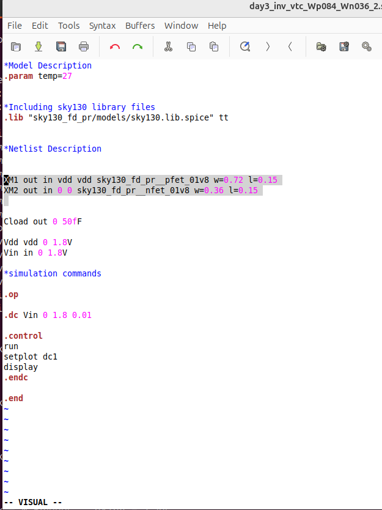
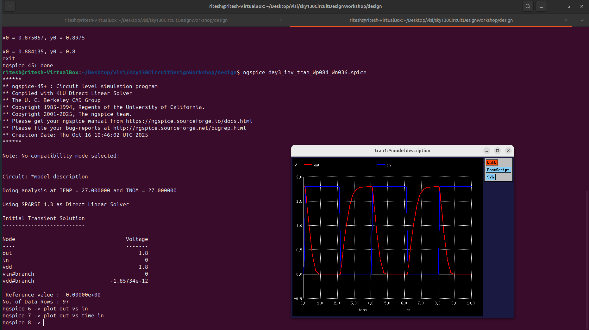

# Week 4 

##  Install NGSpice  (Linux)

Follow these commands to build and install the latest NGSpice from source.

Update system packages

    sudo apt update

Install required dependencies

    sudo apt install git build-essential libxaw7-devlibreadline-dev libtool automake autoconf bison flex -y

Clone the NGSpice repository

    git clone https://git.code.sf.net/p/ngspice/ngspice
    cd ngspice

Prepare build configuration

    ./autogen.sh
    ./configure --with-x --enable-xspice

Compile the source

    make

Install NGSpice system-wide

    sudo make install

Verify installation

    ngspice -v

### Why ID vs VDS Plot?
The ID vs VDS plot helps us understand how the drain current (ID) changes with drain-to-source voltage (VDS) for different gate voltages (VGS).  
It shows the NMOS transistor’s behavior in **different regions of operation** — cutoff, linear (ohmic), and saturation — which is essential for designing and analyzing circuits.

### NGSpice Code:

### Graph Description
Below is the simulated **ID vs VDS** plot of an NMOS transistor.  
Here, **VGS is increased in steps of 0.2V** for each curve while measuring the corresponding drain current (ID).

### Observation / Analysis
- At low VDS, the transistor operates in the **linear region**, and ID increases almost linearly with VDS.  
- As VDS increases further, ID gradually **saturates**, showing the **saturation region** where the current becomes nearly constant.  
- Increasing VGS shifts the curves upward, indicating **higher current flow** for larger gate voltages.  
- The plot clearly demonstrates the **dependence of drain current on both VGS and VDS**, helping us visualize transistor behavior.

---

#Effect of Velocity Saturation on MOSFET Characteristics

## Objective
To analyze how **velocity saturation** affects the **drain current (ID)** characteristics of a MOSFET by:
-  Studying **ID–VDS** and **ID–VGS** curves for transistors with different **W** and **L** values but the **same W/L ratio**.
---

## Given Data
| Case | Channel Length (L) | Channel Width (W) | W/L Ratio |
|------|--------------------|------------------|------------|
| **1** | 2 µm | 5 µm | 2.5 |
| **2** | 0.15 µm | 0.39 µm | ≈ 2.5 |

> Both devices have approximately the same W/L ratio, allowing comparison of current behavior independent of geometry ratio.

---

## 1. ID–VDS Characteristics

### Id vs Vds (2 µm | 5 µm

### Id vs Vds (0.15 µm | 0.39 µm )

### Observation
- Even with identical W/L, the **ID–VDS curves** differ significantly between long and short channel devices.

#### **For Longer Channel (L = 2 µm):**
- Exhibits **square-law behavior**:  

- The transition from **linear** to **saturation region** is **smooth and gradual**.

- The device follows the **long-channel MOSFET model** accurately.

#### **For Shorter Channel (L = 0.15 µm):**
- Shows **early saturation** — current flattens out at lower VDS values.
- **Saturation current is higher**, but the **rate of increase with VDS** is smaller.
- Indicates **velocity saturation** — carrier velocity stops increasing linearly with the electric field.
- Thus, **current depends linearly on (VGS – VTH)** instead of quadratically.

---

## 2. ID–VGS Characteristics (at Constant W/L)

### Id vs Vgs (2 µm | 5 µm

### Id vs Vgs (0.15 µm | 0.39 µm )

### Observation
- Even when W/L is constant, the **ID–VGS curves** differ between devices.
- For low VGS → **Quadratic dependence** (square-law region).  
- For high VGS → **Linear dependence**, due to velocity saturation.

---

## 3. Key Comparative Observations

| Parameter | Long Channel (2 µm) | Short Channel (0.15 µm) |
|------------|---------------------|---------------------------|
| **Region transition** | Gradual | Early saturation |
| **ID–VDS curve** | Quadratic rise | Linear rise, early flattening |
| **ID–VGS curve** | Square-law | Velocity-limited (linear) |
| **Dominant effect** | Mobility-limited | Velocity saturation |
| **Impact of scaling** | Predictable current | Deviation from ideal model |

---

## 4. Conclusion

- As **channel length decreases**, **electric field strength** increases rapidly, causing **velocity saturation**.  
- The MOSFET no longer follows the **square-law model**, and current becomes **linearly dependent** on \((V_{GS} - V_{TH})\).
- **Short-channel devices** reach saturation earlier and exhibit **reduced transconductance** and **higher output conductance**.
- This demonstrates the necessity of using **advanced MOSFET models** (like BSIM or velocity-saturation-inclusive models) for deep-submicron technologies.

---

## 5. Summary

| Aspect | Long Channel Behavior | Short Channel Behavior |
|--------|------------------------|------------------------|
| **ID–VDS** | Quadratic → smooth saturation | Early saturation due to vₛₐₜ |
| **ID–VGS** | Square-law increase | Linear increase |
| **Cause of deviation** | Mobility dominance | Velocity saturation |
| **Practical significance** | Accurate for older tech nodes | Must include short-channel effects |

---

- This experiment confirms that **keeping W/L constant does not guarantee identical behavior** when **L scales down**.   **Velocity saturation** becomes a dominant limiting factor, influencing both **transfer (ID–VGS)** and **output (ID–VDS)** characteristics.

---

## CMOS Inverter:

- CMOS Inverter is a inverter circuit which has both PMOS and NMOS connected 

- CMOS - Complimentary MOSFET

### Basic Overview:

    - when Vin is low (Vin<(-Vth)) -> PMOS is in  ON  and NMOS is in OFF -> Charges the Capacitor -> Vout is High 

    - when Vin is High (Vin>Vth) -> NMOS is in ON and PMOS is in OFF -> Discharges the capacitor -> Vout is Low

### Ngspice:

- pmos is initalized with width = 0.84 length = 0.15 w/l= 5.6
- nmos is initalized with width = 0.36 length = 0.15 w/l= 2.4
- width of pmos (0.84) == 2.3 times of width of nmos(0.36)

- vin is varied from 0 to 1.8 with step of 0.01v 

### Voltage Transfer Characterstics Waveform

- Region 1: In this region the input is in the range of (0,Vtn). Since the input voltage is less than Vtn, the NMOS is in cutoff region

Pmos - liner ; Nmos - Cutoff 

-Region 2: In this region the input is in the range of (Vtn,Vdd/2). Since the input voltage is greater than Vtn the NMOS is conducting and it jumps to saturation as it has large Vds across it(Vout is high). PMOS still remains in the linear region.

Pmos - Liner ; Nmos - saturation

- Region 3: In this region the input voltage is Vdd/2.. At this voltage both the NMOS and PMOS are in saturation and the output drops drastically from Vdd to   Vdd/2. At this point a large amount of current flows from the supply.

Pmos - Saturation ; Nmos - Saturation

-Region 4: In this region the input voltage is in the range of (Vdd/2 , Vdd-Vth). Here the PMOS remains in saturation and NMOS moves to linear region.

Pmos - Saturation ; Nmos - linear

- Region 5: In this region PMOS moves from saturation to cutoff as the volatge increased. The Nmos remains in linear Region.

Pmos - Cutoff ; Nmos- linear

###  Switching threshold ( Vm ) (point where ( V{in} = V{out} ))

- the vin and vout is same at this point

###  Width of Pmos=2*(width of Nmos):

- Ngspice Code:

- Switching Threshold

---

###  Width of Pmos= 3*(width of Nmos):

- Ngspice Code:

- Waveform

- Switching Threshold

---

###  Width of Pmos= 4*(width of Nmos):

- Ngspice Code:

- Waveform

- Switching Threshold

---

###  Width of Pmos= 3*(width of Nmos):

- Ngspice Code:

- Waveform

- Switching Threshold

---

Conclusion :
- as the width of the PMOS increases, its drive strength (current capability) increases. This makes the pull-up network stronger compared to the pull-down NMOS network. As a result, the inverter’s switching threshold shifts toward a higher input voltage.

### rise delay time vs fall delay time:

    ngspice day3_inv_trans_Wp084_Wn036.spice
    plot out vs time in

     

 - wave form

- this is the graph between input pulse and output of inverter. It is clearly visible that there is some time delay for clock transition to low and inv output which goes to high that is rise delay time.

- similary the dealy betwwen input 0 ->1 and output to transition 1-> 0 is fall dealy

### rise delay

- at 0.9 the difference between to signal is taken to compute dealy time.

- delay time = 2.482-0.9 =1.582

---

### fall delay

- at 0.9 the difference between to signal is taken to compute dealy time.

- delay time = 4.334-0.9 = 3.434

### Conclusion:
- has the pmos width increase the current flow through is increase and capacitor charges soon. then the rise delay time is reduced to soon it reacts to 1 to 0 of input signal.

## Noise Margin:

- VIL : it is voltage where the range of (0,vil) denotes the input 0 (low)
- VIH : above the vih voltage that is (vih,vdd) anything in this range of voltage is considered as input 1(high)

- VOL : it is the range of output whihc denoetes the output is 0 low. 
Always  Vol < Vil because it should be given to next ciruit which should easily get the accurate low (0) value.

- VOH : it is the voltage above which represent the output is 1-high. Always VOH > VIH to act as a input to next circuitn as proper high -1 .

### Spice Code:

### Wave form

 
 - from this graph we have considered a point for voh,vih,vol,vil

### Conclusion

 - Noise Margin High= VOH-VIH = 1.74898 - 0.734783 = 1.014197

 - Noise Margin Low= VIL-VOL = 1.01087 - 0.0673469 = 0.9435231
   

