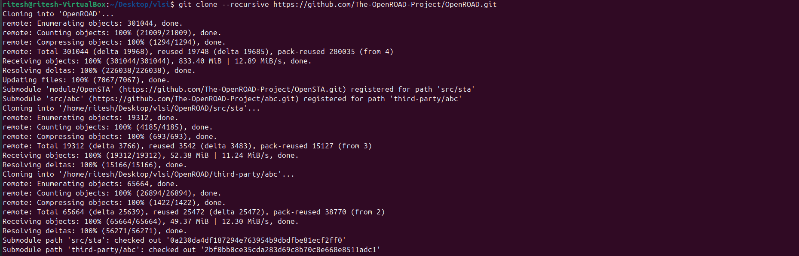

# Week 5  – OpenROAD Flow Setup and Floorplan + Placement 

## OpenROAD:

**OpenROAD** (Open Routing, Placement, and Optimization for Advanced Designs) is an open-source EDA tool that automates the process of converting a synthesized RTL netlist into a placed and routed layout (GDSII).  
It handles various stages such as floorplanning, placement, clock tree synthesis, and routing.

---

### Open Road Installation:

    git clone --recursive https://github.com/The-OpenROAD-Project/OpenROAD.git 

    cd OpenROAD
    sudo ./etc/DependencyInstaller.sh -all

    mkdir build
    cd build
    cmake ..

    make
    sudo make install
    cd test

---

### OpenRoad Version Check:

##  Floorplanning :

Floorplanning defines the size and shape of the chip, and allocates space for macros, standard cells, and I/O pins.
It sets the foundation for efficient placement and routing.

**tcl** :

    initialize_floorplan -site $site \
    -die_area $die_area \
    -core_area $core_area

this defines the floor planning

---

## Placement :

Placement arranges standard cells within the defined core area to minimize wire length and timing delays.
This stage follows floorplanning and ensures an optimized design layout.

**tcl** :

    place_pins -hor_layers $io_placer_hor_layer -ver_layers $io_placer_ver_layer -annealing -min_distance 6

## Parctical :

- let us take a example gcd_nangate45.tcl named  from the openroad folder itself

### gcd_nangate45_copy.tcl

    # gcd flow pipe cleaner
    source "helpers.tcl"
    source "flow_helpers.tcl"
    source "Nangate45/Nangate45.vars"

    set design "gcd"
    set top_module "gcd"
    set synth_verilog "gcd_nangate45.v"
    set sdc_file "gcd_nangate45.sdc"
    set die_area {0 0 100.13 100.8}
    set core_area {10.07 11.2 90.25 91}

    #include -echo "floor_floorplan.tcl"
    #include -echo "floor_pdn.tcl"
    #include -echo "floor_global_placement.tcl"
    #include -echo "floor_detailed_placement.tcl"

- for every stimulation each line is choosen from commanded last 4 line

The main control script that loads helper files and selectively includes other TCL scripts for each design stage.

### 1. floor_floorplan.tcl
 
Initializes the floorplan, defines the die and core area, places I/O pins and macros, and inserts tap cells.  
This sets the foundation for further placement and routing.

- **Code:**

    # Assumes flow_helpers.tcl has been read.
    read_libraries
    read_verilog $synth_verilog
    link_design $top_module
    read_sdc $sdc_file

    set_thread_count [cpu_count]
    # Temporarily disable sta's threading due to random failures
    sta::set_thread_count 1

    utl::metric "IFP::ord_version" [ord::openroad_git_describe]
    # Note that sta::network_instance_count is not valid after tapcells are added.
    utl::metric "IFP::instance_count" [sta::network_instance_count]

    initialize_floorplan -site $site \
    -die_area $die_area \
    -core_area $core_area

    write_def gcd/post_floorplan.def
    source $tracks_file

    # remove buffers inserted by synthesis
    remove_buffers

    if { $pre_placed_macros_file != "" } {
    source $pre_placed_macros_file
    }

    # IO Placement		###

    place_pins -hor_layers $io_placer_hor_layer -ver_layers $io_placer_ver_layer -annealing -min_distance 4

    ################################################################
    # Macro Placement
    if { [have_macros] } {
    lassign $macro_place_halo halo_x halo_y
    set report_dir [make_result_file ${design}_${platform}_rtlmp]
    rtl_macro_placer -halo_width $halo_x -halo_height $halo_y \
    -report_directory $report_dir
    }

    write_def gcd/post_macro_placement.tcl
    ################################################################
    # Tapcell insertion
    eval tapcell $tapcell_args ;# tclint-disable command-args

    write_def gcd/post_tapcell.def

### Run command

    openroad -gui -log gcd_logfile.log gcd_nangate45_copy.tcl

- **Output:**

-enabled the rows 

- enabled the tracks

Explanation:
The floorplan defines the layout boundaries and ensures that pins are placed correctly for efficient placement.

---

### 2. floor_pdn.tcl

Generates the Power Distribution Network (PDN) to supply power/ground connections across the chip.
It ensures proper current delivery and voltage stability for all placed cells.

- **Code:**

- **Output:**

    # Assumes flow_helpers.tcl has been read.
    read_libraries
    read_verilog $synth_verilog
    link_design $top_module
    read_sdc $sdc_file

    set_thread_count [cpu_count]
    # Temporarily disable sta's threading due to random failures
    sta::set_thread_count 1

    utl::metric "IFP::ord_version" [ord::openroad_git_describe]
    # Note that sta::network_instance_count is not valid after tapcells are added.
    utl::metric "IFP::instance_count" [sta::network_instance_count]

    initialize_floorplan -site $site \
    -die_area $die_area \
    -core_area $core_area

    write_def gcd/post_floorplan.def
    source $tracks_file

    # remove buffers inserted by synthesis
    remove_buffers

    if { $pre_placed_macros_file != "" } {
    source $pre_placed_macros_file
    }

    # IO Placement		###

    place_pins -hor_layers $io_placer_hor_layer -ver_layers $io_placer_ver_layer -annealing -min_distance 6

    ################################################################
    # Macro Placement
    if { [have_macros] } {
    lassign $macro_place_halo halo_x halo_y
    set report_dir [make_result_file ${design}_${platform}_rtlmp]
    rtl_macro_placer -halo_width $halo_x -halo_height $halo_y \
    -report_directory $report_dir
    }

    write_def gcd/post_macro_placement.tcl
    ################################################################
    # Tapcell insertion
    eval tapcell $tapcell_args ;# tclint-disable command-args

    write_def gcd/post_tapcell.def

    # Power distribution network insertion
    source $pdn_cfg
    pdngen

    write_def gcd/post_pdn.def

### Run command

    openroad -gui -log gcd_logfile.log gcd_nangate45_copy.tcl

-  both gnd and power nets are seen in this Output

- only power pin visible

- only ground pin is visible

Explanation:
The PDN grid covers the core and macros, providing  power connections(gnd and voltage)

### 3. floor_global_placement.tcl

Performs global placement, roughly arranging standard cells across the core area.
Also includes routability adjustments, repair of slew/fanout/capacitance violations, and checkpointing.

- **Code:**

    # Assumes flow_helpers.tcl has been read.
    read_libraries
    read_verilog $synth_verilog
    link_design $top_module
    read_sdc $sdc_file

    set_thread_count [cpu_count]
    # Temporarily disable sta's threading due to random failures
    sta::set_thread_count 1

    utl::metric "IFP::ord_version" [ord::openroad_git_describe]
    # Note that sta::network_instance_count is not valid after tapcells are added.
    utl::metric "IFP::instance_count" [sta::network_instance_count]

    initialize_floorplan -site $site \
    -die_area $die_area \
    -core_area $core_area

    write_def gcd/post_floorplan.def
    source $tracks_file

    # remove buffers inserted by synthesis
    remove_buffers

    if { $pre_placed_macros_file != "" } {
    source $pre_placed_macros_file
    }

    # IO Placement		###

    place_pins -hor_layers $io_placer_hor_layer -ver_layers $io_placer_ver_layer -annealing -min_distance 6

    ################################################################
    # Macro Placement
    if { [have_macros] } {
    lassign $macro_place_halo halo_x halo_y
    set report_dir [make_result_file ${design}_${platform}_rtlmp]
    rtl_macro_placer -halo_width $halo_x -halo_height $halo_y \
    -report_directory $report_dir
    }

    write_def gcd/post_macro_placement.tcl
    ################################################################
    # Tapcell insertion
    eval tapcell $tapcell_args ;# tclint-disable command-args

    write_def gcd/post_tapcell.def

    # Power distribution network insertion
    source $pdn_cfg
    pdngen

    write_def gcd/post_pdn.def

    ################################################################
    # Global placement

    foreach layer_adjustment $global_routing_layer_adjustments {
    lassign $layer_adjustment layer adjustment
    set_global_routing_layer_adjustment $layer $adjustment
    }
    set_routing_layers -signal $global_routing_layers \
    -clock $global_routing_clock_layers
    set_macro_extension 2

    # Global placement skip IOs
    global_placement -density $global_place_density \
    -pad_left $global_place_pad -pad_right $global_place_pad -skip_io

    # IO Placement
    place_pins -hor_layers $io_placer_hor_layer -ver_layers $io_placer_ver_layer

    # Global placement with placed IOs and routability-driven
    global_placement -routability_driven -density $global_place_density \
    -pad_left $global_place_pad -pad_right $global_place_pad

    # checkpoint
    set global_place_db [make_result_file ${design}_${platform}_global_place.db]
    write_db $global_place_db

    ################################################################
    # Repair max slew/cap/fanout violations and normalize slews
    source $layer_rc_file
    set_wire_rc -signal -layer $wire_rc_layer
    set_wire_rc -clock -layer $wire_rc_layer_clk
    set_dont_use $dont_use

    estimate_parasitics -placement

    repair_design -slew_margin $slew_margin -cap_margin $cap_margin

    repair_tie_fanout -separation $tie_separation $tielo_port
    repair_tie_fanout -separation $tie_separation $tiehi_port

### Run command

    openroad -gui -log gcd_logfile.log gcd_nangate45_copy.tcl

- **Output:**

- in this its clearly visible that macros are overlapping with each other

Explanation:
Cells are distributed optimally for timing and routing congestion, forming the base for detailed placement with overlaping of macros.

### 4. floor_detailed_placement.tcl

Finalizes placement of all standard cells with precise alignment, row legalization, and utilization optimization.
Prepares the design for routing and timing closure.

- **Code:**

    # Assumes flow_helpers.tcl has been read.
    read_libraries
    read_verilog $synth_verilog
    link_design $top_module
    read_sdc $sdc_file

    set_thread_count [cpu_count]
    # Temporarily disable sta's threading due to random failures
    sta::set_thread_count 1

    utl::metric "IFP::ord_version" [ord::openroad_git_describe]
    # Note that sta::network_instance_count is not valid after tapcells are added.
    utl::metric "IFP::instance_count" [sta::network_instance_count]

    initialize_floorplan -site $site \
    -die_area $die_area \
    -core_area $core_area

    write_def gcd/post_floorplan.def
    source $tracks_file

    # remove buffers inserted by synthesis
    remove_buffers

    if { $pre_placed_macros_file != "" } {
    source $pre_placed_macros_file
    }

    # IO Placement		###

    place_pins -hor_layers $io_placer_hor_layer -ver_layers $io_placer_ver_layer -annealing -min_distance 6

    ################################################################
    # Macro Placement
    if { [have_macros] } {
    lassign $macro_place_halo halo_x halo_y
    set report_dir [make_result_file ${design}_${platform}_rtlmp]
    rtl_macro_placer -halo_width $halo_x -halo_height $halo_y \
    -report_directory $report_dir
    }

    write_def gcd/post_macro_placement.tcl
    ################################################################
    # Tapcell insertion
    eval tapcell $tapcell_args ;# tclint-disable command-args

    write_def gcd/post_tapcell.def

    # Power distribution network insertion
    source $pdn_cfg
    pdngen

    write_def gcd/post_pdn.def

    ################################################################
    # Global placement

    foreach layer_adjustment $global_routing_layer_adjustments {
    lassign $layer_adjustment layer adjustment
    set_global_routing_layer_adjustment $layer $adjustment
    }
    set_routing_layers -signal $global_routing_layers \
    -clock $global_routing_clock_layers
    set_macro_extension 2

    # Global placement skip IOs
    global_placement -density $global_place_density \
    -pad_left $global_place_pad -pad_right $global_place_pad -skip_io

    # IO Placement
    place_pins -hor_layers $io_placer_hor_layer -ver_layers $io_placer_ver_layer

    # Global placement with placed IOs and routability-driven
    global_placement -routability_driven -density $global_place_density \
    -pad_left $global_place_pad -pad_right $global_place_pad

    # checkpoint
    set global_place_db [make_result_file ${design}_${platform}_global_place.db]
    write_db $global_place_db

    ################################################################
    # Repair max slew/cap/fanout violations and normalize slews
    source $layer_rc_file
    set_wire_rc -signal -layer $wire_rc_layer
    set_wire_rc -clock -layer $wire_rc_layer_clk
    set_dont_use $dont_use

    estimate_parasitics -placement

    repair_design -slew_margin $slew_margin -cap_margin $cap_margin

    repair_tie_fanout -separation $tie_separation $tielo_port
    repair_tie_fanout -separation $tie_separation $tiehi_port

    ##################################################################

    set_placement_padding -global -left $detail_place_pad -right $detail_place_pad
    detailed_placement

    # post resize timing report (ideal clocks)
    report_worst_slack -min -digits 3
    report_worst_slack -max -digits 3
    report_tns -digits 3
    # Check slew repair
    report_check_types -max_slew -max_capacitance -max_fanout -violators

    utl::metric "RSZ::repair_design_buffer_count" [rsz::repair_design_buffer_count]
    utl::metric "RSZ::max_slew_slack" [expr [sta::max_slew_check_slack_limit] * 100]
    utl::metric "RSZ::max_fanout_slack" [expr [sta::max_fanout_check_slack_limit] * 100]
    utl::metric "RSZ::max_capacitance_slack" [expr [sta::max_capacitance_check_slack_limit] * 100]

    ################################################################
    # Detailed Placement

    detailed_placement

    # Capture utilization before fillers make it 100%
    utl::metric "DPL::utilization" [format %.1f [expr [rsz::utilization] * 100]]
    utl::metric "DPL::design_area" [sta::format_area [rsz::design_area] 0]

    # checkpoint
    set dpl_db [make_result_file ${design}_${platform}_dpl.db]
    write_db $dpl_db

    set verilog_file [make_result_file ${design}_${platform}.v]
    write_verilog $verilog_file

### Run command

    openroad -gui -log gcd_logfile.log gcd_nangate45_copy.tcl

- **Output:**

- all the macros doesnt overlap with each other and placed in proper placement.

- this is further interior section of each block

- Explanation:
Ensures no overlapping cells, finalizes cell locations, and maximizes utilization while maintaining timing integrity.
