# Day 2 – Good floorplan vs Bad FloorPlan and introduction to library cells

key concepts used during the floorplanning stage of physical design in OpenLane.

---

##  Core and Die Area
The **die** is the total chip area, while the **core** is the inner region where logic cells are placed.  
A proper balance between die and core ensures enough space for routing and power distribution.

---

##  Aspect Ratio
The **aspect ratio** is the ratio of height to width of the core.  
A value of **1** makes it square; other values make it rectangular.

    aspect ratio= Height of the die / Width of the die
---

## Square and Rectangular Die
A **square die** has equal height and width, providing uniform routing paths.  
A **rectangular die** is used when the design has directional constraints or IO-heavy sides.

---

## Pre-Placed Cells
Certain large blocks like memory or clock generators are **pre-placed** before automated placement.  
This ensures they occupy fixed locations to optimize timing and layout organization.

- **Pre-Placed Cells:** Custom macros placed manually before placement begins.  
- **DCAP Cells:** Decoupling capacitors used to stabilize power supply and reduce noise near switching regions.

---

## Power Planning
Power planning defines **VDD** and **GND** networks across the chip.  
It ensures every cell receives stable power and prevents voltage drops.

---

## Pin Placement and Spacing
Pins are placed along the core boundary to connect internal logic to external signals.  
Proper spacing avoids routing congestion and eases signal access for IOs.

---

##  Standard Cell Placement
Standard cells are arranged within the defined core area after floorplanning.  
Their positions are optimized to reduce wirelength, improve timing, and maintain design density.

---

## Floor-Planing:

- floor planning is followed by synthesis 

## Configuration Files in OpenLane

There are three configuration Tcl files used in OpenLane, each with a specific priority level from high to low.

### Priority Order (High → Low)
1. `sky130A_sky130_fd_sc_hd_config.tcl` – located inside the specific design directory  
2. `config.tcl` – located inside the specific design directory  
3. `floorplan.tcl` – located inside `openlane/configuration/`

The higher-priority files override the settings of the lower-priority ones during the OpenLane flow.

### `floorplan.tcl`:

    vsduser@vsdsquadron:~/Desktop/work/tools/openlane_working_dir/openlane/configuration$ less floorplan.tcl

 

 - in these the vmetal and hmetal is set which is taken as vmetal+1 , hmetal+1 in floorplanning.Every default cofnfiguration is given inside this file.

### `config.tcl`:

    vsduser@vsdsquadron:~/Desktop/work/tools/openlane_working_dir/openlane/designs/picorv32a$ less config.tcl

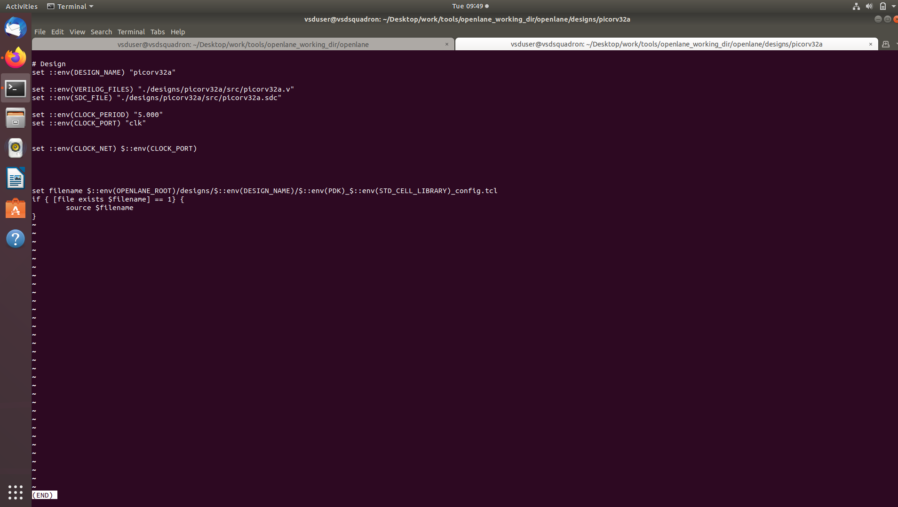

### `sky130A_sky130_fd_sc_hd_config.tcl`:

    vsduser@vsdsquadron:~/Desktop/work/tools/openlane_working_dir/openlane/designs/picorv32a$ less sky130A_sky130_fd_sc_hd_config.tcl

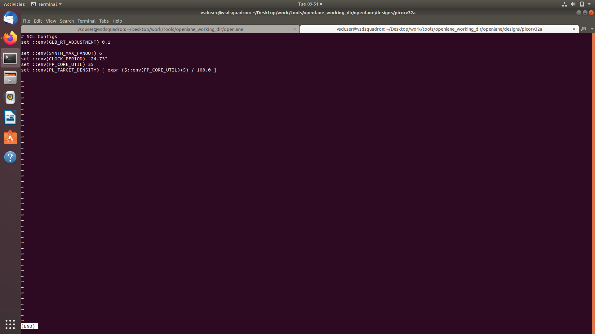

### Command 

    run_floorplan

- ioPlacer.log:

    vsduser@vsdsquadron:~/Desktop/work/tools/openlane_working_dir/openlane/designs/picorv32a/runs/11-11_03-55/logs/floorplan$ less 4-ioPlacer.log

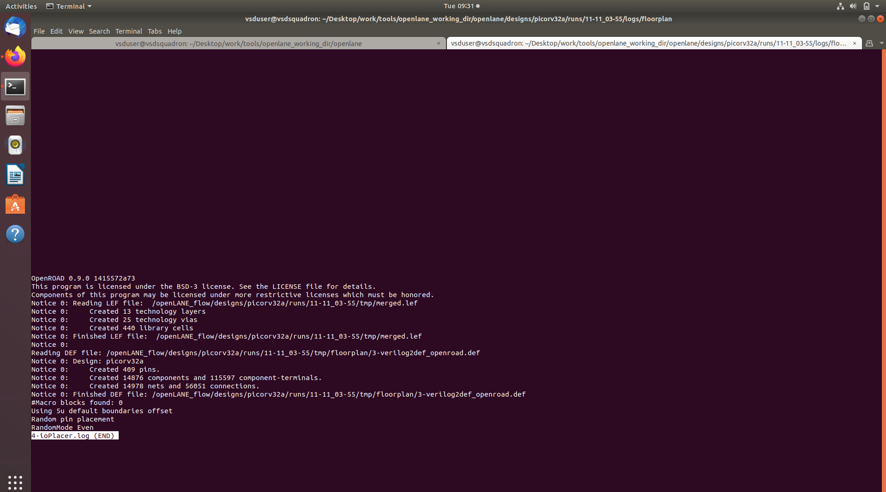

- contains the details about number of pins,componenets,nets,connections are made in our floor plan

### picorv32a.floorplan.def

- to be add 

### Opening the Generated Floorplan in Magic:

    cd vsduser@vsdsquadron:~/Desktop/work/tools/openlane_working_dir/openlane/designs/picorv32a/runs/11-11_03-55/results/floorplan$

    magic -T ~/Desktop/work/tools/openlane_working_dir/pdks/sky130A/libs.tech/magic/sky130A.tech lef read ../../tmp/merged.lef def read picorv32a.floorplan.def &

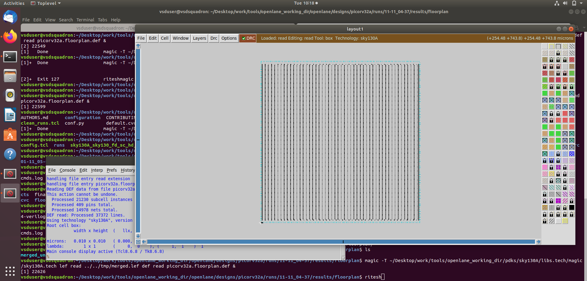

- we can zoom further inside the die to view the tap cells using *z* key

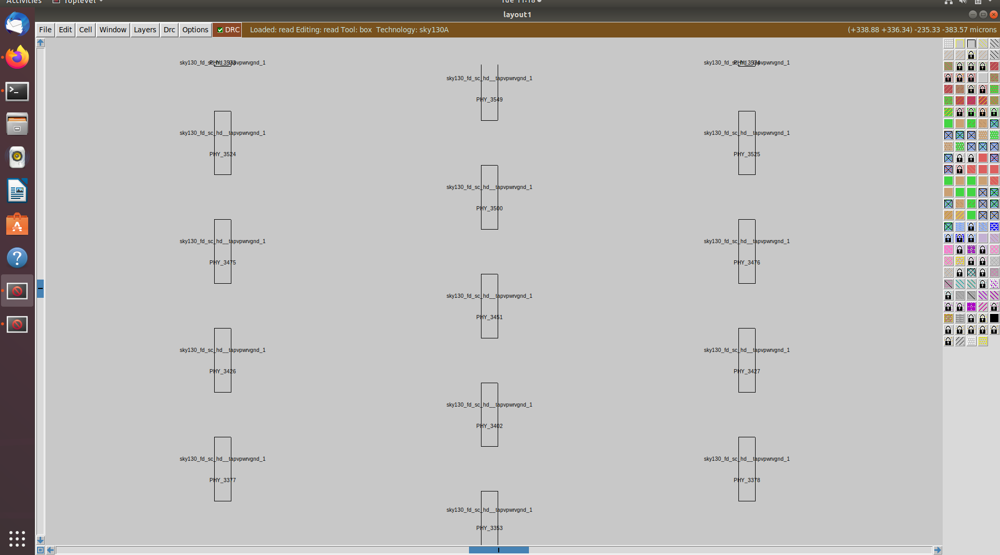

- to select certain cell in this *s* key is is used
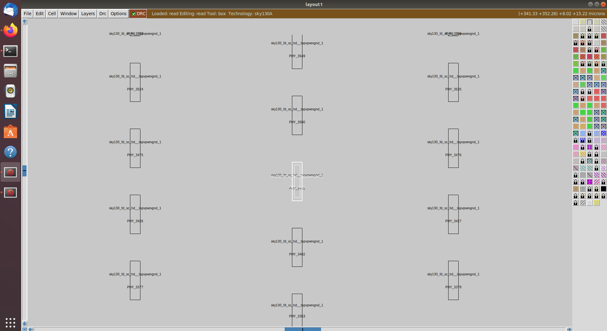

- to get information about selected cell use **what** command 
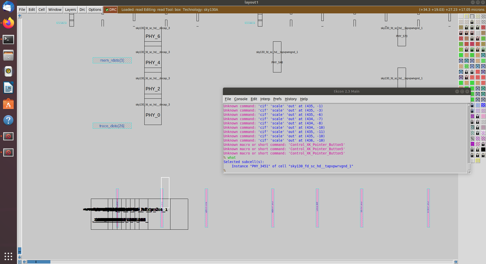

## Placement

Placement is the process of arranging all the standard cells within the defined core area after floorplanning. It ensures that cells are positioned efficiently to reduce wire length and improve timing without overlaps.

### Command
    run_placement

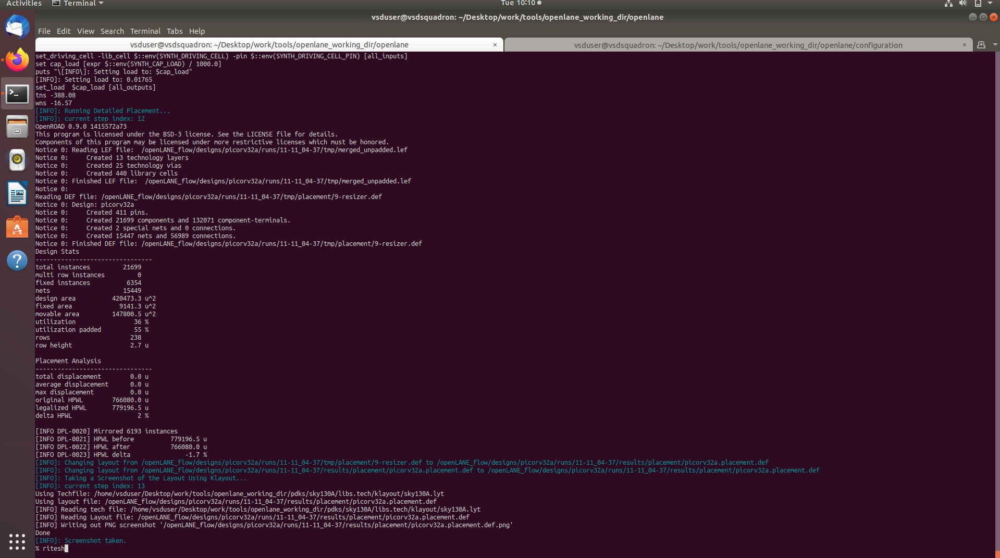

## Visualizing Placement using Magic:

    magic -T ~/Desktop/work/tools/openlane_working_dir/pdks/sky130A/libs.tech/magic/sky130A.tech lef read ../../tmp/merged.lef def read picorv32a.placement.def &

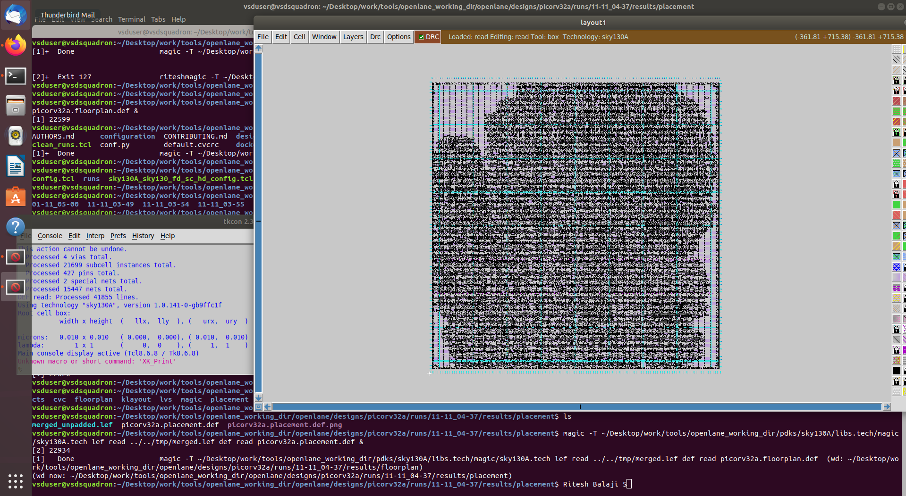

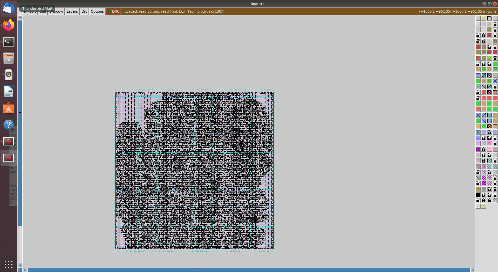

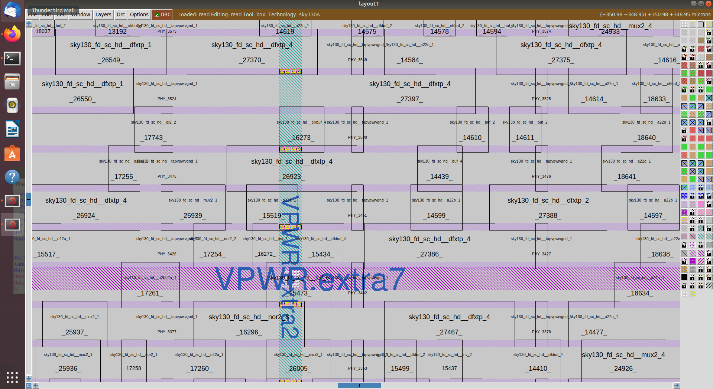

- this is zoomed visualization of placement all the cells are well Placed

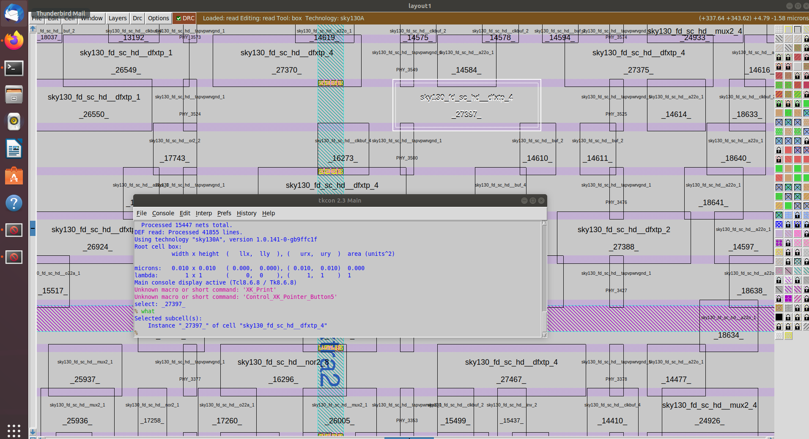

- **what** is used to get information about certain cell 

- the pins are placed with the even distance as 1 is set at the configuration file
## Cell Design Flow

### Inputs
The design flow begins with essential inputs such as the PDK, DRC and LVS rules, and SPICE models. These define the technology parameters and ensure that the design follows fabrication and verification standards.

### Design Step
In this stage, the actual cell design is created and verified at the transistor level. The process involves defining the layout, ensuring design rule compliance, and validating circuit functionality.

### Outputs
After successful design and verification, the flow produces several outputs including CDL files, GDSII layouts, LEF files, SPICE netlists, and reports for timing, noise, and power.

---

## Characterization Flow for a CMOS Inverter

    1. Read the models and technology files required for simulation.  
    2. Load the extracted SPICE netlist of the inverter design.  
    3. Identify the functional behavior of the inverter circuit.  
    4. Include the subcircuit definition containing PMOS and NMOS devices.  
    5. Connect the necessary power and ground sources.  
    6. Apply the input stimulus and set up the characterization environment.  
    7. Attach the required output capacitance for accurate measurement.  
    8. Define simulation commands such as `.tran` and `.dc` for analysis.  
    9. All these elements are then configured in a file used by the characterization tool **GUNA**, which generates timing, noise, and power models for the designed cell.

