# Day 5 - Final steps for RTL to GDS using tritonRoute and openSTA

## Routing

### Preferred L-Shaped Routing
In digital layouts, L-shaped connections are commonly used because they provide a simple and short path between two points. This helps reduce wire length and improves routing efficiency.

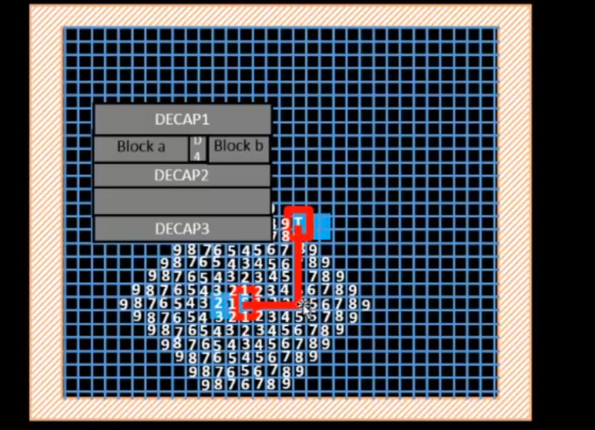

### Maze Routing (Lee’s Algorithm)
Maze routing uses Lee’s algorithm to find a valid path from a source to a destination on a grid.  
The algorithm creates a grid, labels adjacent cells by incrementing values from the parent cell, and continues expanding until the target is reached.  
The final path is identified by tracing back through the continuous numbered sequence.  
This approach is reliable and is primarily used during global routing.

#### Disadvantages
- It is time-consuming because the algorithm explores all possible paths.  
- It requires large memory due to the grid-based expansion.

Routing algorithms in general aim to connect two points with the shortest and most efficient path, which is why L-shaped routing is widely preferred.

---

## DRC Clean Rules
During routing, several design rules must be met for the layout to be DRC-clean:

- Minimum wire width constraints  
- Minimum wire spacing requirements  
- Wire pitch limitations  
- No signal shorts allowed  

When an L-shaped path is created, one segment is horizontal and the other is vertical, so different metal layers are used. This avoids shorting and follows the metal direction rules.

---

## Parasitic Extraction
Every routed wire has physical properties such as resistance and capacitance.  
These values depend on the metal type, width, and length. Parasitic extraction calculates these electrical properties so timing and power analysis can be performed accurately.

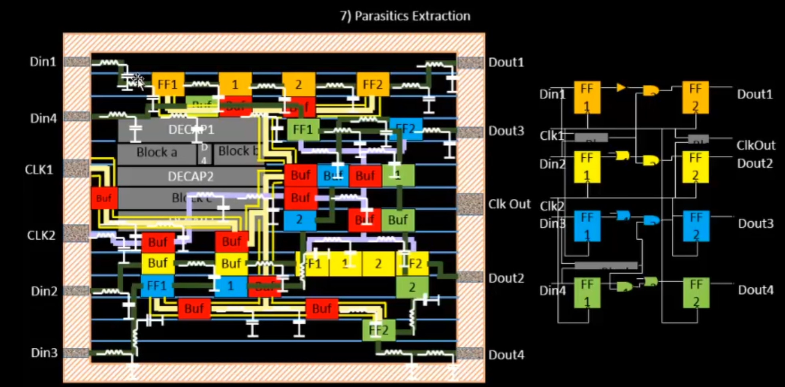

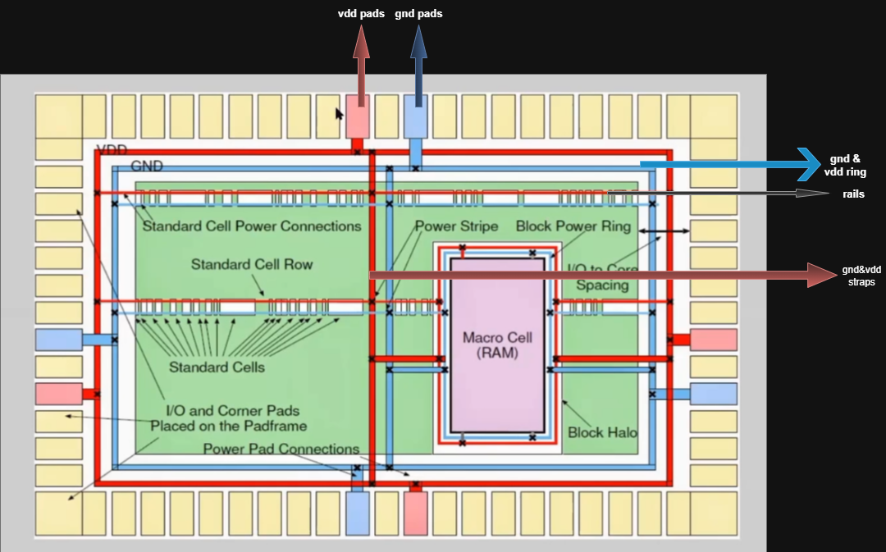

Typical power delivery path: **GND/VDD → Pads → Rails → Straps**

---

## Routing Using TritonRoute

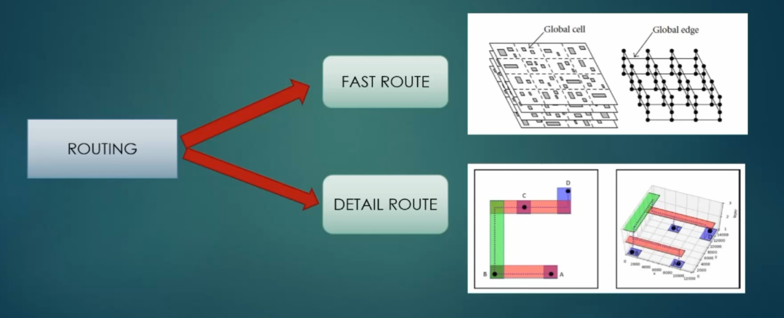

### Types of Routing
1. **FastRoute (Global Routing)**  
   The design area is divided into rectangular regions to estimate an overall routing plan.  
   It generates **route guides** that indicate allowable paths for detailed routing.

2. **Detailed Route**  
   TritonRoute uses the route guides produced during global routing to determine the exact wire paths.  
   It applies routing algorithms to find the best valid connection for each net.

TritonRoute also uses different metal layers for horizontal and vertical routing.  
Using the same metal layer for overlapping directions would create unwanted capacitance, so alternating metal layers prevent this.

---

## Performing Detailed Routing using TritonRoute:

### open openlane 

    cd openlane

    alias docker='docker run -it -v $(pwd):/openLANE_flow -v $PDK_ROOT:$PDK_ROOT -e PDK_ROOT=$PDK_ROOT -u $(id -u $USER):$(id -g $USER) efabless/openlane:v0.21'

    docker

    ./flow.tcl -interactive

    package require openlane 0.9

    prep -design picorv32a -tag 30-10_11-30

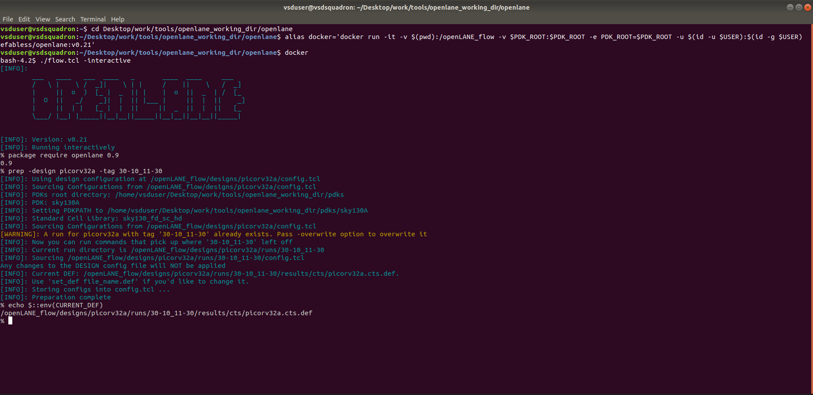

### Generating PDN:

    gen_pdn

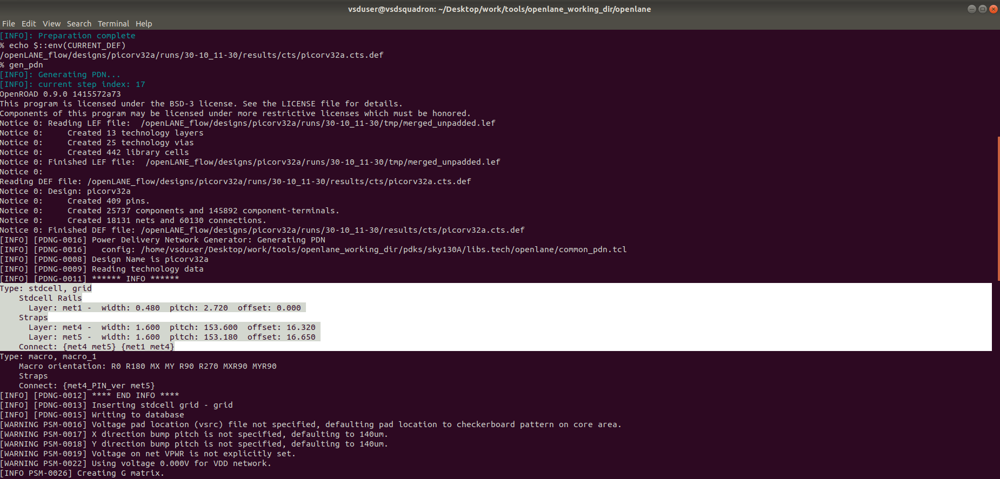

- The standard cell size is **0.48 × 2.72**.  
During layout checks, the width and height must follow the required multiples so that proper power (VDD/GND) connections can be made.

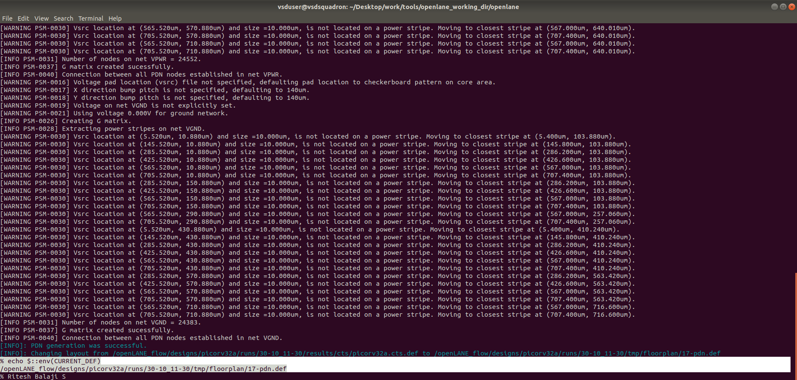

    # Check value of 'CURRENT_DEF'
    echo $::env(CURRENT_DEF)

    #running routing

    run_routing
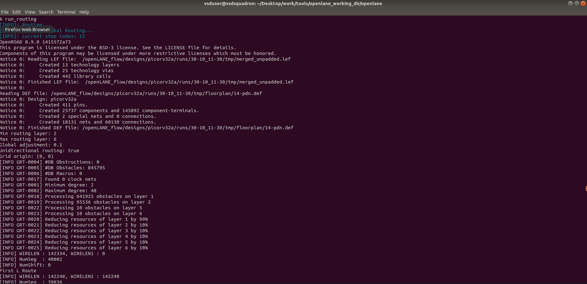

- opening fastguide 

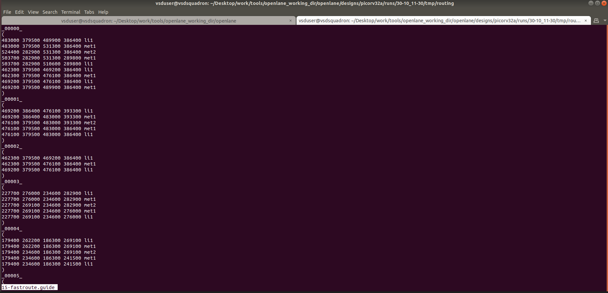

### Opening Routed Layout in Magic:

- command 

    # Navigate to the directory containing the routed DEF file
    cd ~/Desktop/work/tools/openlane_working_dir/openlane/designs/picorv32a/runs/30-10_11-30/results/routing

    # Launch Magic and load the routed DEF and technology LEF
    magic -T ~/Desktop/work/tools/openlane_working_dir/pdks/sky130A/libs.tech/magic/sky130A.tech lef read ../../tmp/merged.lef def read picorv32a.def &

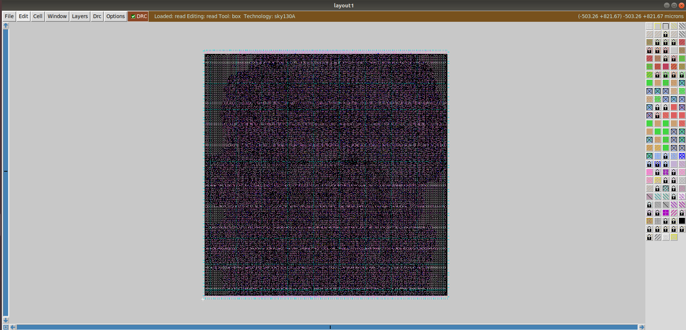

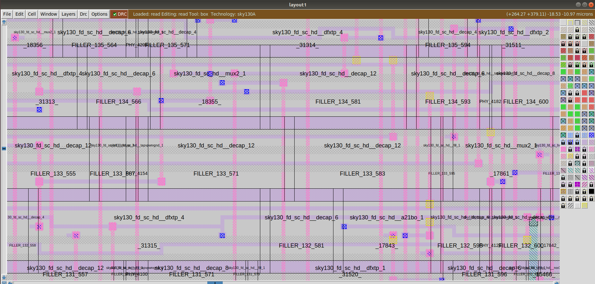

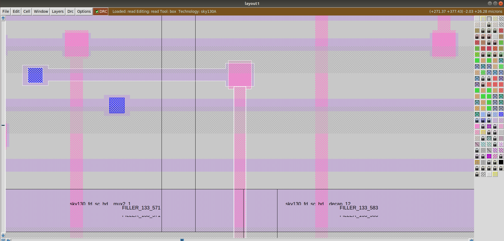

### Parasitic Extraction (SPEF file):

- After routing, a Standard Parasitic Exchange Format (SPEF) file is generated to capture the parasitic resistance and capacitance of all routed nets. This information is essential for performing accurate post-route timing analysis.

- command 

    # Navigate to the directory containing the SPEF extractor
    cd ~/Desktop/work/tools/openlane_working_dir/openlane/scripts/spef_extractor

    # Execute the Python SPEF extraction script using merged LEF and routed DEF
    python3 main.py -l ~/Desktop/work/tools/openlane_working_dir/openlane/designs/picorv32a/runs/30-10_11-30/tmp/merged.lef -d ~/Desktop/work/tools/openlane_working_dir/openlane/designs/picorv32a/runs/30-10_11-30/results/routing/picorv32a.def

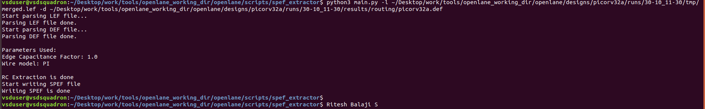
 
- Opening .spef file:

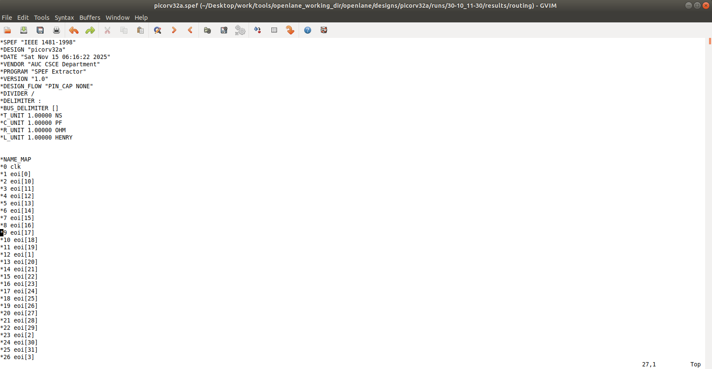

- let us see synthesis.v files:

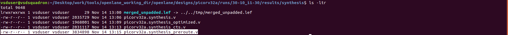

- picorv32a.synthesis.v is file before synthesis , picorv32a.synthesis_preroute.v is file before routing is done.

### OpenSTA Timing Analysis :

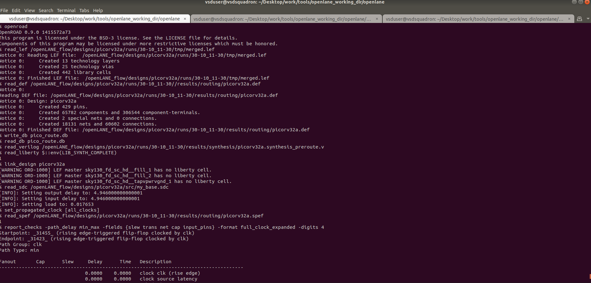

    % openroad
    OpenROAD 0.9.0 1415572a73
    This program is licensed under the BSD-3 license. See the LICENSE file for details.
    Components of this program may be licensed under more restrictive licenses which must be honored.
    % read_lef /openLANE_flow/designs/picorv32a/runs/30-10_11-30/tmp/merged.lef
    Notice 0: Reading LEF file:  /openLANE_flow/designs/picorv32a/runs/30-10_11-30/tmp/merged.lef
    Notice 0:     Created 13 technology layers
    Notice 0:     Created 25 technology vias
    Notice 0:     Created 442 library cells
    Notice 0: Finished LEF file:  /openLANE_flow/designs/picorv32a/runs/30-10_11-30/tmp/merged.lef
    % read_def /openLANE_flow/designs/picorv32a/runs/30-10_11-30//results/routing/picorv32a.def
    Notice 0: 
    Reading DEF file: /openLANE_flow/designs/picorv32a/runs/30-10_11-30/results/routing/picorv32a.def
    Notice 0: Design: picorv32a
    Notice 0:     Created 429 pins.
    Notice 0:     Created 65782 components and 306544 component-terminals.
    Notice 0:     Created 2 special nets and 0 connections.
    Notice 0:     Created 18131 nets and 60602 connections.
    Notice 0: Finished DEF file: /openLANE_flow/designs/picorv32a/runs/30-10_11-30/results/routing/picorv32a.def
    % write_db pico_route.db
    % read_db pico_route.db
    % read_verilog /openLANE_flow/designs/picorv32a/runs/30-10_11-30/results/synthesis/picorv32a.synthesis_preroute.v
    % read_liberty $::env(LIB_SYNTH_COMPLETE)
    1
    % link_design picorv32a
    [WARNING ORD-1000] LEF master sky130_fd_sc_hd__fill_1 has no liberty cell.
    [WARNING ORD-1000] LEF master sky130_fd_sc_hd__fill_2 has no liberty cell.
    [WARNING ORD-1000] LEF master sky130_fd_sc_hd__tapvpwrvgnd_1 has no liberty cell.
    % read_sdc /openLANE_flow/designs/picorv32a/src/my_base.sdc
    [INFO]: Setting output delay to: 4.946000000000001
    [INFO]: Setting input delay to: 4.946000000000001
    [INFO]: Setting load to: 0.017653
    % set_propagated_clock [all_clocks]
    % read_spef /openLANE_flow/designs/picorv32a/runs/30-10_11-30/results/routing/picorv32a.spef
    1
    % report_checks -path_delay min_max -fields {slew trans net cap input_pins} -format full_clock_expanded -digits 4
    Startpoint: 31455 (rising edge-triggered flip-flop clocked by clk)
    Endpoint: 31423 (rising edge-triggered flip-flop clocked by clk)
    Path Group: clk
    Path Type: min

    Fanout       Cap      Slew     Delay      Time   Description
    -------------------------------------------------------------------------------------
                                0.0000    0.0000   clock clk (rise edge)
                                0.0000    0.0000   clock source latency
                        0.0225    0.0100    0.0100 ^ clk (in)
        1    0.0079                                 clk (net)
                        0.0225    0.0000    0.0100 ^ clkbuf_0_clk/A (sky130_fd_sc_hd__clkbuf_16)
                        0.0328    0.1071    0.1171 ^ clkbuf_0_clk/X (sky130_fd_sc_hd__clkbuf_16)
        2    0.0094                                 clknet_0_clk (net)
                        0.0328    0.0001    0.1172 ^ clkbuf_1_1_0_clk/A (sky130_fd_sc_hd__clkbuf_1)
                        0.1112    0.1241    0.2412 ^ clkbuf_1_1_0_clk/X (sky130_fd_sc_hd__clkbuf_1)
        1    0.0088                                 clknet_1_1_0_clk (net)
                        0.1112    0.0004    0.2416 ^ clkbuf_1_1_1_clk/A (sky130_fd_sc_hd__clkbuf_1)
                        0.1103    0.1460    0.3876 ^ clkbuf_1_1_1_clk/X (sky130_fd_sc_hd__clkbuf_1)
        1    0.0087                                 clknet_1_1_1_clk (net)
                        0.1103    0.0004    0.3880 ^ clkbuf_1_1_2_clk/A (sky130_fd_sc_hd__clkbuf_1)
                        0.0980    0.1370    0.5250 ^ clkbuf_1_1_2_clk/X (sky130_fd_sc_hd__clkbuf_1)
        2    0.0076                                 clknet_1_1_2_clk (net)
                        0.0980    0.0005    0.5255 ^ clkbuf_2_2_0_clk/A (sky130_fd_sc_hd__clkbuf_1)
                        0.1110    0.1430    0.6685 ^ clkbuf_2_2_0_clk/X (sky130_fd_sc_hd__clkbuf_1)
        1    0.0088                                 clknet_2_2_0_clk (net)
                        0.1110    0.0004    0.6689 ^ clkbuf_2_2_1_clk/A (sky130_fd_sc_hd__clkbuf_1)
                        0.1061    0.1430    0.8119 ^ clkbuf_2_2_1_clk/X (sky130_fd_sc_hd__clkbuf_1)
        1    0.0084                                 clknet_2_2_1_clk (net)
                        0.1061    0.0004    0.8123 ^ clkbuf_2_2_2_clk/A (sky130_fd_sc_hd__clkbuf_1)
                        0.1219    0.1528    0.9652 ^ clkbuf_2_2_2_clk/X (sky130_fd_sc_hd__clkbuf_1)
        2    0.0097                                 clknet_2_2_2_clk (net)
                        0.1219    0.0001    0.9652 ^ clkbuf_3_4_0_clk/A (sky130_fd_sc_hd__clkbuf_1)
                        0.0838    0.1300    1.0952 ^ clkbuf_3_4_0_clk/X (sky130_fd_sc_hd__clkbuf_1)
        1    0.0063                                 clknet_3_4_0_clk (net)
                        0.0838    0.0002    1.0954 ^ clkbuf_3_4_1_clk/A (sky130_fd_sc_hd__clkbuf_1)
                        0.1187    0.1446    1.2400 ^ clkbuf_3_4_1_clk/X (sky130_fd_sc_hd__clkbuf_1)
        2    0.0095                                 clknet_3_4_1_clk (net)
                        0.1187    0.0005    1.2404 ^ clkbuf_4_9_0_clk/A (sky130_fd_sc_hd__clkbuf_1)
                        0.1132    0.1499    1.3903 ^ clkbuf_4_9_0_clk/X (sky130_fd_sc_hd__clkbuf_1)
        2    0.0090                                 clknet_4_9_0_clk (net)
                        0.1133    0.0005    1.3908 ^ clkbuf_5_19_0_clk/A (sky130_fd_sc_hd__clkbuf_1)
                        0.0663    0.1151    1.5059 ^ clkbuf_5_19_0_clk/X (sky130_fd_sc_hd__clkbuf_1)
        1    0.0048                                 clknet_5_19_0_clk (net)
                        0.0663    0.0003    1.5062 ^ clkbuf_5_19_1_clk/A (sky130_fd_sc_hd__clkbuf_1)
                        0.0170    0.0648    1.5710 ^ clkbuf_5_19_1_clk/X (sky130_fd_sc_hd__clkbuf_1)
        7    0.0002                                 clknet_5_19_1_clk (net)
                        0.0170    0.0000    1.5710 ^ clkbuf_leaf_199_clk/A (sky130_fd_sc_hd__clkbuf_16)
                        0.0394    0.1127    1.6837 ^ clkbuf_leaf_199_clk/X (sky130_fd_sc_hd__clkbuf_16)
        6    0.0172                                 clknet_leaf_199_clk (net)
                        0.0394    0.0000    1.6837 ^ 31455/CLK (sky130_fd_sc_hd__dfxtp_4)
                        0.0852    0.3721    2.0558 ^ 31455/Q (sky130_fd_sc_hd__dfxtp_4)
        8    0.0254                                 net334 (net)
                        0.0853    0.0011    2.0570 ^ 29385/A1 (sky130_fd_sc_hd__mux2_4)
                        0.0660    0.1791    2.2361 ^ 29385/X (sky130_fd_sc_hd__mux2_4)
        2    0.0161                                 net195 (net)
                        0.0660    0.0000    2.2361 ^ 18015/A0 (sky130_fd_sc_hd__mux2_1)
                        0.0365    0.1153    2.3513 ^ 18015/X (sky130_fd_sc_hd__mux2_1)
        1    0.0020                                 03063 (net)
                        0.0365    0.0000    2.3513 ^ 31423/D (sky130_fd_sc_hd__dfxtp_4)
                                            2.3513   data arrival time

                                0.0000    0.0000   clock clk (rise edge)
                                0.0000    0.0000   clock source latency
                        0.0225    0.0100    0.0100 ^ clk (in)
        1    0.0079                                 clk (net)
                        0.0225    0.0000    0.0100 ^ clkbuf_0_clk/A (sky130_fd_sc_hd__clkbuf_16)
                        0.0328    0.1071    0.1171 ^ clkbuf_0_clk/X (sky130_fd_sc_hd__clkbuf_16)
        2    0.0094                                 clknet_0_clk (net)
                        0.0328    0.0001    0.1172 ^ clkbuf_1_1_0_clk/A (sky130_fd_sc_hd__clkbuf_1)
                        0.1112    0.1241    0.2412 ^ clkbuf_1_1_0_clk/X (sky130_fd_sc_hd__clkbuf_1)
        1    0.0088                                 clknet_1_1_0_clk (net)
                        0.1112    0.0004    0.2416 ^ clkbuf_1_1_1_clk/A (sky130_fd_sc_hd__clkbuf_1)
                        0.1103    0.1460    0.3876 ^ clkbuf_1_1_1_clk/X (sky130_fd_sc_hd__clkbuf_1)
        1    0.0087                                 clknet_1_1_1_clk (net)
                        0.1103    0.0004    0.3880 ^ clkbuf_1_1_2_clk/A (sky130_fd_sc_hd__clkbuf_1)
                        0.0980    0.1370    0.5250 ^ clkbuf_1_1_2_clk/X (sky130_fd_sc_hd__clkbuf_1)
        2    0.0076                                 clknet_1_1_2_clk (net)
                        0.0980    0.0005    0.5255 ^ clkbuf_2_2_0_clk/A (sky130_fd_sc_hd__clkbuf_1)
                        0.1110    0.1430    0.6685 ^ clkbuf_2_2_0_clk/X (sky130_fd_sc_hd__clkbuf_1)
        1    0.0088                                 clknet_2_2_0_clk (net)
                        0.1110    0.0004    0.6689 ^ clkbuf_2_2_1_clk/A (sky130_fd_sc_hd__clkbuf_1)
                        0.1061    0.1430    0.8119 ^ clkbuf_2_2_1_clk/X (sky130_fd_sc_hd__clkbuf_1)
        1    0.0084                                 clknet_2_2_1_clk (net)
                        0.1061    0.0004    0.8123 ^ clkbuf_2_2_2_clk/A (sky130_fd_sc_hd__clkbuf_1)
                        0.1219    0.1528    0.9652 ^ clkbuf_2_2_2_clk/X (sky130_fd_sc_hd__clkbuf_1)
        2    0.0097                                 clknet_2_2_2_clk (net)
                        0.1219    0.0001    0.9653 ^ clkbuf_3_5_0_clk/A (sky130_fd_sc_hd__clkbuf_1)
                        0.0891    0.1337    1.0990 ^ clkbuf_3_5_0_clk/X (sky130_fd_sc_hd__clkbuf_1)
        1    0.0068                                 clknet_3_5_0_clk (net)
                        0.0891    0.0002    1.0992 ^ clkbuf_3_5_1_clk/A (sky130_fd_sc_hd__clkbuf_1)
                        0.1930    0.1974    1.2967 ^ clkbuf_3_5_1_clk/X (sky130_fd_sc_hd__clkbuf_1)
        2    0.0160                                 clknet_3_5_1_clk (net)
                        0.1930    0.0006    1.2973 ^ clkbuf_4_11_0_clk/A (sky130_fd_sc_hd__clkbuf_1)
                        0.1225    0.1676    1.4649 ^ clkbuf_4_11_0_clk/X (sky130_fd_sc_hd__clkbuf_1)
        2    0.0098                                 clknet_4_11_0_clk (net)
                        0.1225    0.0001    1.4650 ^ clkbuf_5_23_0_clk/A (sky130_fd_sc_hd__clkbuf_1)
                        0.0613    0.1140    1.5789 ^ clkbuf_5_23_0_clk/X (sky130_fd_sc_hd__clkbuf_1)
        1    0.0043                                 clknet_5_23_0_clk (net)
                        0.0613    0.0001    1.5790 ^ clkbuf_5_23_1_clk/A (sky130_fd_sc_hd__clkbuf_1)
                        1.0452    0.7790    2.3580 ^ clkbuf_5_23_1_clk/X (sky130_fd_sc_hd__clkbuf_1)
        11    0.0906                                 clknet_5_23_1_clk (net)
                        1.0452    0.0000    2.3580 ^ clkbuf_leaf_135_clk/A (sky130_fd_sc_hd__clkbuf_16)
                        0.0529    0.2755    2.6335 ^ clkbuf_leaf_135_clk/X (sky130_fd_sc_hd__clkbuf_16)
        2    0.0039                                 clknet_leaf_135_clk (net)
                        0.0529    0.0001    2.6336 ^ 31423/CLK (sky130_fd_sc_hd__dfxtp_4)
                                0.0000    2.6336   clock reconvergence pessimism
                                -0.0286    2.6050   library hold time
                                            2.6050   data required time
    -------------------------------------------------------------------------------------
                                            2.6050   data required time
                                        -2.3513   data arrival time
    -------------------------------------------------------------------------------------
                                        -0.2537   slack (VIOLATED)

    Startpoint: resetn (input port clocked by clk)
    Endpoint: mem_la_read (output port clocked by clk)
    Path Group: clk
    Path Type: max

    Fanout       Cap      Slew     Delay      Time   Description
    -------------------------------------------------------------------------------------
                                0.0000    0.0000   clock clk (rise edge)
                                0.0000    0.0000   clock network delay (propagated)
                                4.9460    4.9460 ^ input external delay
                        0.0182    0.0064    4.9524 ^ resetn (in)
        1    0.0049                                 resetn (net)
                        0.0182    0.0000    4.9524 ^ input101/A (sky130_fd_sc_hd__buf_6)
                        0.0850    0.1185    5.0709 ^ input101/X (sky130_fd_sc_hd__buf_6)
        7    0.0386                                 net101 (net)
                        0.0850    0.0000    5.0709 ^ 15304/A (sky130_fd_sc_hd__clkbuf_4)
                        0.0229    0.1200    5.1909 ^ 15304/X (sky130_fd_sc_hd__clkbuf_4)
        6    0.0007                                 12638 (net)
                        0.0229    0.0000    5.1909 ^ 17093/C (sky130_fd_sc_hd__nand3_4)
                        0.1368    0.1188    5.3097 v 17093/Y (sky130_fd_sc_hd__nand3_4)
        4    0.0317                                 13857 (net)
                        0.1368    0.0004    5.3101 v 18867/B1 (sky130_fd_sc_hd__a21oi_4)
                        0.5809    0.4833    5.7934 ^ 18867/Y (sky130_fd_sc_hd__a21oi_4)
        2    0.0829                                 net199 (net)
                        0.5846    0.0374    5.8308 ^ output199/A (sky130_fd_sc_hd__clkbuf_2)
                        0.0346    0.1878    6.0186 ^ output199/X (sky130_fd_sc_hd__clkbuf_2)
        1    0.0177                                 mem_la_read (net)
                        0.0346    0.0000    6.0186 ^ mem_la_read (out)
                                            6.0186   data arrival time

                                24.7300   24.7300   clock clk (rise edge)
                                0.0000   24.7300   clock network delay (propagated)
                                0.0000   24.7300   clock reconvergence pessimism
                                -4.9460   19.7840   output external delay
                                        19.7840   data required time
    -------------------------------------------------------------------------------------
                                        19.7840   data required time
                                        -6.0186   data arrival time
    -------------------------------------------------------------------------------------
                                        13.7654   slack (MET)

    %

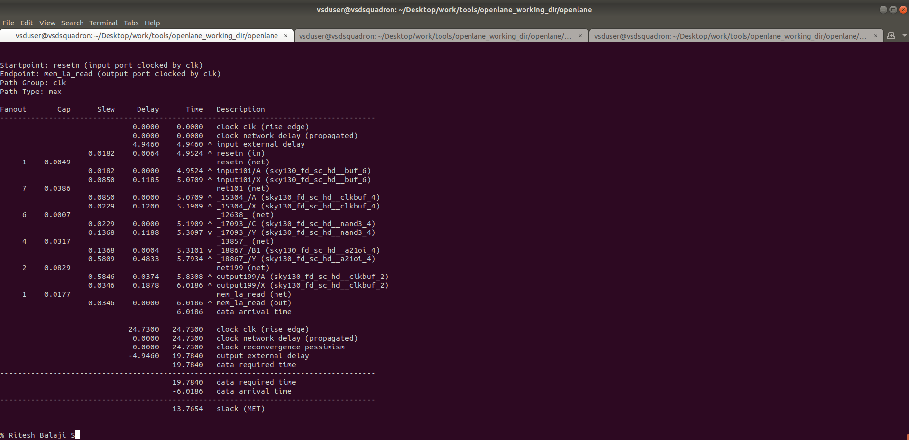

----

