#  Flow from Assembly Code to Hardware

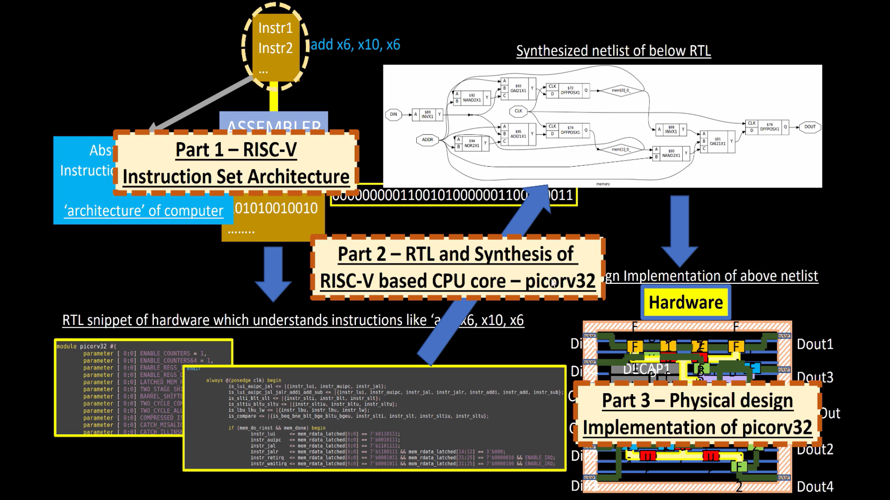
## Part 1 – RISC-V Instruction Set Architecture (ISA)

This is the starting point of any processor design.  
The **RISC-V ISA** defines how the processor understands and executes instructions like `add x6, x10, x6`. These are human-readable assembly commands that describe the processor’s operations on registers.  
An **assembler** converts these instructions into **binary machine code**, which the hardware can interpret directly.  
This stage defines the logical behavior or the “**architecture**” of the computer.

---

## Part 2 – RTL and Synthesis of RISC-V Based CPU Core – `picorv32`

In this step, the processor design is described using **RTL (Register Transfer Level)** code, typically in Verilog.  
The **`picorv32` core** implements the RISC-V instructions in hardware form, defining how data moves between registers, ALUs, and memory.  
When **synthesis** is performed, the RTL is converted into a **gate-level netlist** composed of logic gates (AND, OR, NOT, Flip-Flops, etc.).  
This bridges the gap between high-level design and digital circuit representation.

---

## Part 3 – Physical Design Implementation of `picorv32`

The final step takes the synthesized netlist and converts it into an **actual chip layout**.  
This involves **placement and routing** of standard cells, interconnections, and timing optimization to create the final hardware.  
The result is a **physical layout** that can be fabricated into silicon, representing the real, working processor.  
This stage completes the journey from assembly instruction to tangible hardware.

---

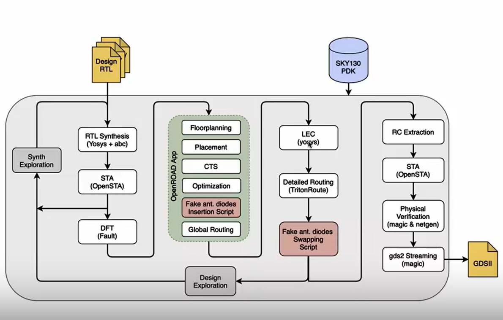

#  RTL to GDSII Flow :

This flow explains how a digital design moves from RTL code to a final chip layout using the OpenLane toolchain.

---

### 1. RTL Synthesis (Yosys + ABC)
This stage converts your Verilog design into a gate-level netlist using Yosys.  
It optimizes logic and maps it to standard cells defined by the technology library.

---

### 2. Static Timing Analysis (OpenSTA)
Timing of the synthesized netlist is checked to ensure signals meet clock deadlines.  
This helps identify slow paths early before layout begins.

---

## Open Lane (Floorplanning - Placement - Clock Tree Synthesis - Optimization):

### 3. Floorplanning
The chip area, core boundary, and placement regions are defined.  
Power rails and IO pins are arranged to prepare the layout for cell placement.

---

### 4. Placement
Standard cells are automatically arranged on the chip area.  
OpenROAD tries to reduce wirelength and congestion while keeping timing balanced.

---

### 5. Clock Tree Synthesis (CTS)
A clock network is built to distribute the clock signal evenly across the chip.  
The goal is to minimize clock skew and delay between different flip-flops.

---

### 6. Optimization
After placement and CTS, small fixes are made to improve timing and remove violations.  
This step ensures cells are legally placed and design rules are followed.

---

### 7. Global and Detailed Routing (TritonRoute)
Routing connects all placed cells with metal wires and vias.  
TritonRoute creates the exact wiring paths following design rules.

---

### 8. Antenna Diode Fixing
Diodes are added to prevent damage during manufacturing due to charge buildup.  
These are automatically inserted and swapped by OpenLane scripts.

---

### 9. Logical Equivalence Check (LEC)
Checks that the post-layout design still performs the same logic as the original RTL.  
Ensures no functionality changed during synthesis or routing.

---

### 10. RC Extraction
Extracts parasitic resistance and capacitance from routed wires.  
This helps in performing accurate post-layout timing analysis.

---

### 11. Post-Layout STA (OpenSTA)
Final timing analysis is done with real parasitic data.  
It ensures the chip meets all timing requirements after routing.

---

### 12. Physical Verification (Magic + Netgen)
DRC and LVS checks verify layout correctness and connectivity.  
These steps ensure the chip can be safely fabricated.

---

### 13. GDSII Generation
The final verified layout is exported into a GDSII file.  
This file is the standard format used for chip fabrication.

---

## OpenLane
- after installing open Lane

- in the directory ~/Desktop/work/tools/openlane_working_dir/openlane/designs we will now synthesis the picorv32a as an lab 

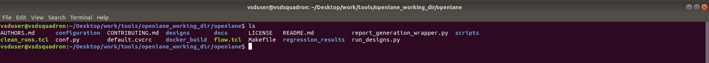

### Synthesis Using Open Lane:

### change to directory  

    ~/Desktop/work/tools/openlane_working_dir/openlane

### Setting Docker Alias for OpenLane

    alias docker='docker run -it -v $(pwd):/openLANE_flow -v $PDK_ROOT:$PDK_ROOT -e PDK_ROOT=$PDK_ROOT -u $(id -u $USER):$(id -g $USER) efabless/openlane:v0.21'

This command creates a shortcut named docker to easily run the OpenLane container.
It links the current folder and the PDK files inside Docker, so OpenLane can access everything it needs without retyping long paths each time.

### Running the OpenLane Docker Container

    docker

This command starts the OpenLane environment inside Docker.
It opens an interactive terminal where we can run all OpenLane commands safely, isolated from your system.

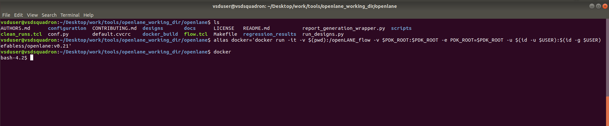

### Starting OpenLane in Interactive Mode

    ./flow.tcl -interactive
This command launches OpenLane in interactive mode, allowing you to run each step of the flow manually (like synthesis, floorplan, placement, etc.).
It gives more control to observe outputs and tweak settings at every stage of the design process.

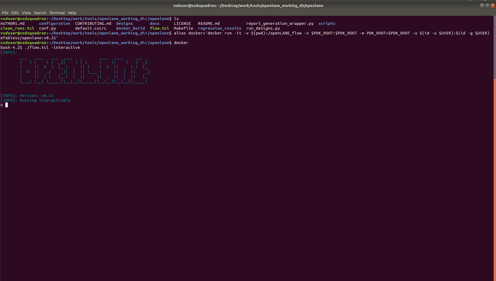

### Loading OpenLane Package

    package require openlane 0.9

The command package require openlane 0.9 loads the OpenLane environment version 0.9 inside Tcl.

### Preparing the Design

    prep -design picorv32a

The command prep -design picorv32a sets up the working directory for the design picorv32a.

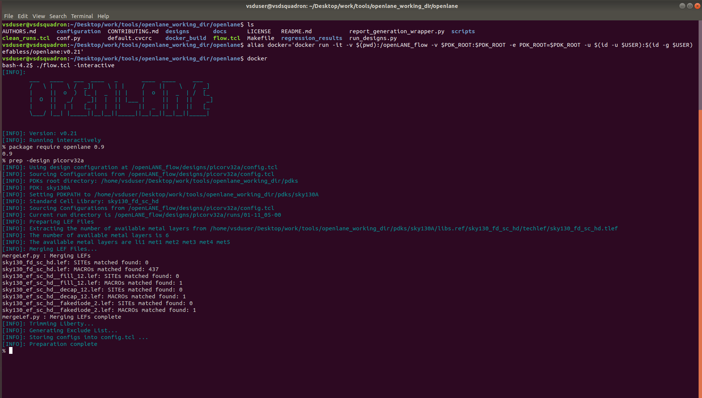

### Running Synthesis

    run_synthesis

The command run_synthesis performs the synthesis stage of the flow.
It converts the Verilog RTL design into a gate-level netlist using Yosys and maps it to standard cells from the PDK library.

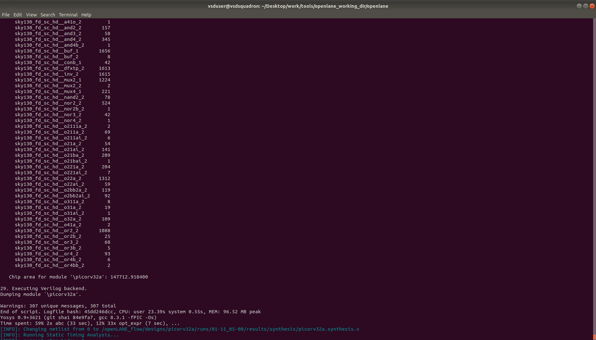

## Calculating Flop Ratio

Flop ratio represents the proportion of flip-flops to the total number of cells in a design.
It indicates how much of the circuit is made up of sequential logic compared to combinational logic.

- Number of D Flip-Flops: 1613

- Total Number of Cells: 14876

    flop ratio= Number of D Flip-Flops/Total Number of Cells

    = 1613/14876

    = 0.01084

    = 0.0108

This means about 10.8% of the total cells in the design are sequential elements (flip-flops).

### exit :
    exit

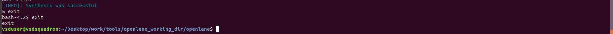

### Report and Result of Synthesis 

- the report and result of synthesis is stored inside the directory as a seperate directory

~/Desktop/work/tools/openlane_working_dir/openlane/designs/picorv32a/runs/01-11_05-00

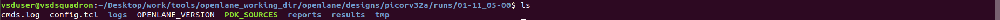

### Netlist Result:

- under result there will be different directories like placment ,routing,synthesis but here we done synthesis so get to synthesis.

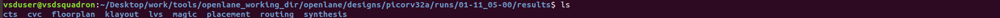

    cd ~/Desktop/work/tools/openlane_working_dir/openlane/designs/picorv32a/runs/01-11_05-00/results/synthesis

    gedit picorv32a.synthesis.v

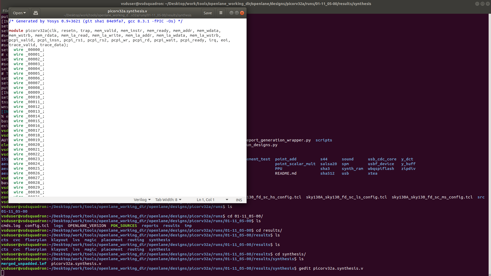

### Synthesis Report:

    cd ~/Desktop/work/tools/openlane_working_dir/openlane/designs/picorv32a/runs/01-11_05-00/reports/synthesis

    gedit 1-yosys_4.stat.rpt

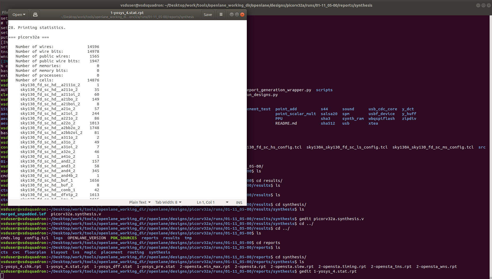
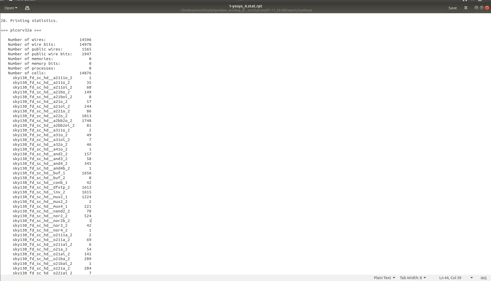

