# Week 8  Post-Layout STA & Timing Graphs Across PVT Corners for Routed VSDBabySoC 

## Post Layout Static Timing Analysis

- Post-STA is the stage where we check whether the design meets all timing requirements after clock tree synthesis or routing. It verifies both setup and hold timing by analyzing the actual delays in the design, including clock skew, buffer insertion, and routing parasitics. The goal is to ensure that data is neither too slow nor too early at any flip-flop. If all slacks are positive, the design is considered timing-clean and ready for the next implementation steps.

### Files needed for Post - STA:

    sta_across_pvt_route.tcl
    vsdbabysoc_post_cts.sdc(copied from cts result)

### sta_across_pvt_route.tcl :
    - place this file inside the ~OpenSTA/examples/BabySoC/ . This Tcl script automatically loads every timing .lib file (each PVT corner) and runs full post-route STA for each one using the same netlist, SDC, and SPEF. It then saves worst-slack, TNS, WNS, and detailed timing reports for every corners.

    - sta_across_pvt_route.tcl 

    set list_of_lib_files(1) "sky130_fd_sc_hd__tt_025C_1v80.lib"
    set list_of_lib_files(2) "sky130_fd_sc_hd__ff_100C_1v65.lib"
    set list_of_lib_files(3) "sky130_fd_sc_hd__ff_100C_1v95.lib"
    set list_of_lib_files(4) "sky130_fd_sc_hd__ff_n40C_1v56.lib"
    set list_of_lib_files(5) "sky130_fd_sc_hd__ff_n40C_1v65.lib"
    set list_of_lib_files(6) "sky130_fd_sc_hd__ff_n40C_1v76.lib"
    set list_of_lib_files(7) "sky130_fd_sc_hd__ss_100C_1v40.lib"
    set list_of_lib_files(8) "sky130_fd_sc_hd__ss_100C_1v60.lib"
    set list_of_lib_files(9) "sky130_fd_sc_hd__ss_n40C_1v28.lib"
    set list_of_lib_files(10) "sky130_fd_sc_hd__ss_n40C_1v35.lib"
    set list_of_lib_files(11) "sky130_fd_sc_hd__ss_n40C_1v40.lib"
    set list_of_lib_files(12) "sky130_fd_sc_hd__ss_n40C_1v44.lib"
    set list_of_lib_files(13) "sky130_fd_sc_hd__ss_n40C_1v76.lib"

    read_liberty /home/ritesh/Desktop/vlsi/sky130RTLDesignAndSynthesisWorkshop/verilog_files/VSDBabySoC/sta/OpenSTA/examples/timing_libs/avsdpll.lib
    read_liberty /home/ritesh/Desktop/vlsi/sky130RTLDesignAndSynthesisWorkshop/verilog_files/VSDBabySoC/sta/OpenSTA/examples/timing_libs/avsddac.lib

    for {set i 1} {$i <= [array size list_of_lib_files]} {incr i} {
        read_liberty /home/ritesh/Desktop/vlsi/sky130RTLDesignAndSynthesisWorkshop/verilog_files/VSDBabySoC/sta/OpenSTA/examples/timing_libs/skywater-pdk-libs-sky130_fd_sc_hd/timing/$list_of_lib_files($i)
        read_verilog /home/ritesh/Desktop/OpenROAD-flow-scripts/flow/designs/sky130hd/vsdbabysoc/vsdbabysoc_post_place.v
        link_design vsdbabysoc
        current_design
        read_sdc /home/ritesh/Desktop/vlsi/sky130RTLDesignAndSynthesisWorkshop/verilog_files/VSDBabySoC/sta/OpenSTA/examples/BabySoC/vsdbabysoc_post_cts.sdc
        read_spef /home/ritesh/Desktop/OpenROAD-flow-scripts/flow/designs/sky130hd/vsdbabysoc/vsdbabysoc.spef

        # Performs a detailed setup timing evaluation
        check_setup -verbose

        report_checks -path_delay min_max -fields {nets cap slew input_pins fanout} -digits {4} > /home/ritesh/Desktop/vlsi/sky130RTLDesignAndSynthesisWorkshop/verilog_files/VSDBabySoC/sta/OpenSTA/examples/BabySoC/STA_OUTPUT/post_route/min_max_$list_of_lib_files($i).txt

        exec echo "$list_of_lib_files($i)" >> /home/ritesh/Desktop/vlsi/sky130RTLDesignAndSynthesisWorkshop/verilog_files/VSDBabySoC/sta/OpenSTA/examples/BabySoC/STA_OUTPUT/post_route/sta_worst_max_slack.txt
        report_worst_slack -max -digits {4} >> /home/ritesh/Desktop/vlsi/sky130RTLDesignAndSynthesisWorkshop/verilog_files/VSDBabySoC/sta/OpenSTA/examples/BabySoC/STA_OUTPUT/post_route/sta_worst_max_slack.txt

        exec echo "$list_of_lib_files($i)" >> /home/ritesh/Desktop/vlsi/sky130RTLDesignAndSynthesisWorkshop/verilog_files/VSDBabySoC/sta/OpenSTA/examples/BabySoC/STA_OUTPUT/post_route/sta_worst_min_slack.txt
        report_worst_slack -min -digits {4} >> /home/ritesh/Desktop/vlsi/sky130RTLDesignAndSynthesisWorkshop/verilog_files/VSDBabySoC/sta/OpenSTA/examples/BabySoC/STA_OUTPUT/post_route/sta_worst_min_slack.txt

        exec echo "$list_of_lib_files($i)" >> /home/ritesh/Desktop/vlsi/sky130RTLDesignAndSynthesisWorkshop/verilog_files/VSDBabySoC/sta/OpenSTA/examples/BabySoC/STA_OUTPUT/post_route/sta_tns.txt
        report_tns -digits {4} >> /home/ritesh/Desktop/vlsi/sky130RTLDesignAndSynthesisWorkshop/verilog_files/VSDBabySoC/sta/OpenSTA/examples/BabySoC/STA_OUTPUT/post_route/sta_tns.txt

        exec echo "$list_of_lib_files($i)" >> /home/ritesh/Desktop/vlsi/sky130RTLDesignAndSynthesisWorkshop/verilog_files/VSDBabySoC/sta/OpenSTA/examples/BabySoC/STA_OUTPUT/post_route/sta_wns.txt
        report_wns -digits {4} >> /home/ritesh/Desktop/vlsi/sky130RTLDesignAndSynthesisWorkshop/verilog_files/VSDBabySoC/sta/OpenSTA/examples/BabySoC/STA_OUTPUT/post_route/sta_wns.txt
    }

### vsdbabysoc_post_cts.sdc:
    - this file is copied from the  4_cts.sdc from the directory ~/Desktop/OpenROAD-flow-scripts/flow/results/sky130hd/vsdbabysoc/base which was generated by running cts (clock tree synthesis).- This SDC file stores the timing constraints used after CTS. It defines the PLL clock and tells the tool to use the real clock tree for timing checks

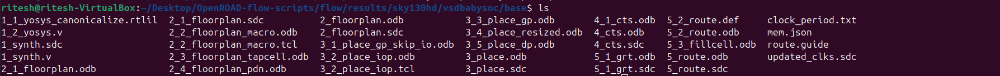
    cp ~OpenROAD-flow-scripts/flow/results/sky130hd/vsdbabysoc/base/4_cts.sdc ~OpenSTA/examples/BabySoC/vsdbabysoc_post_cts.sdc

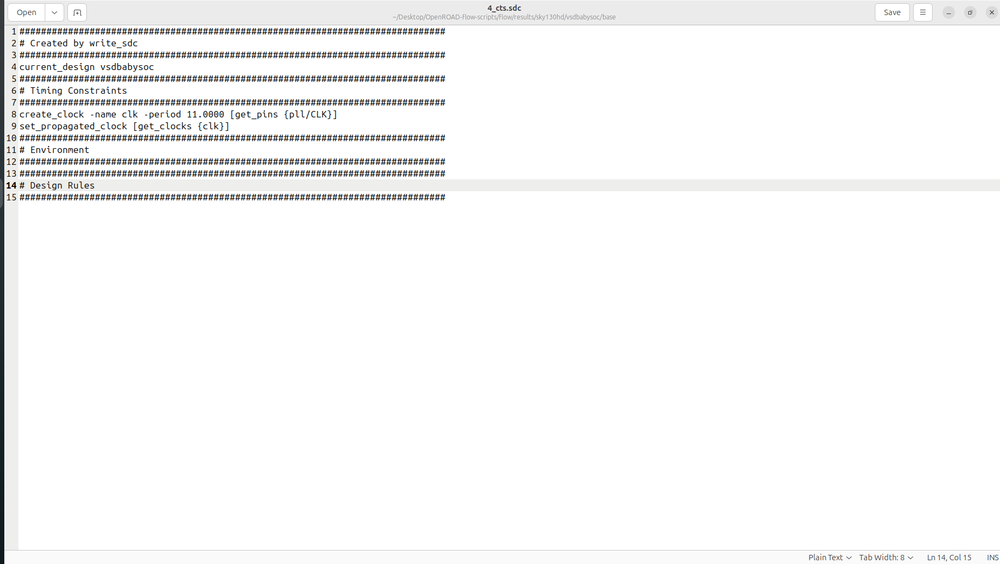
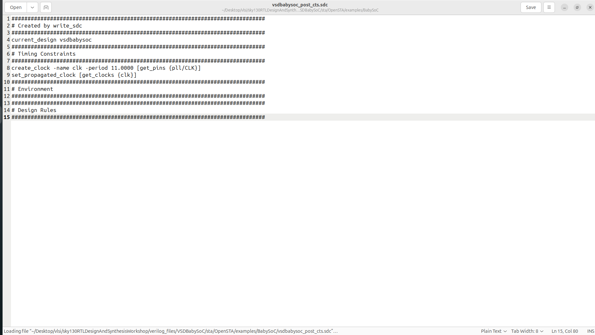

- vsdbabysoc_post_cts.sdc:

        ###############################################################################
        # Created by write_sdc
        ###############################################################################
        current_design vsdbabysoc
        ###############################################################################
        # Timing Constraints
        ###############################################################################
        create_clock -name clk -period 11.0000 [get_pins {pll/CLK}]
        set_propagated_clock [get_clocks {clk}]
        ###############################################################################
        # Environment
        ###############################################################################
        ###############################################################################
        # Design Rules
        ###############################################################################

## Executing Post Route STA:

- command 
    cd ~Opensta

    sta

    source /home/ritesh/Desktop/vlsi/sky130RTLDesignAndSynthesisWorkshop/verilog_files/VSDBabySoC/sta/OpenSTA/examples/BabySoC/sta_across_pvt_route.tcl 

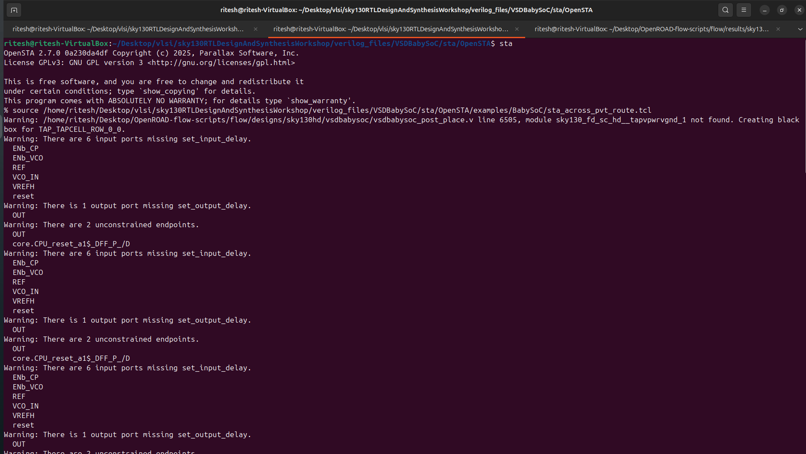
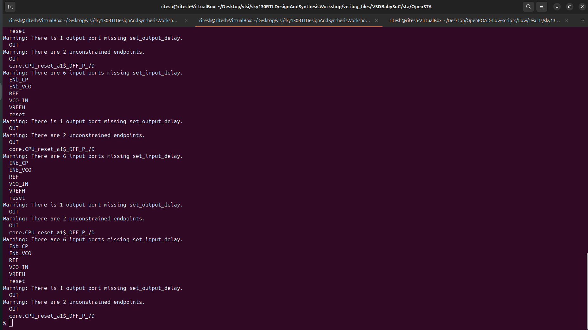

### Results:

    cd /home/ritesh/Desktop/vlsi/sky130RTLDesignAndSynthesisWorkshop/verilog_files/VSDBabySoC/sta/OpenSTA/examples/BabySoC/STA_OUTPUT/post_route/

    ls

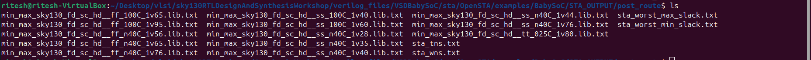

    - These result files are used to plot and analyze the timing behavior of the design. They contain key outputs from the STA run, which help in understanding timing margins and identifying violations across different PVT corners.

## Timing Report Comparision Post Synthesis VS Post Route

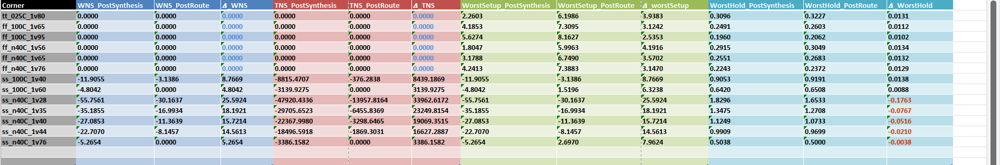

## Worst Negative Slack:

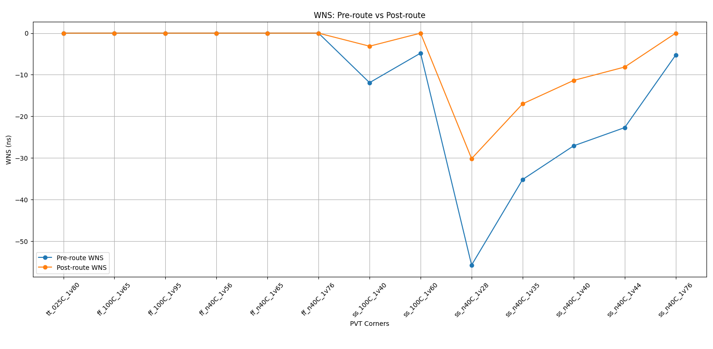

- All slow SS corners show major improvement after routing.
Example:

SS_n40C_1v28 improved from –55.75 ns → –30.16 ns
(a ~25 ns improvement)

SS_n40C_1v35 improved from –35.18 ns → –16.99 ns

SS_100C_1v40 improved from –11.90 ns → –3.13 ns

Reason for improvement:

    - Routing introduced actual buffering, shorter wire routes, and more balanced nets than the rough synthesis estimation. This reduced the delay on several long critical paths.

## Total Negative Slack:

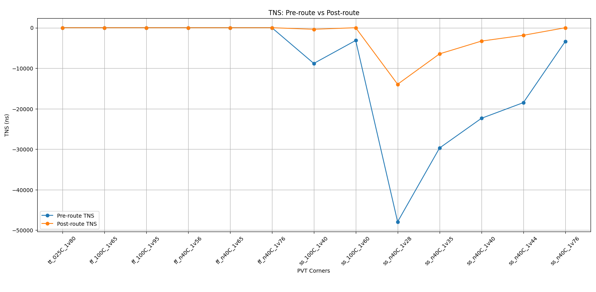

- TNS improved massively — sometimes by tens of thousands of nanoseconds.

Example:

SS_n40C_1v28 improved from –47,920 → –13,957
(~34,000 ns improvement)

Reason

    - Routing helps balance path delays and inserts more optimized buffering, greatly reducing the number of paths failing setup.

- Some corners has no change remains .Some paths were already timing-clean in synthesis and remain clean after routing.

### Setup - Worst MAX Slack :

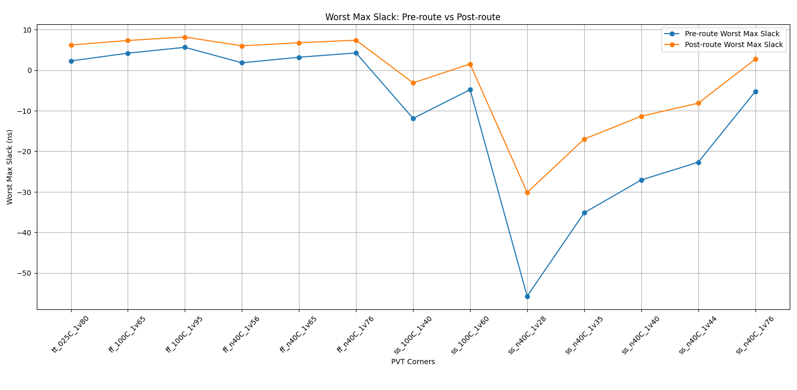

- the Setup Worst MAX Slack has increased the slack from synthesis to routing.Because routing created shorter wires on some paths, buffers were placed in optimal physical positions, synthesis pessimism was removed.

### Hold Timing (Worst MIN Slack)

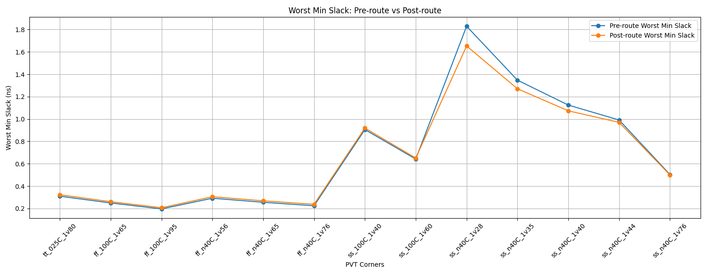

- the changes of slack was very small in hold timing,
where 
- Fast corners got slightly better hold slack

- Slow corners got slightly worse hold slack

### Overall Summary

- Huge improvements in setup TNS (up to 30–35k ns better)

- Major improvements in setup WNS in slow corners

- Better maximum slack in nearly all corners

- Hold timing stable with mild improvements

## Why Post-Route Timing Differs from Pre-Route Timing

Post-route timing almost always looks different from pre-route (post-synthesis) timing because the design becomes **physically realistic** only after placement and routing. Before routing, the timing tool works with **idealized estimates**, but after routing, it uses the **actual wires**, **actual clock tree**, and **actual parasitic values**.

### 1. Real Interconnect Parasitics (R & C)

Before routing, nets use simplified wireload or estimated parasitics.  
After routing, every wire has real:

- Resistance (R)
- Capacitance (C)
- Coupling capacitance (Cc)

These parasitics slow down transitions and increase path delays.

Effects:
- **Setup slack often gets worse**
- **Hold slack may improve** due to added delay

### 2. Clock Tree Synthesis (CTS) Changes Timing

Pre-route STA assumes an ideal clock with zero skew.  
Post-route STA uses the real clock tree, which introduces:

- Clock insertion delay  
- Clock skew  
- Clock imbalance  

This can improve or degrade setup/hold timing.

### 3. SPEF Back-Annotation Makes STA More Accurate

Post-route STA uses **SPEF** files with extracted R and C data.  
This makes timing more accurate, more pessimistic, and closer to real silicon behavior.

### 4. Coupling and Crosstalk Effects

Coupling capacitance between adjacent wires affects signal delays:

- Increases effective delay  
- Can induce noise  
- Reduces timing margins  

Not accounted for in pre-route analysis.

### 5. Physical Layout Influences Delays

Placement and routing shape signal paths:

- Long routes increase delay  
- Congested regions create longer paths  
- Extra vias and layer transitions add delay  

These are missing before routing.

### 6. Power Delivery & IR Drop

With the real power grid connected, cells may experience **IR drop**, reducing drive strength and increasing delay.

### 7. Summary

**Pre-route timing = optimistic & idealized**  
**Post-route timing = realistic & signoff-quality**

Routing introduces real parasitics, clock skew, coupling, congestion, and IR-drop effects, which collectively shift timing results.

### SPEF File Affects Path Delays

- When a design is analyzed after routing, an SPEF file is used to add real-world parasitics—like wire resistance and capacitance—onto every net. Before this, STA only sees ideal or estimated wire loads, which are not accurate.
After SPEF annotation, each path delay gets updated based on actual routed interconnects. Longer wires, higher resistance, or larger coupling capacitance increase the delay on that path.
This means the arrival times at flip-flops and outputs become more realistic.
Setup and hold checks also change, because the true interconnect delay can either slow down or speed up a signal depending on the parasitics.
Overall, SPEF annotation ensures timing reports reflect how the chip will behave physically, not just logically.
It helps catch violations that were hidden before routing and guides engineers to fix real timing issues in the layout.

### Impact of Physical Effects (Capacitance, Resistance, Coupling) on Timing Closure

In our design, the post-route timing showed a clear drop in WNS and TNS when compared to post-synthesis results. This difference mainly comes from the physical RC effects introduced during placement and routing, which were not present during the pre-route (logical) stage.

    1. Added Wire Resistance (R) Slows Down Signals

    During synthesis, nets are assumed to have minimal or ideal interconnect delay.
    After routing, real metal wires are assigned, and their lengths increase the wire resistance.

    In our data, setup slack became more negative after routing.
    This indicates that longer routes increased the RC delay, pushing many paths beyond their required arrival times.

    2. Capacitance (C) Increases Path Delay

    Every routed net has parasitic capacitance—load from metal layers, vias, and neighboring nets.

    After SPEF extraction, the tool calculated higher load capacitance on several critical nets.

    This increased cell delay and net delay, making the post-route WNS worse than post-synthesis.

    The heavy fanout nets and nets traveling across blocks were most affected.

    3. Coupling Capacitance Causes Crosstalk-Induced Delay

    When two nets run close to each other, their electric fields interact, creating coupling capacitance.

    During routing, some critical nets were routed through congested regions, increasing coupling.

    These nets experienced crosstalk delay, worsening setup timing.

    This explains why even some short paths showed increased delay post-route.

    4. RC Effects Can Hurt Hold Timing Too

    Although routing usually makes setup worse, it can also introduce new hold violations:

    After routing, some fast paths became slower due to added RC, reducing hold margin.

    If a path was already borderline short, even small RC differences can push it into violation.

    5. Real Parasitics Make Timing More Accurate

    The difference between your post-synthesis and post-route numbers shows the impact of moving from:

    Ideal timing (no RC) → synthesis results

    Real parasitics (R + C + coupling) → post-route result

    The timing degradation we saw in WNS/TNS directly reflects the physical realities of the layout.

